<div class="lang-switch">
  <span>🌐 <strong>Language:</strong> English</span>
  <a href="ru/" class="lang-btn">🇷🇺 Читать на русском (RU)</a>
</div>

# The Interface of Observation: A Structural and Mathematical Model of Distinction

**Author:** Igor Zhuk ([igor.m.zhuk@gmail.com](mailto:igor.m.zhuk@gmail.com))  
*Preprint / Research Project DOT (Distinction Observable Theory)*  
*Project Archive:* [github.com/Nondual-Observer/DOTheory](https://github.com/Nondual-Observer/DOTheory)

*Can the observer and the observer's primary act be introduced into rigorous science while avoiding speculative metaphysics and a vicious regress (“who observes the observer”)?*

This article investigates the conditions required to perform an elementary act of distinction, retain its result, and pass that result to the next act. The mechanism is described through an **interface of observation**: a coupling between a step of change and a preserved context. On a chosen binary model, this is then used to build a joint scene of distinctions and examine its geometric, color, musical, and arithmetic representations.

The main line of argument is presented verbally and illustrated with examples. Formulas, strict definitions, and mathematical derivations are placed in collapsible sections marked with **▷**. They can be skipped on a first reading: the explanations in the main text are intended to stand on their own.

The material is organized into three reading routes:

1. **Conceptual core (§1–§6):** the position of the observer, the “step–context” interface, and three fundamental prohibitions. This can be read as an illustrated, broadly scientific argument. *(Reading time without the ▷ blocks: ~20–25 min.)*
2. **Full popular route (§1–§10):** the core plus an intuitive development through graph elements—the multidimensional geometry of the scene (cube, octahedron), followed by projections onto sound and color. *(Reading time without the ▷ blocks: ~35–40 min.)*
3. **Reading with the mathematical derivations (the entire article):** the full text with strict definitions, arguments, and additional results. The ▷ blocks assume some familiarity with combinatorics, linear algebra, and the idea of symmetry groups. *(Reading time: 60+ min.)*

*This is the first, introductory part of the study. It unifies three previously published analyses in the series (links at the end) into a single pre-mathematical picture. A second part is planned, with a strict mathematical apparatus and theorem proofs.*


## 1. What Exactly Can Be Formalized

Formalizing consciousness as a whole is an ill-defined task. For precise analysis, one must isolate an operational structure: **the conditions under which something in experience becomes distinguished, remains available, and can be used in the next step of perception**.

A cognitive act combines two interrelated planes. The **phenomenological plane** concerns who undergoes what is happening and how it is given to them. The **operational-logical plane** describes the structure of distinctions: what is separated from what, what changes are possible, and what must remain preserved when moving to the next act.

### The phenomenological plane: subject, sensing, and action

Three connected aspects can be distinguished in immediate experience:

1. **The subject of experience—the position of “I”.**  
   The perceiving and organizing center relative to which the field of experience unfolds. From this position we consider what is happening, select an object of attention, and compare impressions. It *sets the perspective of the observed scene*.

2. **Sensing—the perceived impact of the world.**  
   Color, sound, warmth, density, and the resistance of objects are given to us as concrete experienced qualities. This is the receptive side of interaction: *what happens becomes the content of experience*.

3. **Action—the subject's active participation.**  
   We move, speak, apply effort, displace objects, and transform them. This is the outgoing side of interaction: *the subject becomes a source of changes in the surrounding world*.

Sensing and action are inseparably connected: what is seen can guide the next movement, while movement can change what becomes visible. Their immediate qualitative side—what color, warmth, or one's own volitional effort feel like—belongs to what philosophy calls **qualia**.

*Boundary of formalization:* the ontological nature of the subject and the metaphysical status of qualia remain outside the mathematical apparatus of this article. The model concerns **distinctions between objects, their interactions, and the conditions for preserving a result**, which make continued observation possible.

### The operational-logical plane: distinguish, relate, preserve

To describe this work in the language of relations, three connected tasks must be addressed:

1. **Primary distinction.**  
   Selecting something draws a boundary: relative to a chosen feature, “this” and “not-this” appear. We must determine *which sides are distinguished and what rule defines the transition between states*. The rest of the construction begins with the simplest two-sided distinction.

2. **Distinction of structure.**  
   Different features may be available simultaneously: color and shape, position and distance. Here it is necessary to describe not only each answer separately, but also the relations among them: *which combinations are possible, what changes together, and what may change independently*. This gives rise to the problem of a common multidimensional scene of distinctions.

3. **Preservation of the result and accumulation.**  
   The obtained distinction must remain available to the next action. This requires preserving the result and the possibility of comparing it with a new state. Questions of memory and continuity follow: *what exactly remains after a step, and how can the preserved result participate in further observation?*

### How these sides of cognition are approached in science

In this article, inner experience and the description of its structure are compared through three pairs:

- **Subject of experience and primary distinction:**  
  The subject establishes a position of consideration; primary distinction describes the drawing of a boundary—what is selected and relative to what.

- **Sensing and distinction of structure:**  
  Sensing supplies the variety of experienced qualities; distinction of structure describes their combinations and mutual relations within the scene.

- **Action and preservation of result and accumulation:**  
  Action expresses the subject's activity in changing the environment; preservation of the result retains the trace of what has been done and allows it to be used in subsequent steps.

Related links between perception, action, and the coordination of experience are studied in **epistemology, physiology, and perception research**:

- **Immanuel Kant's epistemology:**  
  *Perceived content:* sensibility provides the material of experience (color, sound, touch). Through it an object is given to us, but the impressions are still dispersed.  
  *Active work:* the understanding connects impressions by means of concepts and rules, making judgments about objects.  
  *Coordination:* all representations are related to the formula “I think”—a unified self-consciousness that binds sensory material and the work of understanding into coherent experience.

- **P. K. Anokhin's theory of functional systems:**  
  *Perceived content:* the organism continuously receives afferent signals from the environment and from its own body.  
  *Active work:* on this basis, a program of action and an expected result are formed.  
  *Coordination:* reverse afferentation reports the actual outcome; a mismatch with expectation guides correction. Perception, memory, action, and checking the result form a single closed loop.

- **The sensorimotor approach of Kevin O'Regan and Alva Noë:**  
  *Perceived content:* vision provides color, contours, and the positions of objects, all changing with movements of the eyes and body.  
  *Active work:* a person shifts their gaze, approaches, or moves around an object—movement becomes an active way to investigate the environment.  
  *Coordination:* the perceiver masters regularities of change, such as how a change in viewpoint transforms contours. Visual experience relies on practical mastery of the link between one's own action and changes in sensation.

### From separate descriptions to a unified mechanism

The goal of the following formalization is to assemble these sides of the observer and the act of distinction into a single mathematical structure.

Geometry provides an intuitive model of such structural correspondence: the same magnitude can be *measured* or *calculated*. The Pythagorean theorem allows the length of the hypotenuse of a right triangle to be calculated from the lengths of the other two sides.


For legs of lengths 3 and 4, the hypotenuse can be calculated as 5. The same length can also be measured with a ruler. **Geometric construction and numerical calculation work as two coordinated ways of expressing the same structure.**

<a id="example-geometry-length"></a>
<details markdown="1" id="details-example-geometry-length">
<summary><strong>▷ [Example] Geometry and the calculation of length</strong></summary>

For a right triangle with legs $a$, $b$ and hypotenuse $c$:

$$a^2+b^2=c^2, \qquad 3^2+4^2=5^2.$$

In this example, the hypotenuse has length $5$.

</details>

This leads to the central task of the study: to construct a unified mechanism—the **interface of observation**—in which drawing a distinction, changing state, reading the result, and using that result further are connected within one coherent system.

We begin with the observer: **how can its position be represented in a description and distinguished from an image of the observer among perceived objects?**


## 2. The Observer in the Model and the Subject of Experience

Consider an elementary example involving a change of observational perspective. Looking at a table makes the table the initial object of consideration. One can then consider a judgment about the table: for example, ask oneself why it appears wooden. The previous judgment now becomes the object of analysis. At the next step, the very manner in which that judgment was made becomes the object.

The sequence can continue: table, judgment about the table, way of making the judgment. Yet at every step, what becomes an object is not the acting position of observation itself, but its description or projection—a thought, image, or model. The current position of consideration again fails to coincide with any object in the scene.

In second-order cybernetics (Heinz von Foerster), this transition is described as a movement from observing systems to the “observation of observation.” In the sequence above, the previous step becomes the object of the next act of consideration. A system can construct descriptions of its own previous steps, but every such description remains content within the scene rather than the very perceiving and acting position of the observer for whom that scene is unfolded.

In every act of perception, **content** can be distinguished from the **current position** from which it is considered. Previous content becomes material for the next step, while the position of consideration shifts together with the observer. In the model, this corresponds to two **complementary functions**: *changing the content and preserving the condition under which results remain comparable*.

A related idea lies at the heart of Immanuel Kant's epistemology: dispersed impressions (sounds, objects, thoughts) are united into one person's coherent experience only because each of them is related to a common center—the formula “I think.” This “I” acts as an invariant connective condition that gathers the stream of perceptions into a whole while remaining outside the series of perceived things—the transcendental unity of apperception.

> **[Definition] Observer** — the role that connects changes of state with the preservation of a common context. An image or description of the observer may become an object in the scene, but the current position of observation itself is not another state of that scene.

<a id="formal-observer-role"></a>
<details markdown="1" id="details-formal-observer-role">
<summary><strong>▷ [Formal description] Typing the observer's role</strong></summary>

In the model, scene states and the role of observation have different types. The set $X$ contains states; the symbol $O$ denotes a role realized through a step of change and a preserved reading. The notation

$$O \notin X$$

fixes this convention. Descriptions of the observer may belong to $X$ as states of the scene.

</details>

## 3. The Original Whole and the Negative Beginning: The Birth of a Boundary

Perception is initially given as a sensory stream—an undivided original whole. The stream of impressions does not yet determine which distinctions are available to the observer and can be used further. The same material may remain distinguishable by some features and unavailable by others.

The distinction between a continuous stream of experience and a structure of operational distinctions can be illustrated by the following example.

Imagine watching a foreign television series in a dubbed version: you understand the plot, distinguish the characters' actions, grasp the meaning of speech, and hear its timbre and intonation. At some point the audio is switched to the original track in a language you do not know: the semantic part of the dialogue disappears immediately.

Yet only the ability to extract a certain structure from the stream has disappeared. The sensory fabric of experience continues, but the semantic channel stops supplying distinctions: the same stream remains available by acoustic features while becoming blocked by semantic ones.

Understanding dialogue is built from a chain of operations on already distinguished material: hearing speech, extracting its structure, relating words to meanings. To connect content into a meaningful relation, the observer must possess distinctions available to the corresponding mode of reading. For connected meaning to arise, a distinction has to be extracted from an undifferentiated background.

The observer orders the world through the same gesture by which it separates itself from that world. The primary negation isolates a logical position of consideration: **“I as observer am not what I perceive”** (“I” / “Not-I”). Within the field of experience itself, selecting any quality immediately turns the entire remaining background, relative to that chosen feature, into “not-this.”

We therefore consider a two-sided distinction: relative to a chosen feature, “this” and “not-this” are selected. A boundary separates the selected quality from the background and holds both sides within one field of consideration.

A two-sided boundary as a primary instrument for structuring distinctions appears in several scientific approaches, though it plays different roles in each:

- **In information theory and cybernetics** (Claude Shannon, Gregory Bateson)—as binary coding of alternatives and as a difference that affects subsequent process.
- **In linguistics and cognitive psychology** (Roman Jakobson, George Kelly)—as binary opposition: a quality is recognized through comparison with an opposite pole (“light / dark,” “warm / cold”).
- **In the logic of form** (G. Spencer-Brown)—as a primary operational act (*draw a distinction*) from which the calculus begins.

**The relation between the poles specifies how they are connected:** which states correspond to one another and how one may pass from one to the other.

Drawing a boundary defines a partition into classes—it divides states into two alternative groups (“this” and “not-this”)—but the rule that pairs individual elements across the boundary is specified by a separate operation. The minimal configuration of a boundary is a mutually reversible exchange: a repeated transition returns the original state.

> **[Definition] Act of distinction** — an elementary discrete event that performs a transition between opposite sides of a boundary and changes the state of the system (**step of change**).

Within this class, an elementary two-sided step expresses three basic properties of the boundary:

1. **Contrast (non-coincidence of the sides):** the transition genuinely changes the state. In the model, this property excludes trivial identity and develops into a requirement that states must change and a **prohibition of coincidence**.
2. **Mutuality and reversibility (preservation of context):** a repeated transition returns the initial state. The two states form one pair united by a common center of symmetry. This gives a **condition of context preservation**: the step cannot occur at the cost of losing the rule that links the states.
3. **Autonomy and uniqueness (internal closure):** for two states, the mutual exchange is determined uniquely. On a larger carrier, one must specify which states form pairs. The binary step is closed in itself (**prohibition of external support**), while combinations of independent distinctions develop into the geometry of a cube of states.

The two sides of one boundary remain sides of one distinction rather than two separate worlds. Because the act of distinction unfolds within the field of perception as an **original whole**, the boundary simultaneously separates and connects: both sides belong to one common context.

<a id="formal-partition-involution"></a>
<details markdown="1" id="details-formal-partition-involution">
<summary><strong>▷ [Formal description] Partition of the state space and an involutive step</strong></summary>

Let the state space associated with a given distinction be a set $X$. In the two-sided regime, drawing a boundary partitions it into two disjoint nonempty subsets $A$ and $B$ (disjoint union):

$$X = A \sqcup B, \quad A \neq \emptyset, \quad B \neq \emptyset.$$

The symbol $\sqcup$ records two conditions:

1. the sides mutually exclude one another: $A \cap B = \emptyset$;
2. together they reconstruct the state space of the distinction: $A \cup B = X$.

The partition $X=A\sqcup B$ classifies states into two classes, but by itself does not yet generate a transition map between individual elements. Constructing a step of change requires the following data:

1. equal cardinalities of the two sides: $|A|=|B|$;
2. a choice of bijection $f\colon A\to B$;
3. an involution $\alpha\colon X\to X$ exchanging the two sides:

$$\alpha(a)=f(a), \quad \alpha(b)=f^{-1}(b) \quad (a\in A,\ b\in B).$$

The resulting map satisfies the conditions of a free involution exchanging the sides:

$$\alpha^2=\mathrm{id}_X, \quad \alpha(x)\neq x, \quad \alpha(A)=B, \quad \alpha(B)=A.$$

On the minimal two-element carrier $X=\{a,b\}$, the choice of bijection is unique—the transposition $(a\,b)$.  
On a finite carrier of odd cardinality, a free involution does not exist: every involution of a finite odd set has at least one fixed point ($\alpha x=x$), which halts the step of change at that point.

</details>


## 4. Symmetry of the Pair and the Axis of Relation: The Integrity of Distinction

The two sides of a boundary are defined solely relative to one another: neither exists prior to, or independently of, the act that separates them.

In G. Spencer-Brown's logic of form, one side is designated *marked* and the other *unmarked* (blank or background). In that description the sides are asymmetric: one carries a mark, while the other lacks it.

In the model proposed here, the sides mutually exclude each other as opposite outcomes of one distinction while remaining structurally equal. Partitioning the state space does not create a hierarchy of “mark” and “blank”: neither pole has an a priori privilege.

Names for the sides—such as “zero” and “one,” or “plus” and “minus”—appear only after a representation convention has been chosen. **But this external labeling does not alter the structure of the pair itself:** *when the labels are exchanged, the relation of opposition remains unchanged.*

An elementary geometric prototype of such a symmetric pair is a line segment: its two ends are singled out by the structure as boundary points. Mutual exchange swaps them while preserving the pair itself, without selecting either end as primary.

In a geometric representation, mutual exchange of the poles is expressed by reflection about a fixed center. The center displays the symmetry of the pair while remaining outside the two discrete outcomes.

The model strictly distinguishes three components:

1. **A pair of discrete states:** the interchangeable outcomes themselves, passing into one another and forming a relation of mutual exchange.
2. **A geometric center:** the midpoint of the segment (marked by a dashed circle in the diagram above)—a fixed point of the continuous extension that organizes the symmetry of exchange but is excluded from the discrete outcomes.
3. **The role of the observer:** the organizing position that holds both states as parts of one common context.

In the analogy of a mechanical balance, objects on the pans change height relative to a fixed equilibrium point. If the support point itself is included among the discrete states of motion, then under inversion the edges exchange places while the middle remains unchanged. Stable operation of distinction requires strictly paired discrete outcomes (the two ends of a segment, or objects on the pans), whereas the center of symmetry serves as an invisible axis of their mutual relation.

In the method, the discrete and the continuous are not isolated worlds but sides of a single process:

- **The discrete side** consists of changeable states (the poles of the pair, the opposite sides of the boundary). It provides contrast and performs the step of change: for distinction to occur, the state must change.
- **The continuous side** allows the same symmetry to be represented through the interval between the poles and its fixed center.

In the chosen model of free mutual exchange, a third discrete outcome creates a difficulty: a finite odd number of states cannot be partitioned completely into pairs. Every involution of a finite odd set necessarily has a fixed point.

The proposed approach resolves this difficulty by separating functional roles. The integrity of a pair does not require a separate discrete object within the scene: the discrete outcomes provide the changing content (the step), while the continuous geometric center holds their symmetry. This resembles Francisco Varela's calculus of self-reference in its interest in what preserves the connectedness of an operation. In the present construction, however, the fixed center appears only in the geometric representation of exchange.

<a id="context-varela-involution"></a>
<details markdown="1" id="details-context-varela-involution">
<summary><strong>▷ [Context] Varela's autonomous value and free involution</strong></summary>

In Francisco Varela's calculus of self-reference ([*“A Calculus for Self-Reference”*, 1975](https://homepages.math.uic.edu/~kauffman/VarelaCSR.pdf)), which develops G. Spencer-Brown's apparatus, a “third autonomous value” is introduced as the result of closing an operation onto itself. Such a state is admissible in three-valued logics. In the class of models based on a free involution (requiring the absence of fixed states, $\alpha x\neq x$), however, a finite odd carrier excludes free reversal: every involution on a finite odd set necessarily has a fixed point that stops the step of change. The study [“Observer and Distinction: Discrete and Continuous Manifestations of an Isotropic Boundary”](https://habr.com/ru/articles/1058672/) considers the distinction between a discrete pair and the center of its continuous extension. The comparison with Varela's autonomous value is an analogy only; no operation-preserving mapping between the two calculi is constructed here.

</details>

When there are several distinctions, two structural conditions must be coordinated:

- **Internal unmarkedness:** within each individual pair, the opposite sides preserve symmetry without selecting a preferred pole.
- **Distinguishability of axes:** independent acts of distinction form different degrees of freedom of the scene (which makes it possible to distinguish and number the axes themselves).

Numbering the axes fixes a measurement system while preserving the structural equality of the poles on each axis. A multidimensional scene of states is built from such independent axes. The common center expresses the symmetry of the entire scene; membership of a state in a particular pair is retained by its own reading.

An elementary distinction joins state change with preservation of the relation between outcomes. Geometry makes this relation visible: exchanging the poles leaves the center of reflection fixed. The coordination of the step itself with a preserved reading will now be described as the interface of observation.

<a id="formal-boundary-pair-center"></a>
<details markdown="1" id="details-formal-boundary-pair-center">
<summary><strong>▷ [Formal description] Boundary pair, reflection, and center</strong></summary>

A free involution on a discrete carrier determines pairs of opposite states. A geometric center appears only after choosing a continuous extension in which this involution is realized by central reflection.  
On the real line, a pair of boundary points may be represented by symmetric coordinates $P_R=\{-a,a\}$ (with scale parameter $a>0$, as in the diagram above), or by $\{0,1\}$ on the unit interval $[0,1]$. Mutual exchange is given by the reflection $x\mapsto -x$ (respectively, $x\mapsto 1-x$). The unique fixed point of this reflection is the geometric center of symmetry $\sigma=0$ (respectively, $\sigma_{1/2}=1/2$). This continuous invariant is strictly excluded from the discrete set of boundary states:

$$\sigma \notin P_R.$$

</details>

<a id="example-unmarked-pair-algebra"></a>
<details markdown="1" id="details-example-unmarked-pair-algebra">
<summary><strong>▷ [Example] An algebraic model of an unmarked pair</strong></summary>

The roots of the equation $x^2+1=0$ form a pair: the imaginary unit $i$ and its opposite $-i$. The automorphism of complex conjugation $z\mapsto\bar z$ exchanges the two roots while preserving addition and multiplication in the field $\mathbb C$. The field structure determines the pair $\{i,-i\}$ while leaving the two members mutually equal in status: selecting one root as a distinguished representative, or choosing an orientation of the complex structure, requires an external convention.

</details>

<a id="consequence-affine-shift-reflection"></a>
<details markdown="1" id="details-consequence-affine-shift-reflection">
<summary><strong>▷ [Consequence] Affine shift and central reflection</strong></summary>

In the discrete vector space $\mathbb F_2^n$, the mutual-exchange operation $x\mapsto x\oplus a$ is an affine translation (shift) with no fixed points when $a\neq0$. On the real interval $[0,1]$, the operation $x\mapsto1-x$ is central reflection about the point $1/2$. The law of mutual exchange and the partition into pairs do not depend on the choice of origin. Changing the origin changes state labels while preserving the relation of opposition itself.

</details>


## 5. The Interface of Observation: Step of Change and Preserved Reading

If an elementary distinction disappears at the moment it arises, experience breaks apart into flashes of unrelated states: the result of the previous step cannot be compared with a new state or used in the next inference.

A coherent chain of experience requires the coordinated presence of changing content and a persisting connective condition. In the model, this relation is supplied by the **interface of observation**:

> **[Definition] Interface of observation** — a functional node of the model that coordinates a step of state change with recognition of the common context of a pair (**preserved reading**) and ensures transmission of the result to the next action.

It is realized by a pair of complementary functions:

1. **Act (step of change):** the ability to perform a transition—to alter content, change viewpoint, or pass to the opposite side of a boundary.
2. **Preserved reading (retention of an invariant):** the ability to recognize the unchanging condition that preserves a unified context through the change.

An intuitive example of this coupling is turning one's gaze inside a room. In the simplest description, retain only two views of the room and the mutual transitions between them. Both views belong to the same room. The act is the transition between the views, while the preserved reading relates both states as belonging to one common space. The visual image has changed, but experience does not break into two unrelated worlds: the preserved condition retains the fact that we are dealing with the same environment.

The common content retained across changing states is called an **invariant**, while the operation that reads this unchanging result is called a **preserved reading**. The result of such a reading remains identical when the step is performed.

Retaining an invariant has a cost: it necessarily abstracts away from the concrete state. When two positions are identified as states of one switch, the switch itself is preserved while the difference between its positions is erased: knowing the common context tells us which device is involved, but hides whether it is currently on or off.

If the next step uses the position of the switch, both that position and its membership in this particular device must be preserved. To maintain continuity of experience, the interface of observation connects the concrete state with the common context of the distinction and thereby prevents the process from disintegrating into unrelated flashes.

Two complementary approaches to this problem have developed in second-order cybernetics and the foundations of logic:

- **Observation as Act** (G. Spencer-Brown, Niklas Luhmann): the observer is defined by the operation of drawing a distinction. In the model, this corresponds to the step condition: an elementary step of distinction on a discrete carrier produces a transition between states and has no fixed points.
- **Observation as Invariant** (Heinz von Foerster, Louis Kauffman): stable objects of perception are related to an [“eigenform”](https://journals.isss.org/index.php/proceedings51st/article/view/811)—a condition unchanged under repeated application of an operation. In the model, this motif expresses preservation of context.

These motifs are joined in the interface of observation: one operation changes the state, while the other retains a common context. On a discrete carrier, the invariant reading is given by the relation of membership of alternating states in one pair of opposites.

The interface of observation coordinates the step of change with the reading of an invariant: one operation produces difference, the other preserves context. For this coupling to remain stable and allow passage to more complex structures, it must be protected against breakdown by a system of boundary conditions.

<a id="formal-observation-interface"></a>
<details markdown="1" id="details-formal-observation-interface">
<summary><strong>▷ [Formal description] The interface of observation and the universal property of the quotient</strong></summary>

Let $X$ be a state space. The coupled pair of functions is described by two maps:

1. **Act (step of change)** is given by a free involution $\alpha\colon X\to X$:

$$\alpha^2=\mathrm{id}_X, \quad \alpha x\neq x \quad \text{for all }x\in X.$$

   The transformation $\alpha$ carries opposite states into one another and has no fixed points.

2. **Preserved reading** is given by a quotient map $\pi\colon X\to Q$, where $Q=X/\langle\alpha\rangle$ is the set of equivalence classes (orbits of the action of $\alpha$). Since $\alpha^2=\mathrm{id}_X$ and there are no fixed points, every orbit has exactly two elements: $[x]=\{x,\alpha x\}$.

**Invariance condition for the reading (preservation of context):** the result of the reading is invariant under the step:

$$\pi(\alpha x)=\pi(x).$$

**Universal property:** every reading map $f\colon X\to Y$ that is unchanged by the step ($f\circ\alpha=f$) factors uniquely through the canonical quotient:

$$f=\bar f\circ\pi.$$

Thus the quotient by orbits is the universal preserved reading.

**Status of the model:** the pair $(\alpha,\pi)$ is a minimal model of state change and preservation of common context, but not a full model of memory or history: it preserves the relation between the two states of a pair but does not retain a prior history or a sequence of performed steps.

Commutative diagram of the interface of observation:

```text
x  ───── α ─────▶  αx
│                  │
π                  π
▼                  ▼
[x] ═════════════  [x]
```

The upper row gives the step of change ($x\to\alpha x$); the lower row gives preservation of context: both states are projected by $\pi$ onto the same invariant class $[x]$.  
The position of the observer $O$ does not belong to the state space: $O\notin X$.

</details>


## 6. The Method of Negative Conditions and Counting Resolutions

Section six occupies a central place in the study: it connects the role of the observer (§2), the step of distinction (§3–§4), and preserved reading (§5) into a common method of construction. We first determine which losses cause the interface to collapse; then we examine the admissible modes of its operation and determine exactly what is fixed by the stated conditions—before moving to several independent distinctions and constructing a spatial scene of experience (§7–§8).

The construction of the interface unfolds in three successive stages:

1. We first investigate **conditions of breakdown** (§6.1): three fundamental prohibitions (preservation of the boundary, distinguishability of the performed act, and internal consistency) outline the failure modes of the interface and form a joint Borromean linkage.
2. We then unfold the **mechanics of resolutions** (§6.2): within the chosen distribution of roles, we consider the regimes of boundary, step, and relation.
3. Finally, the procedure is completed by **counting variants** (§6.3): we determine the number of admissible realizations of the interface—from the uniquely forced mutual exchange of a pair to the boundary of the discrete description and an extension toward a continuous center of symmetry.


### 6.1. Three Fundamental Prohibitions and Borromean Connectedness

It is impossible to describe a state “before” or “outside” distinction by means of thought without already distinguishing it: in trying to think such a state, we have already selected it as an object of thought, separated it from a background, and separated the judgment from its negation. We always encounter ourselves from within an ongoing distinction. The negative method therefore begins not by searching for primitive elements, but by identifying which losses destroy the observer's interface.

This route has strict precedents in science: the second law of thermodynamics can be formulated through prohibitions (the impossibility of a perpetual-motion machine of the second kind, Carathéodory's axiomatization), quantum no-go theorems reveal which demands on descriptions of physical phenomena are mutually incompatible, and affine geometry relates points by mutual differences without an absolute zero of reference.

The previous sections have already revealed three concrete requirements for stable operation of the interface: the distinction must be preserved (§3), the performed act must remain recognizable (§4), and the relation between states must be supplied by the structure itself (§2, §5). In the language of the negative method, these requirements are expressed as three fundamental prohibitions of the theory:

1. **Prohibition of coincidence—preservation of the boundary.**

   > *Content of the prohibition:* Within the act itself, the difference between what distinguishes and what is distinguished must be preserved. While the distinction is being performed, the very relation by which one thing is selected relative to another cannot be eliminated.

   *What breaks when it is violated:* If the distinguisher and the distinguished completely coincide, the boundary between them disappears. A statement about distinction remains without the distinction itself: there is no longer anything to select and compare.

   *Role in the interface:* This prohibition protects the initial condition of all further work—the presence of a difference. A result can be preserved and connected to the next action only where there is something to distinguish.

2. **Prohibition of tracelessness—distinguishability of the performed act.**

   > *Content of the prohibition:* A performed distinction must leave a feature by which it can be distinguished from the absence of that distinction. The theory calls such a distinguishable feature a trace of the act.

   *What breaks when it is violated:* If the trace is lost completely, a performed act becomes indistinguishable from its absence. The current result may still remain available, but it is no longer possible to determine from it whether an action was performed. The possibility of taking this particular step into account in subsequent work is lost.

   *Role in the interface:* This prohibition protects the availability of the performed distinction. The interface must not only draw a distinction but also preserve the possibility of taking the obtained result into account in the next action.

3. **Prohibition of external closure—internal consistency.**

   > *Content of the prohibition:* The connectedness of a distinction must be supplied by its own structure. An explanation of how the sides are distinguished and the results connected cannot terminate in a reference to an external arbiter whose own operation remains unexplained.

   *What breaks when it is violated:* If coordination is delegated entirely to an external support whose mechanism lies outside the explanation, the foundational question is merely moved outward. One must then explain how this external support itself distinguishes and connects.

   *Role in the interface:* This prohibition protects the autonomy of coordination. The rules by which a result is recognized and connected to the next state must belong to the structure of the interface of observation itself.

All three prohibitions concern one and the same act. It is not enough separately to preserve difference, leave a trace, and find a method of coordination: **one integral act must remain distinguished, recognizable, and internally connected**. At the same time, satisfying two requirements cannot compensate for violating the third: without difference there is nothing to retain; without a trace the performed act is unavailable to continuation; and without internal coordination the explanation depends on a support placed outside its own scope.

An intuitive image for such dependence is provided by **Borromean rings**: three rings are linked together even though no pair of rings is linked by itself. Removing any one ring allows the other two to separate, so the whole is held together only by the joint participation of all three.

By analogy with this structure, the joint retention of the conditions is called **Borromean connectedness of the prohibitions** in the theory. Here the rings are an intuitive analogy for the joint operation of the requirements; their logical independence requires a separate proof. Violating any one of the three conditions destroys the integrity of the act: the remaining requirements no longer guarantee a coherent distinction. Together they define what the model calls the **integrity of the interface of observation**: *what has been distinguished remains available, while subsequent states preserve their relation to previous ones*.


### 6.2. Mechanics of Resolutions: Three Modes of Interface Operation

A mode of interface operation in which all three conditions are retained jointly is called a **resolution** in the theory. Prohibitions show *which loss causes the whole to collapse*; resolutions show ways *to preserve the whole in action*.

The joint operation of the prohibitions is unfolded through a distribution of roles. In each mode, two conditions determine how the distinction is carried out, while the third marks the boundary beyond which it would be destroyed. All three prohibitions continue to hold. By taking each prohibition in turn as the one that maintains the limiting boundary, we obtain three modes of operation of the interface:

- **Boundary mode—retaining the distinction.**

  > *Joint operation:* The **prohibition of tracelessness** and the **prohibition of external closure** come to the foreground. A drawn distinction must remain available, and the relation between its sides must be supported by the structure of the interface itself. This allows the sides to be preserved and recognized as parts of one relation.

  *Retained limit:* The **prohibition of coincidence** requires membership in one relation not to erase the difference between the sides. They are connected but must remain distinguishable. If they merged, the very basis for speaking of a boundary would disappear.

  *Resolution:* The interface can **preserve the distinction between the sides itself**: upon repeated access they remain distinguishable and are recognized as sides of the same relation. This makes it possible to retain exactly what has been separated from what.

- **Step mode—change with an available result.**

  > *Joint operation:* The **prohibition of coincidence** and the **prohibition of external closure** come to the foreground. A transition must relate distinguishable states by a rule that belongs to the structure of the interface itself (for a two-sided pair, mutual exchange serves as such a rule).

  *Retained limit:* The **prohibition of tracelessness** requires a performed step to leave a recognizable result. If everything by which that step can be distinguished from its absence is lost, the step cannot be taken into account in subsequent work.

  *Resolution:* The interface can **perform a transition and pass its result to the next action**. Difference becomes available as change: after the step there is a result that can be recognized and used further.

- **Relation mode—coordination of changing states.**

  > *Joint operation:* The **prohibition of coincidence** and the **prohibition of tracelessness** come to the foreground. States remain distinguishable, and the results of their changes remain available. Together these conditions provide what must be coordinated: different states and preserved results of actions on them.

  *Retained limit:* The **prohibition of external closure** requires the method of comparison to belong to the interface itself. The relation must be established by its own rules and internal relations. Otherwise every act of coordination would require an external arbiter, whose decision would then need a separate justification.

  *Resolution:* The interface can **coordinate the results of successive steps**: establish which changes belong to the same system and how the new result is related to the previous one. This allows separate transitions to form a coherent sequence.

**The same requirements therefore unfold from three sides:** *what makes it possible to retain a boundary, what makes a step possible, and what preserves the relation between states*.


### 6.3. Counting Variants and the Boundaries of the Model Class

The method now asks a concrete question about the structure of the interface and checks how many ways remain to satisfy all requirements. The result falls into one of three cases:

- **One variant (forced structure).**  
  *Mechanism:* The joint action of the prohibitions determines a unique solution relative to the stated problem.  
  *Example:* For an elementary pair of states, the requirement of a nontrivial reversible step leaves exactly one possibility: mutual exchange.  
  *Consequence:* The law of exchange is determined by the structure of the pair itself and does not depend on the observer's choice. Only the names assigned to the sides remain conventional.

- **Several variants (remaining freedom).**  
  *Mechanism:* The prohibitions remove inadmissible cases but leave several solutions among which the stated conditions do not yet determine a unique choice.  
  *Example:* When moving to several independent distinctions, the structure specifies their mutual relations but does not determine which axis should be called first or which end of a segment should count as the origin.  
  *Consequence:* When solutions differ only by names or by ordering of elements, the choice is an observer convention (a calibration); if the modes of action themselves differ, an additional substantive justification is required.

- **No variants (boundary of the class and extension).**  
  *Mechanism:* The stated requirement is fundamentally incompatible with the prohibitions within the chosen class of models.  
  *Example:* A discrete exchange step relates both states in one pair but must change state and therefore excludes a fixed point. If we additionally require that this relation be represented by a fixed geometric point of balance, the discrete carrier is insufficient: among the discrete vertices there is no suitable point (the number of solutions is zero).  
  *Consequence:* The absence of a solution identifies the exact boundary of the discrete description and presents a choice: abandon the additional requirement or extend the class of models. If we choose a geometric continuation—the whole segment or the body of a cube—and extend the same symmetric reversal to it, the center becomes the unique fixed point of the transformation.

Thus prohibitions and resolutions operate as one connected system: prohibitions preserve the conditions of distinction, resolutions show ways of satisfying them jointly, and counting determines what is already fixed uniquely, where a convention or additional condition is required, and where the accepted description has reached its limit.

A way of distinguishing that can be reproduced and distinguished from other ways becomes a stable mode of operation of the interface. Its result can be included in the next action, where the same basic requirements are checked again: the distinction must remain preserved, the result must remain available, and the relation must be maintained from within.

We can now take the next step: move from one elementary two-sided distinction to several independent ones, construct their common finite carrier, and trace the relations and geometric forms that arise in the common scene of observation.

<a id="formal-resolutions-counting"></a>
<details markdown="1" id="details-formal-resolutions-counting">
<summary><strong>▷ [Formal specification] Joint admissibility, roles of the prohibitions, and counting solutions</strong></summary>

**Joint admissibility.** For a concrete problem, let $\mathcal C$ be a set of candidates and let $P_D,P_F,P_C\colon\mathcal C\to\{0,1\}$ be the tested conditions. They express the mathematical realization of the initial requirements adopted for this problem. The prohibited subsets and the set of resolutions are

$$Z_i=\{S\in\mathcal C\colon P_i(S)=0\}, \qquad \mathcal R=\bigcap_{i\in\{D,F,C\}}\{S\colon P_i(S)=1\}.$$

Violation of any condition excludes the corresponding construction from $\mathcal R$. Removing a requirement from the test has a different effect: it enlarges, or leaves unchanged, the set of admissible constructions. Nonemptiness of $\mathcal R$ is established by exhibiting a joint solution.

The Borromean image in the main text expresses the joint necessity of the requirements within the adopted definition of integrity. Conjunction alone does not prove their logical independence or the existence of any topological linking. To establish independence of each $P_i$ from the others in a chosen model, one must exhibit a construction satisfying the other two conditions while violating $P_i$.

**Distribution of roles.** In the adopted scheme, one prohibition has a limiting role $l$, while the two others have active role $a$. In the order $(D,F,C)$ there are exactly three such assignments:

$$(l,a,a), \qquad (a,l,a), \qquad (a,a,l).$$

Both statuses presuppose that the corresponding prohibition is satisfied. These three role assignments must not be identified with the six mixed states of three binary coordinates introduced in the next section.

**Minimal interface.** Let $X$ be a nonempty finite set and $\alpha\colon X\to X$ a free involution:

$$\alpha^2=\mathrm{id}_X, \qquad \alpha(x)\neq x.$$

The canonical reading

$$\pi\colon X\to X/\langle\alpha\rangle, \qquad \pi(x)=\{x,\alpha x\}$$

satisfies $\pi\alpha=\pi$. This is preservation of orbital context. The role of observation is typed separately from points of $X$; this typing condition by itself is not a condition of coordinate symmetry.

**Trace of a single step.** The current state and its orbit do not determine whether a transition was performed. To distinguish one step from its absence, one may additionally preserve the initial and final states:

$$r(x,\varepsilon)=(x,\alpha^\varepsilon x), \qquad x\in X, \quad \varepsilon\in\{0,1\}.$$

For this record, the test

$$\tau(u,v)=\begin{cases}0,&u=v,\\1,&u\neq v\end{cases}$$

satisfies $\tau(r(x,\varepsilon))=\varepsilon$. This is an additional accessible record of one verifiable transition, not a consequence of the single equality $\pi\alpha=\pi$. It does not reconstruct an arbitrary history: for multiple actions, one must separately specify which distinction of history is preserved. Increasing the number of coordinates without a recording rule does not by itself solve this problem.

**Counting and redescriptions.** The number of labeled solutions is $|\mathcal R|$. If a pre-specified group of admissible redescriptions $G$ acts on $\mathcal R$, the number of solutions up to these redescriptions is $|\mathcal R/G|$. Uniqueness of a labeled solution and uniqueness up to $G$ are different claims. Several orbits mean non-equivalence relative to the chosen $G$; without additional conditions they cannot be declared non-isomorphic in every possible sense.

**Verifiable example of selecting operations.** On a fixed set of $2m$ labeled elements, the number of free involutions is

$$|\mathcal I_{2m}|=\frac{(2m)!}{2^m m!}=(2m-1)!!.$$

For eight states this number is $105$. On $X=\mathbb F_2^3$, compatibility with all translations $T_a(x)=x\oplus a$, that is $\alpha T_a=T_a\alpha$, forces $\alpha(x)=x\oplus b$ with $b\neq0$: seven operations remain. Additional compatibility with all permutations of the three coordinates requires all coordinates of $b$ to coincide. The only remaining case is $b=111$, that is, the full reversal $\kappa(x)=x\oplus111$. Thus, under successive imposition of exactly these conditions, the number of operations changes as

$$8!=40320 \longrightarrow 105 \longrightarrow 7 \longrightarrow 1.$$

**A separate fixed-point problem.** For $n\ge1$, the full reversal $\kappa(x)=x\oplus\mathbf1$ on $\{0,1\}^n$ has $\mathrm{Fix}(\kappa)=\varnothing$. This is the absence of a fixed vertex, not the absence of an admissible reversal operation.

In the chosen continuous extension $[0,1]^n$, the central reflection $\bar\kappa(x)=\mathbf1-x$ has a unique fixed point:

$$\bar\kappa(x)=x \iff x=(1/2,\ldots,1/2).$$

The common center expresses the symmetry of the entire extension. For $n>1$ it does not replace the reading of an individual orbit: there are several distinct opposite pairs, but only one common midpoint.

</details>


## 7. Minimal Carrier: The Generating Sequence and the Birth of a Scene

A single isolated act of distinction is represented by a line segment (as discussed in §4), but experience can retain several independent distinctions at the same time: “lighter / darker,” “nearer / farther,” “left / right.”

To investigate them jointly, we fix all admissible combinations of answers at once. This unified system of relations is organized by combinatorics, graph theory, and geometry:

- **combinatorics** specifies the number of joint states and their exact composition;
- **graph theory** specifies relations between states;
- **geometry** displays a chosen arrangement of these relations around a common center of symmetry.

### Combinatorial carrier and ranks of distinction

One distinction is written as a single binary digit with two states: 0 or 1. Independent distinctions combine in all possible ways: for two distinctions there are four states—00, 01, 10, 11. Adding one more distinction gives each of these two continuations: for example, 00 gives rise to 000 and 001. Thus the number of joint states doubles at each step.

The number of simultaneously retained independent distinctions defines the **rank of the scene**:

- **rank 1:** two states—0 and 1;
- **rank 2:** four states—00, 01, 10, 11;
- **rank 3:** eight states—from 000 to 111.

At this level we have a set of binary coordinates and all possible combinations of answers. Their spatial arrangement is chosen in the next step.

### Geometric representation of rank: a generating sequence of carriers

A single binary coordinate 0/1 is represented by a line segment: the two states occupy its endpoints, while the midpoint displays the symmetry of exchange. For several coordinates, choose mutually perpendicular axes with equal scale. All axes pass through a **common center of symmetry**. Every new distinction adds a dimension and doubles the number of vertices:

- **Rank 1:** one distinction gives a segment with two opposite poles and a central balance point between them;
- **Rank 2:** two independent distinctions give two axes in a plane, while the four joint states form the vertices of a square;
- **Rank 3:** three independent distinctions give three spatial axes, while the eight joint states form the vertices of a cube.
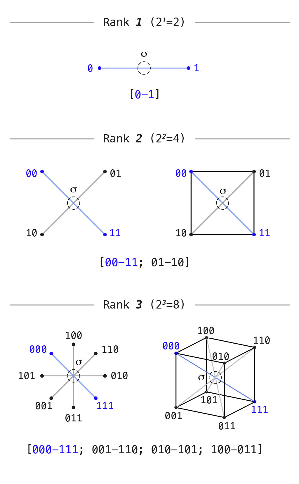
*Note: the rays through the center in the rank diagram depict diametrically opposite pairs, not coordinate axes.*

The rest of the article develops the construction specifically for **rank 3**: the first genuinely three-dimensional carrier in this sequence.

Three properties are preserved in the chosen geometric representation:

1. **A common center of symmetry.** The axes meet at the center of the figure. Under the exchange of all opposite vertices, the center remains fixed. Scene states occupy the vertices; the center displays their symmetry.
2. **Pairwise complementarity of states.** Every state has exactly one diametrically opposite vertex in which all zeros are replaced by ones and all ones by zeros.
3. **Equality of vertices under symmetry.** No state is privileged in advance: rotations and reflections can permute the vertices while preserving the figure.

At rank 3, the eight cube vertices form four pairs of diametric opposites: 000–111, 001–110, 010–101, 011–100. There are three coordinate axes but four opposite pairs: the axes correspond to individual coordinates, whereas the pairs correspond to simultaneous reversal of all coordinates.

### The polar axis of the range and the birth of the active scene

In the adopted binary labeling, select a **polar axis of the range**—the pair of limiting states in which all answers are zero or all are one. At rank 3 this is the pair 000–111, shown in blue in the diagram.

For the following construction, take this homogeneous pair as the limits of the range, while the mixed combinations will be treated as the active scene in which differences are active and contrast with one another.

In the color analogy, the continuous filling of the polar axis corresponds to a brightness scale: from black (000) to white (111). Along this axis all three coordinates are equal and there is no chromatic difference. The remaining six cube vertices contain differences between coordinates and therefore define chromatic relations.

This separation determines the distinction between the full and active carriers:

- **Full carrier:** at rank 3, this is the cube with all eight states and four pairs of opposites: 000–111, 001–110, 010–101, 011–100.


- **Active scene:** the states remaining after removal of the two limiting poles, 000 and 111. At rank 3, six mixed states remain, forming three opposite pairs: 001–110, 010–101, 011–100.

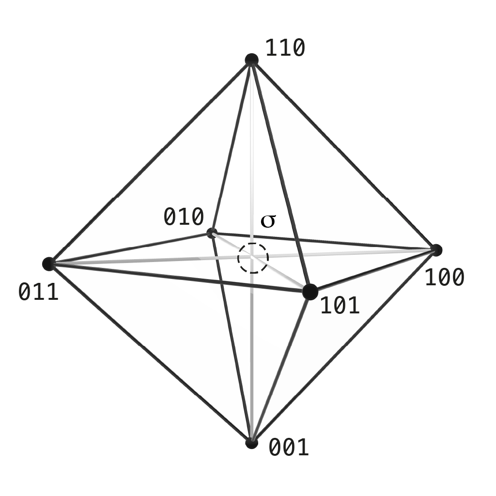

At every rank, two poles are removed from the full set:

- at rank 1, the active scene is empty: both states are poles;
- at rank 2, two states remain—one opposite pair, represented by a line;
- at rank 3, six states remain—three opposite pairs.

In this sequence, a single active line is immediately followed by a three-pair scene. Its three-dimensional representation is constructed from the relations among the six states.

<a id="formal-rank-polar-pair"></a>
<details markdown="1" id="details-formal-rank-polar-pair">
<summary><strong>▷ [Formal description] Rank, number of states, and the choice of a polar pair</strong></summary>

For $n\ge1$ independent binary distinctions, the full carrier is $Q_n=\{0,1\}^n$ and contains $2^n$ states. Independence here means that all combinations of coordinate values are admissible.

The full reversal $\kappa(x)=\mathbf1-x$ partitions the vertices into $2^{n-1}$ opposite pairs. The number of coordinate axes is $n$; for $n>2$, the number of diametric pairs already differs from it.

In the chosen labeling, fix the polar pair $P=\{\mathbf0,\mathbf1\}$. The active carrier is

$$X_{\mathrm{adm}}=Q_n\setminus P, \qquad |X_{\mathrm{adm}}|=2^n-2.$$

The number of active pairs is $2^{n-1}-1$. At ranks $1,2,3$ this gives respectively $0,1,3$ pairs.

The pair $P$ depends on the labeling of the two sides of the individual coordinates. For example, reversing the labels of the first coordinate maps the pair $\{000,111\}$ to $\{100,011\}$. Coordinate permutations and global complementation preserve the original pair.

The geometric representation additionally uses the standard Euclidean metric and mutually perpendicular coordinate axes with equal scale. The center of the continuous cube is $\sigma_{1/2}=(1/2,\ldots,1/2)$; it is not among the discrete vertices. Combinatorial independence alone determines neither a metric nor angles between axes.

</details>


## 8. Geometry of Relations: From the Step of Change to the Octahedron

The six states of the active scene specify admissible outcomes. But perceptual experience is determined not by isolated points alone but by relations among them: transitions from one state to another, distinctions between what is near and what is opposite.

The full reversal exchanges the two sides within one opposite pair. Yet different states in the scene also have different degrees of proximity. The number of binary coordinates that must be switched in order to move from one state to another—the Hamming distance—provides a measure of that proximity:

- 10**0** → 10**1**: one coordinate changes (nearest neighbors);
- **10**0 → **01**0: two coordinates change (intermediate distance);
- **001** → **110**: all three coordinates change (diametric opposition).

On the six states of the active scene, this rule defines exactly three disjoint classes of relations:

1. **One step (adjacency and a closed cycle):**  
   Transitions changing exactly one coordinate connect all six states into a single continuous closed cycle:  
   001 → 101 → 100 → 110 → 010 → 011 → 001.

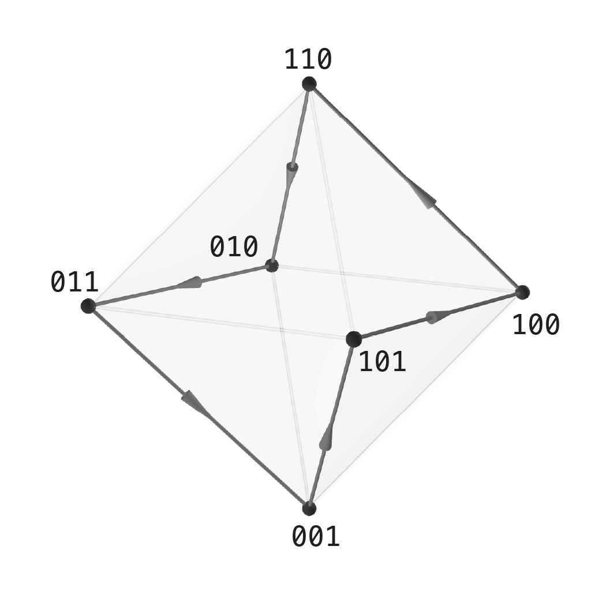

   Each step in this cycle changes one distinction while preserving the other two.

2. **Two steps (splitting into two triads):**  
   Transitions changing two coordinates divide the six states into two disjoint triples (triads):  
   001, 010, 100—the first triple; 110, 101, 011—the second.

   In the first triple exactly one bit is 1; in the second exactly two bits are 1. Within each triple, all states are mutually equidistant.

3. **Three steps (diametric opposites):**  
   Transitions changing all three coordinates simultaneously form three mutually opposite pairs:  
   001–110, 010–101, 011–100.


   These relations connect complete antipodes through the central point of symmetry.

All three types of relation are defined on the same six states. Every unordered pair belongs to exactly one of these classes: two states differ in one, two, or three coordinates.

If nearest-neighbor relations (1 step) are united with relations inside the triads (2 steps), the resulting edge network is the graph of an **octahedron**. To draw a regular octahedron, place the six states symmetrically while preserving these relations. Each vertex is connected to four others; its opposite vertex lies at the other end of an internal diagonal. The three such diagonals intersect at a common center.

The cube and the regular octahedron are related by **duality**: placing vertices at the centers of the six faces of a cube and joining centers of adjacent faces produces an octahedron. Opposite cube faces correspond to opposite octahedron vertices. This provides one way to visualize the obtained network; after the two poles are removed, the remaining cube vertices must be repositioned.

The construction of the active scene reveals a fundamental distinction between the **objective structure of relations** and the **observer's subjective convention**:

1. **Invariance of relations.** Once a polar pair and the adjacency rules have been chosen, the relational configuration is fixed: a closed six-cycle, two opposing triads, and three pairs of opposites. Names such as colors, notes, or divisors do not alter these relations. In the applications of §9, the same scheme appears as a color wheel and complementary color pairs, intervals of a whole-tone scale, and divisibility relations between numbers.
2. **Freedom in choosing coordinates.** To write states numerically, the observer must choose a reference system: an ordering of distinctions (which axis is called first, second, third) and a polarity convention (which side is called 0 and which 1). Permuting the axes or simultaneously exchanging all zeros and ones preserves the chosen polar pair and all three classes of relations.

The choice of labeling determines the written codes and the polar pair; subsequent names assigned to vertices allow the same network to be read in different substantive contexts.

<a id="formal-graph-structure-symmetries"></a>
<details markdown="1" id="details-formal-graph-structure-symmetries">
<summary><strong>▷ [Formal description] Graph structure and classification of scene symmetries</strong></summary>

On the active carrier $X_{\mathrm{adm}}=\{0,1\}^3\setminus\{000,111\}$, the complete graph of pairwise relations $K_6$ contains $\binom62=15$ pairs. The Hamming metric $d_H$ partitions the edges of the complete graph strictly into three disjoint regular layers:

$$E(K_6)=E(R_1)\sqcup E(R_2)\sqcup E(R_3), \quad 15=6+6+3.$$

1. **Layer $R_1$ (distance 1):** a connected 2-regular subgraph—a Hamiltonian cycle on six vertices (6 edges). It gives the minimal discrete traversal of neighboring states.
2. **Layer $R_2$ (distance 2):** a disconnected 2-regular subgraph—two triangles $2K_3$ (6 edges), stratifying the carrier by Hamming weight into two planes ($w=1$ and $w=2$).
3. **Layer $R_3$ (distance 3):** a 1-regular subgraph—a perfect matching of antipodes $3K_2$ (3 edges). It is the fixed-point-free involution of full complementation, connecting diametric pairs through central inversion.

**The octahedral graph and its geometric realization:**  
The union of the first two metric layers, $R_1\cup R_2=K_6\setminus R_3$, is the abstract 4-regular complete tripartite graph $K_{2,2,2}$ (the octahedral graph). In its standard convex realization, its eight triangular cycles become the eight faces of an octahedron. In the inherited Euclidean coordinates of the cube, edges in $R_1$ have length $1$ while edges in $R_2$ have length $\sqrt2$; a regular octahedron appears only after a symmetric re-embedding (for example, at vertices $\{\pm e_1,\pm e_2,\pm e_3\}$). The layer $R_3$ gives the three internal spatial diagonals of the octahedron, intersecting at the center of symmetry $\sigma_{1/2}$.

**Symmetry groups and classification of bases:**

- The full automorphism group of the octahedral graph, $\mathrm{Aut}(K_{2,2,2})\cong\mathbb Z_2^3\rtimes S_3$, has order 48 (permutations of the three opposite pairs and independent swaps within each pair).
- The automorphism group of the three-layer structure preserving each metric layer separately ($R_1\cong C_6$, $R_2\cong2K_3$, $R_3\cong3K_2$) has order 12 and is isomorphic to $S_3\times\mathbb Z_2$ (permutations of the three coordinates and global complementation).
- The full group of linear automorphisms of the vector space $\mathbb F_2^3$ is $\mathrm{GL}_3(\mathbb F_2)$ of order 168. It acts transitively on the 168 ordered linear bases; quotienting by permutations of the three axes $S_3$ gives $168/6=28$ classes of unordered bases. Metric isometries of the Hamming cube form the hyperoctahedral group of order 48. Preserving the fixed polar vector $111$ selects its stabilizer in $\mathrm{GL}_3(\mathbb F_2)$, of order $168/7=24$, which after quotienting by $S_3$ gives $24/6=4$ classes of bases compatible with the chosen polar axis (the condition $v_1+v_2+v_3=111$).

**Relation to literals:**  
The six mixed binary words correspond bijectively to the six literals of the first volume: $e_i\leftrightarrow(i,1)$ and $\mathbf1-e_i\leftrightarrow(i,0)$ for $i\in\{1,2,3\}$. Literals of the same coordinate form incompatible opposite pairs at distance 3, while literals belonging to different coordinates are compatible. This determines the edges of $K_{2,2,2}$ and exactly matches the six octahedron vertices with the six faces of the Boolean cube. A detailed combinatorial analysis of the subgraphs is given in [“The Observer as a Finite Structure of Distinction”](https://habr.com/ru/articles/1058448/).

</details>


## 9. Projections of One Combinatorics: Color, Sound, and Arithmetic

The resulting six-point scheme does not depend on the substantive names assigned to its vertices. To make this explicit, consider three labelings: the color vertices of the RGB cube, pitch classes of a whole-tone scale, and divisors of the number 30.

In all three cases, the elements can be matched explicitly so that the adjacency cycle, the two triads, and the three complementary pairs are preserved. This allows one relational structure to be investigated through different examples:

- in **color space** (§9.1), three opposite color pairs form a six-sector color wheel, two complementary models (RGB and CMY), and complementary color pairs converging at a neutral gray center;
- in **musical tuning** (§9.2), whole-tone steps select a six-note whole-tone scale, which decomposes into two augmented triads and limiting harmonic antipodes—tritones;
- in the **arithmetic of divisors** (§9.3), three prime factors of a square-free number organize its proper divisors into the same system of divisibility relations and complementary pairs.

### 9.1. Color projection: from cube to octahedron

A natural model of the full rank-3 carrier is the standard **RGB color cube**:

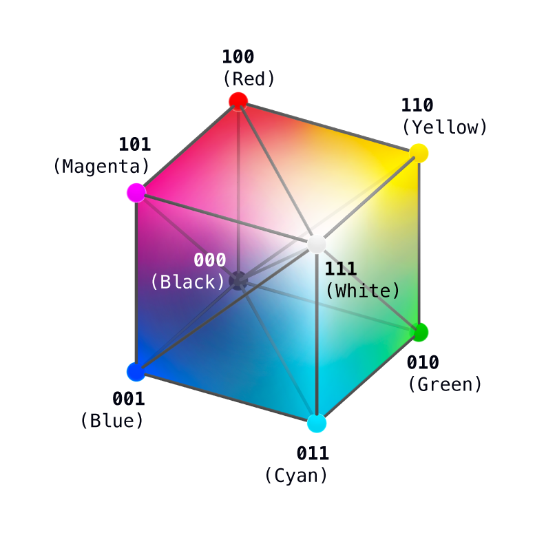

Its vertices encode eight states: the limiting poles—black (000) and white (111)—together with six chromatic colors.

Removing black (000) and white (111) leaves six active vertices—the **chromatic octahedron**:
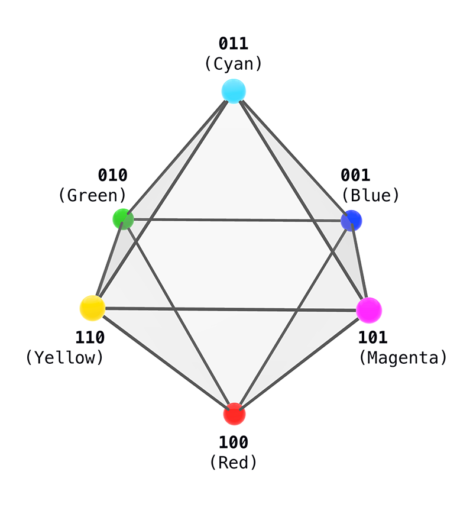
On it, relations between colors are represented by three kinds of connections:

- **Six-sector color wheel (adjacency, distance 1):** adjacency forms a closed traversal through all six octahedron vertices, alternating additive and subtractive colors:  
  Red (100) → Yellow (110) → Green (010) → Cyan (011) → Blue (001) → Magenta (101) → Red (100).

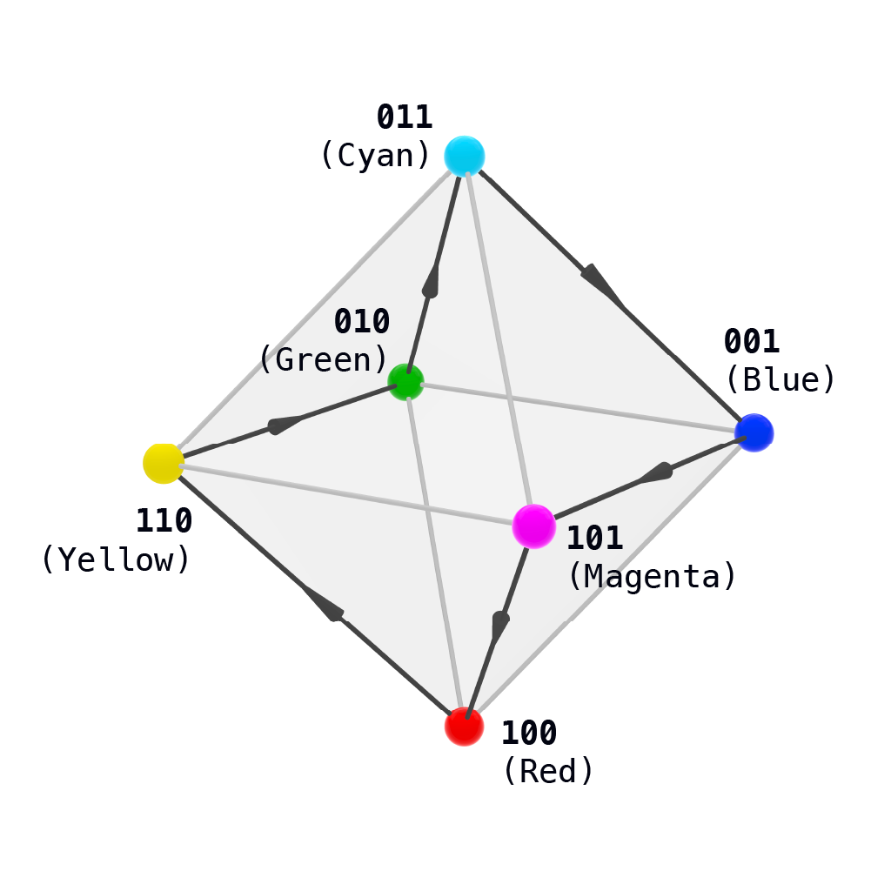
- **Additive and subtractive models (triads, distance 2):** vertices with one 1 form the additive **RGB** model (Red 100, Green 010, Blue 001), while vertices with two 1s form the colors of the subtractive **CMY** model (Yellow 110, Magenta 101, Cyan 011). In the octahedron they form two opposite parallel triangular faces.

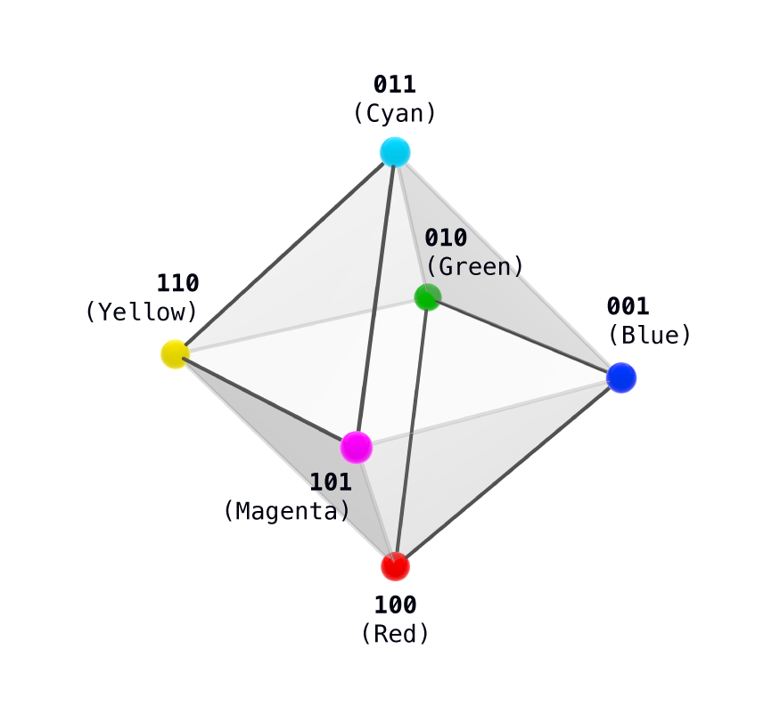
- **Complementary pairs (antipodes, distance 3):** diametric opposites connect complementary pairs: Red–Cyan, Green–Magenta, Blue–Yellow. Complementarity is given by bitwise complementation in the geometric RGB-cube model. Averaging the coordinates of complementary colors gives neutral gray: each of the three color channels takes half its full value.
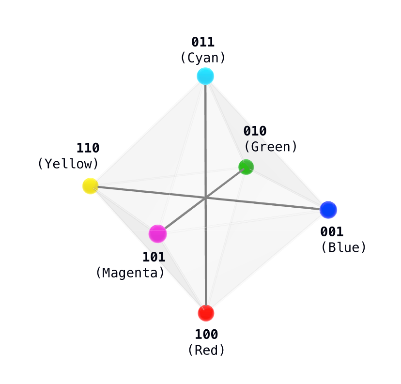
### 9.2. Sound projection: the whole-tone scale

In twelve-tone equal temperament, a whole-tone step (two semitones) selects a **whole-tone scale** of six notes: C, D, E, F♯, G♯, A♯. Notes separated by an octave are treated here as repetitions of the same pitch class.

The six tones carry the same octahedral system of relations. The complementary group of six belongs to a further extension of the labeling: its numerical labels are obtained by products of adjacent labels from the primary group—for example, multiplying 2 by 6 gives 12. It is shown here to compare the two whole-tone collections:
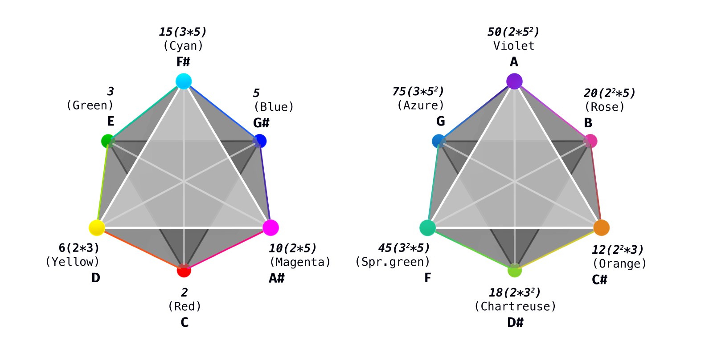
*The diagram shows two mutually complementary octahedra that together exhaust the 12 pitch classes of the chromatic octave: on the left, the primary whole-tone scale C, D, E, F♯, G♯, A♯; on the right, the second complementary scale C♯, D♯, F, G, A, B. Notes, color labels, and numerical divisors are shown simultaneously at the vertices.*

To make the relational structure visible in musical tuning, the three-dimensional octahedron is projected onto the plane of a twelve-tone chromatic circle. Under this projection, the three Hamming-metric layers become three different types of lines:

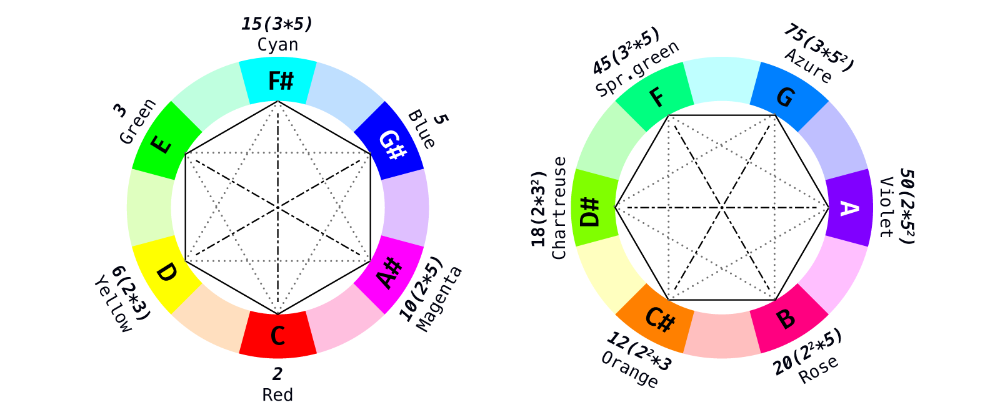

- **Whole tones (distance 1, solid hexagon):** adjacency in the six-vertex cycle corresponds to a whole-tone interval (C → D → E → F♯ → G♯ → A♯ → C). In the planar diagram this step forms the solid closed contour of the outer hexagon.
- **Two triads (distance 2, dashed triangles):** the six notes split into two augmented triads—two isolated triples: C, E, G♯ and D, F♯, A♯ (the exact structural analogue of the RGB and CMY triples). In the diagram they form two opposing dashed triangles.
- **Tritones (distance 3, dash-dot diameters):** diametric pairs of the octahedron form exactly three tritones—[C–F♯], [D–G♯], [E–A♯]. A tritone divides the octave exactly in half and serves here as the limiting harmonic antipode; in the diagram these opposites are connected by dash-dot lines through the center of the circle.

The choice of starting note functions as a musical calibration: transposition changes the note names but preserves all interval relations of the whole-tone collection.

### 9.3. Arithmetic projection: the multiplicative lattice of divisors of 30

In elementary number theory, the same relational scheme appears among the divisors of 30. The number is the product of three distinct primes—2, 3, and 5. Each prime factor is either present in a divisor or absent, so a divisor can be written using three binary coordinates:

- **Polar axis:** the trivial divisors 1 (analogue of 000) and 30 (analogue of 111) are excluded as the limits of the range.
- **Six divisors other than 1 and 30:**
  - the three primes (weight 1): 2, 3, 5—indivisible primary elements (RGB in the color labeling; C, E, G♯ in the note labeling);
  - the three composites (weight 2): pairwise products 6, 10, 15: six is obtained from two and three, ten from two and five, fifteen from three and five (CMY in the color labeling; D, A♯, F♯ in the note labeling).
- **Relations between divisors by Hamming distance:**
  - **Distance 1:** direct divisibility (multiplication or division by one prime factor) gives the cycle 2 → 6 → 3 → 15 → 5 → 10 → 2.
  - **Distance 2:** separation into the prime triple 2, 3, 5 and the triple of products 6, 10, 15; every pair within the latter triple shares one prime factor.
  - **Distance 3:** complementary divisor pairs with constant product 30: 2–15, 3–10, 5–6.

Joining the pairs at distances 1 and 2 again reproduces the edge skeleton of an octahedron.

In the whole-tone diagrams above (both the three-dimensional octahedron and the circular projection), divisors of 30 are already placed beside the vertices. Divisibility makes the isomorphism among the three domains visually explicit: the prime divisors 2, 3, 5 occupy exactly the additive face (RGB) and the notes C, E, G♯, while the pairwise products 6, 10, 15 occupy the subtractive face (CMY) and the notes D, F♯, A♯. Direct divisibility repeats the closed six-step cycle (distance 1), while diametric pairs of complementary divisors (whose product is 30) exactly coincide with the tritone lines and complementary-color pairs (distance 3).

Correspondence of states in the three examples:

| Binary code | Number of 1s | Color | Note | Divisor of 30 | Color triad |
| :---: | :---: | :--- | :--- | :---: | :--- |
| **100** | 1 | Red | C | 2 | RGB |
| **110** | 2 | Yellow | D | 6 | CMY |
| **010** | 1 | Green | E | 3 | RGB |
| **011** | 2 | Cyan | F♯ | 15 | CMY |
| **001** | 1 | Blue | G♯ | 5 | RGB |
| **101** | 2 | Magenta | A♯ | 10 | CMY |

| Number of changed coordinates | Form of relation | Color | Sound | Divisors of 30 |
| :--- | :--- | :--- | :--- | :--- |
| **One** | Closed six-vertex cycle | Six-sector wheel | Whole tone—two semitones | Multiply or divide by one prime factor |
| **Two** | Two triangles | RGB and CMY triads | Two augmented triads | Triple 2, 3, 5 and triple 6, 10, 15 |
| **Three** | Three opposite pairs | Complementary colors | Three tritones | Pairs with product 30 |

<a id="formal-color-sound-arithmetic"></a>
<details markdown="1" id="details-formal-color-sound-arithmetic">
<summary><strong>▷ [Formal description] Compatibility of the color, sound, and arithmetic labelings</strong></summary>

The table defines bijections from the active scene to three sets of labels. For color, use $c(x)=x$ on the vertices of the RGB cube. For an opposite pair $y=\mathbf1-x$,

$$c(x)+c(y)=(1,1,1),\qquad \frac{c(x)+c(y)}2=(1/2,1/2,1/2).$$

This is coordinate averaging in the chosen RGB model.

In the cyclic order $(100,110,010,011,001,101)$, the musical labels have pitch classes $(0,2,4,6,8,10)$ modulo $12$. The circular distance in semitones between labels $p,q$ is

$$\delta(p,q)=\min(|p-q|,12-|p-q|).$$

For every pair among these six states, $\delta(p(x),p(y))=2d_H(x,y)$. The layers $R_1,R_2,R_3$ correspond respectively to whole tones, major thirds within augmented triads, and tritones.

The arithmetic labeling is given by

$$d(x)=2^{x_1}3^{x_2}5^{x_3}.$$

The poles $000,111$ correspond to the divisors $1,30$. For the remaining six states:

- $R_1$: multiplication or division by one prime factor; cycle $C_6$;
- $R_2$: the two triples $\{2,3,5\}$ and $\{6,10,15\}$; graph $2K_3$;
- $R_3$: complementary divisors satisfying $d(x)d(y)=30$; matching $3K_2$.

The union $R_1\cup R_2$ is $K_{2,2,2}$. These correspondences preserve the chosen three relations. Physical laws of color mixing and perceptual laws of musical intervals require their own domain-specific models.

</details>

*The diagrams with two octahedra and the icosahedron show a further extension of the labeling; its detailed mathematical analysis is presented in a separate publication.*

The color vertices, notes of the whole-tone scale, and divisors of 30 realize one and the same three-layer relational scheme. A further development of this structure into a 12-part icosahedral system is investigated in [“Combinatorial Synesthesia: Chords and Colors as Arithmetic of Divisors on the Icosahedron”](https://habr.com/ru/articles/1058556/).

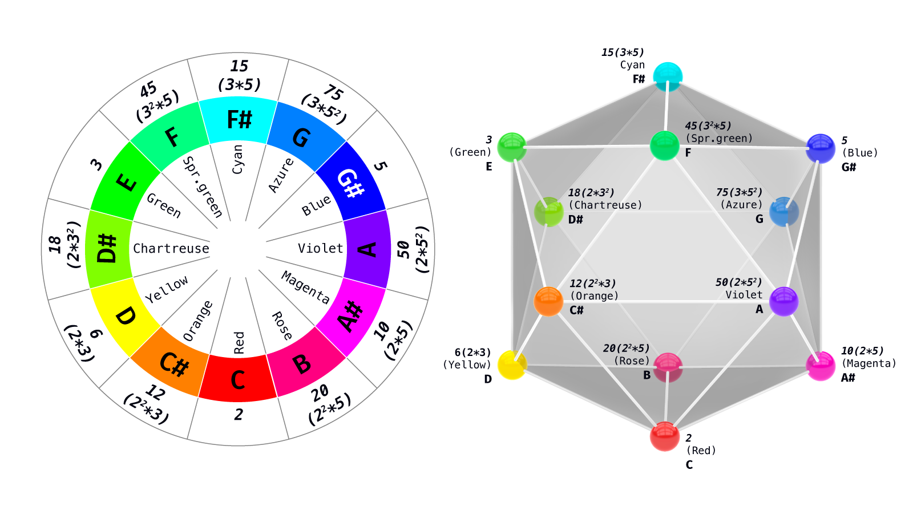


## 10. Structural Summary and the Mathematical Bridge to Part II

The constructed scheme connects a step of state change with preservation of common context. Several independent distinctions form a joint scene on which relations between states can be investigated:

1. **Interface of observation:** a step changes the state, while preserved reading makes it possible to recognize the common context. The role of observation is described through this coupling.
2. **Procedure for counting admissible variants:** the adopted conditions make it possible to determine which modes of action are admissible, where a solution is unique, and where freedom of choice remains.
3. **Active rank-3 scene:** after excluding the two homogeneous poles, six mixed states remain. Their relations form a cycle, two triads, and three opposite pairs. The union of the cycle and triad relations gives the edge network of an octahedron.
4. **Center of symmetry:** in the geometric representation, opposite pairs pass through the common midpoint of the figure. Under exchange of opposites, that midpoint remains fixed.

Sequence of construction:

1. Select an object relative to a position of observation and a background.
2. Consider a two-sided boundary and the exchange of its sides.
3. Connect state change with preservation of common context.
4. Specify conditions under which a distinction remains available to continuation.
5. Assemble several independent distinctions into a joint scene.
6. Investigate its relations and compare their realizations in color, sound, and divisors.

### What remains for Part II

The second part (“The First Mathematical Model of Distinction”) will examine four questions in detail:

1. **Uniqueness of the exchange step:** which conditions leave the full reversal of all coordinates as the unique operation on the cube.
2. **Freedom in choosing coordinates:** which changes of labeling preserve the organization of the scene.
3. **Preserved answers:** what can be learned about a state when the answer is required to remain invariant under reversal.
4. **Discrete and continuous:** how individual state pairs relate to the common center of their geometric representation.

<a id="formal-part-two-program"></a>
<details markdown="1" id="details-formal-part-two-program">
<summary><strong>▷ [Formal description] Mathematical program of Part II</strong></summary>

1. **Uniqueness of the exchange step ($40320\to105\to7\to1$):** among all $8!=40320$ possible permutations of cube states, the imposed negative conditions (the requirement of a free involution $\kappa^2=\mathrm{id}$, $\kappa(x)\neq x$, compatibility with translations, and compatibility with permutations of distinctions) successively eliminate the remaining alternatives, leaving exactly one joint solution within this class of cube permutations—the full inverse reversal $\kappa$.
2. **Symmetries of the carrier and classification of bases:** the group $\mathrm{GL}_3(\mathbb F_2)$ of order 168 acts transitively on 168 ordered coordinate bases; after identifying bases that differ only by permutations of the three axes, 28 classes remain ($168/|S_3|=28$). Metric isometries of the cube form the hyperoctahedral group of order 48, while the stabilizer of the polar vector $111$ in $\mathrm{GL}_3(\mathbb F_2)$ has order 24 (4 classes after quotienting by $S_3$).
3. **Invariant reading and projective geometry:** quotienting the cube by the orbits of the reversal $\kappa$ divides 8 states into 4 opposite pairs and produces 16 Boolean invariant readings forming a 4-dimensional vector space $\mathbb F_2^4$. Constant functions form a 1-dimensional subspace of trivial readings $\langle\mathbf1\rangle$. The quotient space by trivial constants, $\mathbb F_2^4/\langle\mathbf1\rangle\cong\mathbb F_2^3$, has dimension 3; after projectivization, its 7 nonzero classes form the 7 points of the Fano projective plane $\mathrm{PG}(2,2)$, where each point corresponds to a pair of nontrivial complementary invariants $\{f,\neg f\}$, and its 7 lines are given by seven triples of these points.
4. **Boundary of the discrete model and continuous convex extension:** on the cube vertices, the equation $\kappa(x)=x$ has no solutions, so the invariant of the discrete model is an orbit relation rather than a fixed vertex. Under a separate choice of the continuous convex extension $[0,1]^3$, a fixed point $\sigma_{1/2}$ of the affine reversal appears.

</details>


### Published Materials in the Series

Individual parts of the model have been discussed in previously published articles:

- [“The Observer as a Finite Structure of Distinction”](https://www.reddit.com/r/cybernetics/comments/1tbc6wm/observer_as_a_finite_structure_of_distinction/) — development of the minimal observer model on the Boolean cube, the six-point scene, the octahedron, and an opponent color wheel.
- [“Observer and Distinction: Dual Faces of One ∞”](https://www.reddit.com/r/combinatorics/comments/1us793e/observer_and_distinction_dual_faces_of_one/) — the boundary of the discrete model, the prohibition of a fixed point of reversal, and the passage to a continuous space with a center of symmetry.
- [“Combinatorial Synesthesia: Chords and Colors as Divisor Arithmetic on the Icosahedron”](https://www.reddit.com/r/combinatorics/comments/1urhkt2/combinatorial_synesthesia_chords_and_colors_as/) — coordination of perceptual modalities through polyhedral geometry and arithmetic lattices of divisors.

An earlier version of the project is available in the [DOT: Distinction Observable Theory archive, version 4](https://github.com/Nondual-Observer/DOTheory).


---

### License and Copyright

&copy; 2026 Igor Zhuk ([igor.m.zhuk@gmail.com](mailto:igor.m.zhuk@gmail.com)).  

This work is published under an open, public, non-commercial license: **Creative Commons Attribution-NonCommercial 4.0 International ([CC BY-NC 4.0](https://creativecommons.org/licenses/by-nc/4.0/))**.

* **Free Use:** You are free to read, download, share, cite, and use this material for any educational, research, and personal non-commercial purposes.
* **Attribution:** Appropriate credit must be given to the author (Igor Zhuk) with a link to the original publication ([https://nondual-observer.github.io/ObserverInterfece/](https://nondual-observer.github.io/ObserverInterfece/)).
* **Non-Commercial:** Commercial use of this material without prior written permission from the author is strictly prohibited.

<script>
window.MathJax = {
  tex: {
    inlineMath: [['$', '$'], ['\\(', '\\)']],
    displayMath: [['$$', '$$'], ['\\[', '\\]']]
  }
};
</script>
<script defer src="https://cdn.jsdelivr.net/npm/mathjax@3/es5/tex-mml-chtml.js"></script>

<script>
(function () {
  function openHashTarget() {
    if (!window.location.hash) return;
    var id = decodeURIComponent(window.location.hash.slice(1));
    var target = document.getElementById(id);
    if (!target) return;

    var details = target.tagName && target.tagName.toLowerCase() === 'details'
      ? target
      : target.nextElementSibling && target.nextElementSibling.tagName && target.nextElementSibling.tagName.toLowerCase() === 'details'
        ? target.nextElementSibling
        : target.closest && target.closest('details');

    if (details) details.open = true;

    window.setTimeout(function () {
      target.scrollIntoView({ behavior: 'smooth', block: 'start' });
    }, 0);
  }

  document.addEventListener('DOMContentLoaded', openHashTarget);
  window.addEventListener('hashchange', openHashTarget);
})();
</script>
