<div class="lang-switch">
  <span>🌐 <strong>Язык:</strong> Русский</span>
  <a href="../" class="lang-btn">🇬🇧 Read in English (EN)</a>
</div>

# Интерфейс наблюдения: как математически формализовать акт различения

**Автор:** Игорь Жук ([igor.m.zhuk@gmail.com](mailto:igor.m.zhuk@gmail.com))  
*Препринт / Исследовательский проект DOT (Distinction Observable Theory)*  
*DOI архива:* [10.5281/zenodo.20257220](https://doi.org/10.5281/zenodo.20257220)


*Можно ли ввести наблюдателя и его первичное действие в строгую науку, избегая умозрительной метафизики и дурного регресса («кто наблюдает за наблюдателем»)?*

В статье исследуются условия, необходимые для того, чтобы совершить элементарный акт различения, зафиксировать его результат и передать следующему действию. Этот механизм описывается через интерфейс наблюдения — связку шага изменения и сохраняемого контекста. На выбранной двоичной модели затем строится совместная сцена различений и разбираются её геометрические, цветовые, музыкальные и арифметические представления.

Основная линия изложена словами и показана на примерах. Формулы, строгие определения и математические разборы вынесены в спойлеры со знаком «▷». При первом чтении их можно пропускать: объяснения в основном тексте читаются самостоятельно.

Материал разделён на 3 маршрута чтения:

1. **Концептуальное ядро (§1–§6):** позиция наблюдателя, интерфейс «шаг — контекст» и три фундаментальных запрета. Читается как наглядный общенаучный разбор. *(Время чтения без блоков «▷»: ~20–25 мин.)*
2. **Полный популярный маршрут (§1–§10):** ядро плюс наглядное развёртывание на элементы графов — многомерная геометрия сцены (куб, октаэдр), проекции на звук и цвет. 
   *(Время чтения без блоков «▷»: ~35–40 мин.)*
3. **Чтение с математическими разборами (статья целиком):** полный текст со строгими определениями, обоснованиями и дополнительными результатами. Для блоков «▷» пригодятся основы комбинаторики, линейной алгебры и представление о группах симметрий. 
   *(Время чтения: от 60 мин.)*

*Это первая, вводная часть исследования: она связывает три уже вышедших разбора цикла (ссылки — в конце) в единую предматематическую картину. К выходу планируется вторая часть со строгим математическим аппаратом и доказательствами теорем.*


---

## 1. Что именно можно формализовать

Формализовать сознание целиком — неопределённая задача. Для точного анализа необходимо выделить операциональную структуру: **условия, при которых нечто в опыте оказывается различённым, сохраняется и может быть использовано на следующем шаге восприятия**.

Познавательный акт объединяет два взаимосвязанных плана. **Феноменологический план** относится к тому, кто переживает происходящее и как оно ему дано. **Операционно-логический план** описывает структуру различий: что отделено от чего, какие изменения возможны и что должно сохраняться при переходе к следующему действию.

### Феноменологический план: субъект, чувствование и действие

В непосредственном опыте можно выделить три связанных аспекта:

1. **Субъект опыта — позиция «Я».**  
   Воспринимающий и организующий центр, относительно которого разворачивается поле опыта. Из этой позиции мы рассматриваем происходящее, выделяем предмет внимания и сопоставляем впечатления. Она *задаёт перспективу наблюдаемой сцены*.
    
2. **Чувствование — воспринимаемое воздействие мира.**  
   Цвет, звук, тепло, плотность, сопротивление объектов даны нам как конкретные переживаемые качества. Это воспринимающая сторона взаимодействия: *происходящее становится содержанием опыта*.
    
3. **Действие — активное участие субъекта.**  
   Мы движемся, говорим, прилагаем усилия, перемещаем и преобразуем объекты. Это исходящая сторона взаимодействия: *субъект становится источником изменений в окружающем мире*.

Чувствование и действие неразрывно связаны: увиденное может направить следующее движение, а движение — изменить то, что становится видимым. Их непосредственная качественная сторона — как ощущаются цвет, тепло или собственное волевое усилие — относится к тому, что в философии называют **квалиа**.

*Граница формализации:* онтологическая природа субъекта и метафизический статус квалиа остаются за пределами математического аппарата статьи. Предметом модели становятся **различия объектов, их взаимодействия и условия сохранения результата**, благодаря которым наблюдение может продолжаться.

### Операционно-логический план: различить, связать и сохранить

Чтобы описать эту работу на языке отношений, предстоит решить три взаимосвязанные задачи:

1. **Первичное различение.**  
   Выделение чего-либо проводит границу: относительно выбранного признака появляется «это» и «не-это». Необходимо установить, *какие стороны различены и каким правилом задаётся переход между состояниями*. С простейшего двустороннего различения начинается дальнейшее построение.
    
2. **Различение структуры.**  
   Одновременно могут быть доступны разные признаки: цвет и форма, положение и удалённость. Здесь важно описать не только каждый отдельный ответ, но и связи между ними: *какие сочетания возможны, что меняется вместе и что может изменяться независимо*. Так возникает задача общей многомерной сцены различений.
    
3. **Сохранение результата и накопление.**  
   Полученное различие должно оставаться доступным следующему действию. Для этого требуется сохранять результат и возможность сопоставить его с новым состоянием. Отсюда возникают вопросы памяти и преемственности: *что именно удерживается после шага и как сохранённое может участвовать в дальнейшем наблюдении*.

### Как эти стороны познания рассматриваются в науке

В этой статье внутренний опыт и описание его структуры сопоставляются через три пары:

* **Субъект опыта и первичное различение:**  
  Субъект задаёт позицию рассмотрения; первичное различение описывает проведение границы — что именно выделяется и относительно чего.

* **Чувствование и различение структуры:**  
  Чувствование поставляет многообразие переживаемых качеств; различение структуры описывает их сочетания и взаимные отношения на сцене.

* **Действие и сохранение результата и накопление:**  
  Действие выражает активность субъекта, изменяющую окружающее; сохранение результата позволяет удерживать след совершённого и использовать полученное в последующих шагах.

Сходные связи между восприятием, действием и согласованием опыта исследуются в **философии познания, физиологии и исследованиях восприятия**:

- **Философия познания Иммануила Канта:**  
  *Воспринимаемое содержание:* чувственность даёт материал опыта (цвет, звук, прикосновение). Через неё предмет нам дан, но полученные впечатления ещё разрозненны.  
  *Активная работа:* рассудок соединяет впечатления по понятиям и правилам, вынося суждения об объектах.  
  *Согласование:* все представления соотносятся с формулой «я мыслю» — единым самосознанием, объединяющим чувственный материал и работу рассудка в связный опыт.

- **Теория функциональных систем П. К. Анохина:**  
  *Воспринимаемое содержание:* организм непрерывно получает афферентные сигналы от среды и собственного тела.  
  *Активная работа:* на этой основе формируется программа действия и ожидаемый результат.  
  *Согласование:* обратная афферентация сообщает о реальном итоге; расхождение с ожиданием направляет коррекцию. Восприятие, память, действие и проверка результата образуют единый замкнутый цикл.

- **Сенсомоторный подход Кевина О’Ригана и Алвы Ноэ:**  
  *Воспринимаемое содержание:* зрению доступны цвет, очертания и расположение предметов, меняющиеся вместе с движением глаз и тела.  
  *Активная работа:* человек переводит взгляд, приближается, обходит предмет — движение становится активным способом исследования среды.  
  *Согласование:* воспринимающий осваивает закономерности изменений: как смена ракурса трансформирует очертания. Зрительный опыт опирается на практическое владение связью между собственным действием и изменением ощущений.

### От описания сторон — к единому механизму

Цель дальнейшей формализации — собрать эти стороны наблюдателя и акта различения в единую математическую структуру.

Наглядный образец подобных структурных связей даёт геометрия: одну и ту же величину можно *измерить* или *вычислить*. Теорема Пифагора позволяет вычислить длину гипотенузы прямоугольного треугольника по длинам двух катетов.

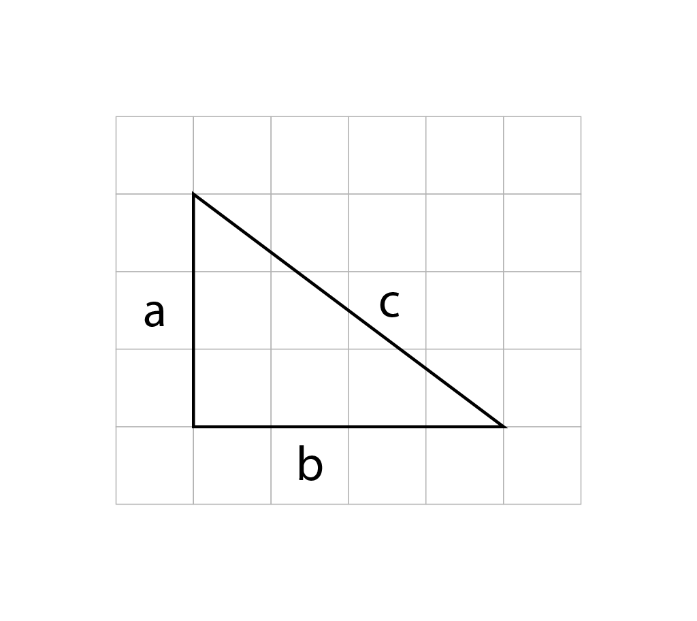

Для катетов длиной 3 и 4 можно вычислить гипотенузу: 5. И при этом ту же длину можно измерить линейкой. **Геометрическое построение и числовой расчёт работают как два согласованных способа выражения одной структуры.**

<details markdown="1">
<summary><strong>▷ [Пример] Геометрия и вычисление длины.</strong></summary>


Для прямоугольного треугольника с катетами $a$, $b$ и гипотенузой $c$:

$a^2+b^2=c^2, \qquad 3^2+4^2=5^2.$

В примере длина гипотенузы равна $5$.

</details>

Так возникает задача этого исследования: создать единый механизм — **интерфейс наблюдения**, — в котором проведение различия, изменение состояния, чтение результата и его дальнейшее использование связаны в целостную систему.

Начнём с самого наблюдателя: **как учесть его позицию в описании и отличить её от образа наблюдателя среди воспринимаемых объектов?**


---

## 2. Наблюдатель в модели и субъект опыта

Рассмотрим элементарный пример со сменой ракурса наблюдения. Взгляд на стол делает стол исходным предметом рассмотрения. Затем можно рассмотреть суждение о столе: спросить себя, почему он кажется деревянным. Предметом анализа становится предыдущее суждение. Следующим шагом предметом становится сам способ этой оценки.

Такой переход продолжается: стол, суждение о столе, способ вынесения суждения. Но объектом каждый раз оказывается не сама действующая позиция наблюдения, а её описание, проекция — мысль, образ или модель. Текущая позиция рассмотрения снова не совпадает ни с одним объектом сцены.

В кибернетике второго порядка (Х. фон Фёрстер) этот переход описан как движение от наблюдения систем к «наблюдению наблюдения». В описанной последовательности предметом следующего рассмотрения становится предыдущий шаг. Система способна строить описания собственных прошлых шагов, но любое такое описание остаётся содержанием на сцене, а не самой, воспринимающей и действующей позицией наблюдателя, для которой оно развёрнуто.

В каждом акте восприятия различимы **содержание** и **текущая позиция** его рассмотрения. Предыдущее содержание становится материалом для следующего шага, а позиция рассмотрения смещается вместе с наблюдателем. В модели этому соответствуют две **взаимодополняющие функции**: *изменение содержания и сохранение условия, по которому результаты остаются сопоставимыми.*

Близкая идея лежит в основе теории познания Иммануила Канта: разрозненные впечатления (звуки, предметы, мысли) объединяются в связный опыт одного человека только потому, что каждое из них соотносится с общим центром — формулой «я мыслю». Это «я» выступает неизменным связующим условием, которое собирает поток восприятий воедино, оставаясь за пределами ряда воспринимаемых вещей — трансцендентальным единством апперцепции.

> **[Определение] Наблюдатель** — это роль, которая связывает смену состояний с сохранением общего контекста. Его образ или описание может стать объектом сцены, но сама текущая позиция наблюдения не является ещё одним её состоянием.

<details markdown="1">
<summary><strong>▷ [Формальное описание] Типизация роли наблюдателя.</strong></summary>

В модели состояния сцены и роль наблюдения имеют разные типы. Множество $X$ содержит состояния; символ $O$ обозначает роль, реализуемую шагом изменения и сохраняемым чтением. Запись

$O \notin X$

фиксирует это соглашение. Описания наблюдателя могут входить в $X$ как состояния сцены.

</details>

---

## 3. Исходное целое и отрицательное начало: рождение границы

Восприятие первично дано как чувственный поток — нерасчленённое исходное целое. Поток впечатлений ещё не определяет, какие различия доступны наблюдателю и могут быть использованы дальше. Один и тот же материал может оставаться различимым по одним признакам и недоступным по другим.

Различие между непрерывным потоком переживания и структурой операциональных различий наглядно раскрывает следующий пример.

Представьте просмотр иностранного сериала в дубляже: понятен сюжет, различимы действия персонажей, смысл речи, её тембр и интонации. В некоторый момент звук переключается на оригинальную дорожку на незнакомом языке: смысловая часть диалога мгновенно исчезает.

При этом исчезает только способность вычленять из него структуру. Чувственная ткань опыта длится дальше, но смысловой канал перестаёт поставлять различия: один и тот же поток остаётся доступен по акустическим признакам и заблокирован по смысловым.

Понимание диалога складывается из цепочки действий над уже различённым материалом: услышать речь, выделить структуру, соотнести слова со значениями. Чтобы связать содержание в осмысленное отношение, наблюдатель должен располагать различиями, доступными данному способу чтения. Чтобы возник связанный смысл, необходимо вычленить различие из недифференцированного фона.

Наблюдатель упорядочивает мир тем же жестом, которым отделил себя от него. Первичное отрицание обособляет логическую позицию рассмотрения: **«Я как наблюдатель — это не то, что я воспринимаю»** («Я» / «Не-Я»). А внутри самого поля опыта выделение любого качества немедленно превращает весь остальной фон относительно выбранного признака в «не-это».

Далее рассматривается двустороннее различение: относительно выбранного признака выделяются «это» и «не-это». Граница отделяет выделенное качество от фона и удерживает обе стороны внутри одного поля рассмотрения.

Двусторонняя граница как первичный инструмент структурирования различий возникает в нескольких научных подходах, но выполняет там разные задачи:

- **В теории информации и кибернетике** (К. Шеннон, Г. Бейтсон) — как двоичное кодирование альтернатив и различие, влияющее на дальнейший процесс.
- **В лингвистике и когнитивной психологии** (Р. Якобсон, Дж. Келли) — как бинарная оппозиция: качество осознаётся через сопоставление с противоположным полюсом («светлое / тёмное», «тёплое / холодное»).
- **В логике формы** (Дж. Спенсер-Браун) — как первичное операциональное действие (*draw a distinction*), с которого начинается его исчисление.

**Отношение между полюсами задаёт способ их связи:** какие состояния сопоставляются друг с другом и как можно перейти от одного к другому.

Проведение границы задаёт разбиение на классы — делит состояния на две альтернативные группы («это» и «не-это»), — но правило взаимного сопоставления элементов задаётся отдельной операцией. Минимальная конфигурация границы — взаимно обратимый обмен: повторный переход возвращает исходное состояние.

> **[Определение] Акт различения** — элементарное дискретное событие, осуществляющее переход между противоположными сторонами границы и меняющее состояние системы (**шаг изменения**).

Внутри этого класса элементарный двусторонний шаг выражает три базовых свойства границы:

1. **Контраст (несовпадение сторон):** переход действительно меняет состояние. В модели это свойство исключает тривиальное тождество и развёртывается как требование сменяемости состояний и **запрет совпадения**.
2. **Взаимность и обратимость (сохранение контекста):** повторный переход возвращает исходное состояние. Оба состояния образуют одну пару, объединённую общим центром симметрии. Это задаёт **условие сохранения контекста**: совершённый шаг не может происходить с потерей связующего правила.
3. **Автономность и однозначность (внутренняя замкнутость):** для двух состояний взаимный обмен определяется однозначно. На большем носителе требуется задать, какие состояния образуют пары. Двоичный шаг замкнут в себе (**запрет внешней опоры**), а сочетание независимых различений разворачивается в геометрию куба состояний.

Две стороны одной границы остаются сторонами одного различения, а не двумя отдельными мирами. Поскольку акт различения развёртывается внутри поля восприятия как **исходное целое**, граница одновременно разделяет и связывает: обе её стороны принадлежат одному общему контексту.

<details markdown="1">
<summary><strong>▷ [Формальное описание] Разбиение пространства состояний и шаг инволюции.</strong></summary>

Пусть исходное пространство состояний данного различения задано множеством $X$. В двустороннем режиме проведение границы разбивает его на два непересекающихся непустых подмножества $A$ и $B$ (дизъюнктное объединение):

$$X = A \sqcup B, \quad A \neq \emptyset, \quad B \neq \emptyset.$$

Символ $\sqcup$ фиксирует два условия:

1. стороны взаимно исключают друг друга: $A \cap B = \emptyset$;
2. вместе они восстанавливают пространство состояний различения: $A \cup B = X$.

Разбиение $X = A \sqcup B$ задаёт классификацию состояний на два класса, но само по себе ещё не порождает отображения перехода между элементами. Построение шага изменения требует следующей цепочки данных:

1. требование равной мощности сторон: $|A| = |B|$;
2. выбор биекции $f \colon A \to B$;
3. задание инволюции $\alpha \colon X \to X$, обменивающей стороны:

$$\alpha(a) = f(a), \quad \alpha(b) = f^{-1}(b) \quad (a \in A, b \in B).$$

Полученное отображение удовлетворяет условиям свободной инволюции, обменивающей стороны:

$$\alpha^2 = \mathrm{id}_X, \quad \alpha(x) \neq x, \quad \alpha(A) = B, \quad \alpha(B) = A.$$

На минимальном двухэлементном носителе $X = \{a, b\}$ выбор биекции единственен — транспозиция $(a\,b)$.  
На конечном нечётном носителе свободных инволюций не существует: всякая инволюция конечного нечётного множества оставляет хотя бы один неподвижный элемент ($\alpha x = x$), что останавливает шаг изменения в этой точке.

</details>

---

## 4. Симметрия пары и ось связи: целостность различения

Две стороны границы определены исключительно относительно друг друга: ни одна из них не существует до и независимо от акта их разделения.

В логике формы Дж. Спенсер-Браун объявляет одну из сторон отмеченной (*marked*), а другую — неотмеченной (*unmarked*, пустотой или фоном). В таком описании стороны асимметричны: одна наделена признаком, вторая лишена его.

В предлагаемой модели стороны взаимно исключают друг друга как противоположные исходы одного различения, но остаются структурно равноправными. Разбиение пространства состояний не создаёт иерархии «знака» и «пустоты»: ни один из полюсов не имеет априорного преимущества.

Названия сторон — например, «ноль» и «единица» или «плюс» и «минус» — появляются лишь после выбора способа записи. **Но эта внешняя разметка не меняет структуру самой пары**: *при перемене меток отношение противоположности остаётся неизменным.*

Наглядным геометрическим прообразом такой симметричной пары служит отрезок: два его конца выделены структурой как граничные точки. Взаимный обмен меняет их местами и сохраняет саму пару, не выделяя ни один из концов в качестве исходного.

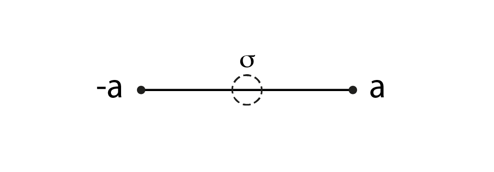

В геометрическом изображении взаимный обмен полюсов выражается отражением относительно неподвижного центра. Он показывает симметрию пары, оставаясь вне двух дискретных исходов.

В модели строго различаются три компонента:

1. **Пара дискретных состояний:** сами сменяемые исходы, которые переходят друг в друга и образуют отношение взаимного обмена.
2. **Геометрический центр:** середина отрезка (на схеме выше обозначена пунктирным кругом) — неподвижная точка непрерывного расширения, организующая симметрию обмена, но исключённая из дискретных исходов.
3. **Роль наблюдателя:** организующая позиция, удерживающая оба состояния как части одного общего контекста.

В аналогии механических весов предметы на чашах меняются высотой относительно неподвижной точки равновесия. Если попытаться включить саму точку опоры в число дискретных состояний движения, то при инверсии края обменяются местами, а середина так и останется неизменной. Устойчивая работа различения требует строго парных дискретных исходов (два конца отрезка или предметы на весах), тогда как центр симметрии служит невидимой осью их взаимной связи.

В методе дискретное и непрерывное выступают не изолированными мирами, а сторонами единого процесса:

- **Дискретная сторона** — это сменяемые состояния (полюса пары, противоположные стороны границы). Она обеспечивает контраст и выполняет шаг изменения: чтобы различение состоялось, состояние обязано меняться.
- **Непрерывная сторона** — непрерывное изображение позволяет представить ту же симметрию через промежуток между полюсами и его неподвижный центр.

В выбранной здесь модели свободного взаимного обмена третий дискретный исход создаёт затруднение: конечное нечётное число состояний невозможно разбить на пары без остатка. У всякой инволюции нечётного конечного множества неизбежно возникает неподвижная точка.

В предлагаемом подходе это затруднение снимается разведением функциональных ролей. Целостность пары не требует отдельного дискретного объекта на сцене: дискретные исходы поставляют сменяемое содержание (шаг), а непрерывный геометрический центр удерживает их симметрию. С исчислением самореференции Франсиско Варелы это сближает интерес к тому, что сохраняет связность операции. В нашей конструкции неподвижный центр появляется при геометрическом изображении обмена.

<details markdown="1">
<summary><strong>▷ [Контекст] Автономное значение Варелы и свободная инволюция.</strong></summary>

В исчислении самореференции Франсиско Варелы ([*«A Calculus for Self-Reference»*, 1975](https://homepages.math.uic.edu/~kauffman/VarelaCSR.pdf)), развивавшем аппарат Дж. Спенсера-Брауна, вводится «третье автономное значение» как результат замыкания операции на себя. В рамках трёхзначных логик такое состояние допустимо. Однако в классе моделей со свободной инволюцией (требующей отсутствия неподвижных состояний, $\alpha x \neq x$) конечный нечётный носитель исключает свободное обращение: у всякой инволюции конечного нечётного множества неизбежно возникает неподвижная точка, останавливающая шаг изменения. В исследовании [«Наблюдатель и различение: дискретное и непрерывное проявления изотропной границы»](https://habr.com/ru/articles/1058672/) рассматривается различие между дискретной парой и центром её непрерывного расширения. Сопоставление с автономным значением Варелы здесь носит характер аналогии; отображение между двумя исчислениями с сохранением их операций не построено.

</details>

Когда различений несколько, согласуются два структурных условия:

- **Внутренняя неразмеченность:** внутри каждой отдельной пары противоположные стороны сохраняют симметрию без выделения преимущественного полюса.
- **Различимость осей:** независимые акты различения образуют разные степени свободы сцены (что позволяет различать и нумеровать сами оси).

Нумерация осей фиксирует систему измерений, сохраняя структурное равноправие полюсов на каждой оси. Из таких независимых осей строится многомерная сцена состояний. Общий центр выражает симметрию всей сцены; принадлежность состояния конкретной паре сохраняется её собственным чтением.

Элементарное различение соединяет изменение состояния и сохранение связи между исходами. Геометрия делает эту связь наглядной: обмен полюсов оставляет центр отражения неподвижным. Согласование самого шага и сохраняемого чтения далее описывается как интерфейс наблюдения.

<details markdown="1">
<summary><strong>▷ [Формальное описание] Граничная пара, отражение и центр.</strong></summary>

Свободная инволюция на дискретном носителе определяет пары противоположных состояний. Геометрический центр возникает только после выбора непрерывного расширения, в котором эта инволюция реализована центральным отражением.  
На вещественной оси пара граничных точек задаётся симметричными координатами $P_R = \{-a, a\}$ (с масштабным параметром $a > 0$, как на схеме выше) или $\{0, 1\}$ на единичном отрезке $[0, 1]$. Взаимный обмен задаётся отражением $x \mapsto -x$ (соответственно, $x \mapsto 1 - x$). Единственная неподвижная точка этого отражения — геометрический центр симметрии $\sigma = 0$ (соответственно, $\sigma_{1/2} = 1/2$). Этот непрерывный инвариант отображения строго исключён из дискретного множества граничных состояний:

$$\sigma \notin P_R.$$

</details>

<details markdown="1">
<summary><strong>▷ [Пример] Алгебраическая модель неразмеченной пары.</strong></summary>

Корни уравнения $x^2+1=0$ задаются парой: мнимой единицей $i$ и противоположным числом $-i$. Автоморфизм комплексного сопряжения $z\mapsto\bar z$ меняет корни местами, сохраняя сложение и умножение поля $\mathbb C$. Структура поля определяет пару $\{i,-i\}$, оставляя члены взаимно равноправными: выбор одного из корней как выделенного представителя либо выбор ориентации комплексной структуры требует внешнего соглашения.

</details>

<details markdown="1">
<summary><strong>▷ [Следствие] Аффинный сдвиг и центральное отражение.</strong></summary>

На дискретном векторном пространстве $\mathbb{F}_2^n$ операция взаимного обмена $x \mapsto x \oplus a$ является аффинным переносом (сдвигом), не имеющим неподвижных точек при $a \neq 0$. На вещественном отрезке $[0, 1]$ операция $x \mapsto 1 - x$ является центральным отражением относительно точки $1/2$. Закон взаимного обмена и разбиение на пары не зависят от выбора начала координат. Смена начала меняет метки состояний, сохраняя само отношение противоположности.

</details>

---

## 5. Интерфейс наблюдения: шаг изменения и сохраняемое чтение

Если элементарное различие исчезает в момент возникновения, опыт распадается на вспышки несвязанных состояний: результат прошлого шага невозможно сопоставить с новым состоянием или использовать в следующем выводе.

Связная цепочка опыта требует согласованного присутствия сменяемого содержания и сохраняющегося связующего условия. В модели эта связь задаётся **интерфейсом наблюдения**:

> **[Определение] Интерфейс наблюдения** — функциональный узел модели, согласующий шаг изменения состояния с распознаванием общего контекста пары (**сохраняемое чтение**) и обеспечивающий передачу результата следующему действию.

Он реализуется парой взаимодополняющих функций:

1. **Акт (шаг изменения):** способность совершить переход — изменить содержание, сменить ракурс или перейти к противоположной стороне границы.
2. **Сохраняемое чтение (удержание инварианта):** способность распознать то неизменное условие, которое сохраняет контекст единым при совершённом изменении.

Наглядный пример этой связки — поворот взгляда в комнате. В простейшем описании оставим два вида комнаты и взаимные переходы между ними. Оба вида относятся к одной комнате. Актом является переход между ними, а сохраняемое чтение связывает оба состояния как принадлежащие общему пространству. Зрительный образ обновился, но опыт не распадается на два несвязанных мира: сохраняемое условие удерживает тот факт, что перед нами то же самое окружение.

То общее содержание, которое удерживается между сменяющимися состояниями, называется **инвариантом**, а сама операция считывания этого неизменного итога — **сохраняемым чтением**. Результат такого чтения остаётся тождественным при совершении шага.

Удержание инварианта имеет свою цену: оно неизбежно абстрагирует конкретное состояние. Когда два положения указываются как состояния одного переключателя (тумблера), сохраняется сам переключатель, но стирается различие между его положениями: знание общего контекста сообщает, о каком приборе идёт речь, но скрывает, включён он сейчас или выключен.

Если следующий шаг использует положение переключателя, сохраняется и это положение, и его принадлежность данному прибору. Для сохранения преемственности опыта интерфейс наблюдения связывает конкретное состояние с общим контекстом различения, предотвращая распад процесса на бессвязные вспышки.

В кибернетике второго порядка и основаниях логики в связи с этим сформировались два дополняющих подхода:

- **Наблюдение как Акт** (Дж. Спенсер-Браун, Н. Луман): наблюдатель определяется операцией проведения различия. В модели этому соответствует условие шага: элементарный шаг различения на дискретном носителе производит переход между состояниями и не имеет неподвижных точек.
- **Наблюдение как Инвариант** (Х. фон Фёрстер, Л. Кауффман): устойчивые объекты восприятия связываются с [«собственной формой»](https://journals.isss.org/index.php/proceedings51st/article/view/811) (*eigenform*) — условием, неизменным при повторном применении операции. В модели это требование выражает сохранение контекста.

Эти мотивы соединяются в интерфейсе наблюдения: одна операция меняет состояние, другая удерживает общий контекст. На дискретном носителе инвариант чтения задаётся отношением принадлежности сменяющих друг друга состояний единой паре противоположностей.

Интерфейс наблюдения согласует шаг изменения и чтение инварианта: одна операция производит различие, другая удерживает контекст. Чтобы эта связка оставалась устойчивой и позволяла переходить к более сложным структурам, её необходимо защитить от распада системой граничных условий.

<details markdown="1">
<summary><strong>▷ [Формальное описание] Интерфейс наблюдения и универсальное свойство фактора.</strong></summary>

Пусть $X$ — пространство состояний. Связанная пара функций описывается двумя отображениями:

1. **Акт (шаг изменения)** задаётся свободной инволюцией $\alpha \colon X \to X$:

$$\alpha^2 = \mathrm{id}_X, \quad \alpha x \neq x \quad \text{для всех } x \in X.$$

   Преобразование $\alpha$ взаимно переводит противоположные состояния друг в друга, не имея неподвижных точек.

2. **Сохраняемое чтение** задаётся отображением факторизации $\pi \colon X \to Q$, где $Q = X/\langle\alpha\rangle$ — множество классов эквивалентности (орбит действия $\alpha$). Поскольку $\alpha^2 = \mathrm{id}_X$ и неподвижных точек нет, каждая орбита строго двухэлементна: $[x] = \{x, \alpha x\}$.

**Условие инвариантности чтения (сохранение контекста):** результат чтения инвариантен относительно совершённого шага:

$$\pi(\alpha x) = \pi(x).$$

**Универсальное свойство:** любое отображение чтения $f \colon X \to Y$, не меняющееся при действии шага ($f \circ \alpha = f$), единственным образом пропускается через канонический фактор:

$$f = \bar{f} \circ \pi.$$

Это показывает, что факторизация по орбитам является универсальным сохраняемым чтением.

**Статус модели:** связка $(\alpha, \pi)$ представляет собой минимальную модель смены состояния и сохранения общего контекста, но не является полной моделью памяти или истории (она удерживает связь состояний пары, но не хранит предыстории или последовательности совершённых шагов).

Коммутативная диаграмма интерфейса наблюдения:
```text
x  ───── α ─────▶  αx
│                  │
π                  π
▼                  ▼
[x] ═════════════  [x]
```
Верхняя строка задаёт шаг изменения ($x \to \alpha x$), нижняя — сохранение контекста: оба состояния проецируются отображением $\pi$ в один инвариантный класс $[x]$.  
Позиция наблюдателя $O$ не принадлежит пространству состояний: $O \notin X$.

</details>

---

## 6. Метод отрицательных условий и счёт разрешений

Шестой раздел занимает центральное место в исследовании: он соединяет роль наблюдателя (§2), шаг различения (§3–§4) и сохраняемое чтение (§5) в общий способ построения. Сначала выясняется, при какой утрате интерфейс распадается; затем раскрываются допустимые режимы его работы и проверяется, что именно определено поставленными условиями — прежде чем переходить к нескольким независимым различиям и строить пространственную сцену опыта (§7–§8).

Построение интерфейса разворачивается в трёх последовательных шагах:

1. Сначала исследуются **условия распада** (§6.1): три фундаментальных запрета (сохранения границы, различимости совершённого действия и внутренней согласованности) очерчивают границы крушения интерфейса и образуют его совместную борромеевскую связку.
2. Затем раскрывается **механика разрешений** (§6.2): в принятой схеме распределения ролей рассматриваются режимы границы, шага и связи.
3. Наконец, процедура завершается **счётом вариантов** (§6.3): проверяется число допустимых реализаций интерфейса — от однозначно вынужденного взаимного обмена пары до границы дискретного описания и расширения к непрерывному центру симметрии.

---

### 6.1. Три фундаментальных запрета и борромеевская связность

Описать состояние «до» или «вне» различения средствами мышления невозможно: пытаясь помыслить такое состояние, мы уже выделяем его как предмет мысли, отделяя от фона, а суждение — от его отрицания. Мы всегда застаём себя внутри совершающегося различения. Поэтому отрицательный метод начинает не с поиска первоэлементов, а с выявления того, при какой утрате интерфейс наблюдателя разрушается.

В науке этот путь имеет строгие прецеденты: второе начало термодинамики строится через запреты (невозможность вечного двигателя второго рода, аксиоматика Каратеодори), квантовые теоремы о невозможности показывают, какие требования к описанию физических явлений несовместимы между собой, а аффинная геометрия связывает точки взаимными разностями без абсолютного нуля отсчёта.

В предыдущих разделах уже проявились три конкретных требования к устойчивой работе интерфейса: различие должно сохраняться (§3), совершённый акт — оставаться распознаваемым (§4), а связь между состояниями — обеспечиваться самим его устройством (§2, §5). На языке отрицательного метода эти требования выражаются тремя фундаментальными запретами теории:

1. **Запрет совпадения — сохранение границы.**  
   
   > *Содержание запрета:* В самом акте должна сохраняться разница между различающим и различаемым. Пока различение осуществляется, нельзя устранить само отношение, благодаря которому одно выделяется относительно другого.

   *Что разрушается при нарушении:* При полном совпадении различающего и различаемого исчезает граница между ними. Утверждение о различении остаётся без самого различия: уже нечего выделять и сопоставлять.  

   *Роль в интерфейсе:* Этот запрет защищает исходное условие всей дальнейшей работы — наличие различия. Сохранять результат и связывать его со следующим действием можно лишь там, где есть что различать.

2. **Запрет бесследности — различимость совершённого акта.**  
   
   > *Содержание запрета:* Совершённое различение должно оставлять признак, по которому его можно отличить от отсутствия различения. Такой различимый признак теория называет следом акта.

   *Что разрушается при нарушении:* Если след полностью утрачен, состоявшийся акт становится неотличимым от своего отсутствия. Текущий результат может оставаться доступным, но по нему уже нельзя установить, было ли совершено действие. Теряется возможность учесть именно этот шаг в продолжении работы.  

   *Роль в интерфейсе:* Этот запрет защищает доступность совершённого различения. Интерфейс должен не только проводить различие, но и сохранять возможность учесть полученный результат в следующем действии.

3. **Запрет внешнего замыкания — внутренняя согласованность.**  
   
   > *Содержание запрета:* Связность различения должна обеспечиваться его собственной структурой. Объяснение того, как стороны различены, а результаты связаны, не может завершаться ссылкой на внешнего арбитра, чья собственная работа остаётся необъяснённой.  

   *Что разрушается при нарушении:* Если согласование целиком передано внешней опоре, устройство которой оставлено за пределами объяснения, вопрос об основании лишь переносится наружу. Теперь требуется объяснять, как различает и связывает уже эта внешняя опора.  

   *Роль в интерфейсе:* Этот запрет защищает самостоятельность согласования. Правила, по которым результат распознаётся и связывается со следующим состоянием, должны входить в устройство самого интерфейса наблюдения.

Все три запрета относятся к одному и тому же акту. Недостаточно по отдельности сохранить различие, оставить след и найти способ согласования: **различённым, распознаваемым и внутренне связанным должен оставаться один целостный акт**. При этом соблюдение двух требований не восполняет нарушения третьего: без различия нечего удерживать, без следа совершённое недоступно продолжению, а без внутреннего согласования объяснение зависит от опоры, вынесенной за его пределы. 

Наглядный образ такой зависимости — **борромеевы кольца**: три кольца сцеплены вместе, хотя никакая пара сама по себе не сцеплена. Удаление любого кольца позволяет разъединить два оставшихся, поэтому целое удерживается лишь совместным участием всех трёх.

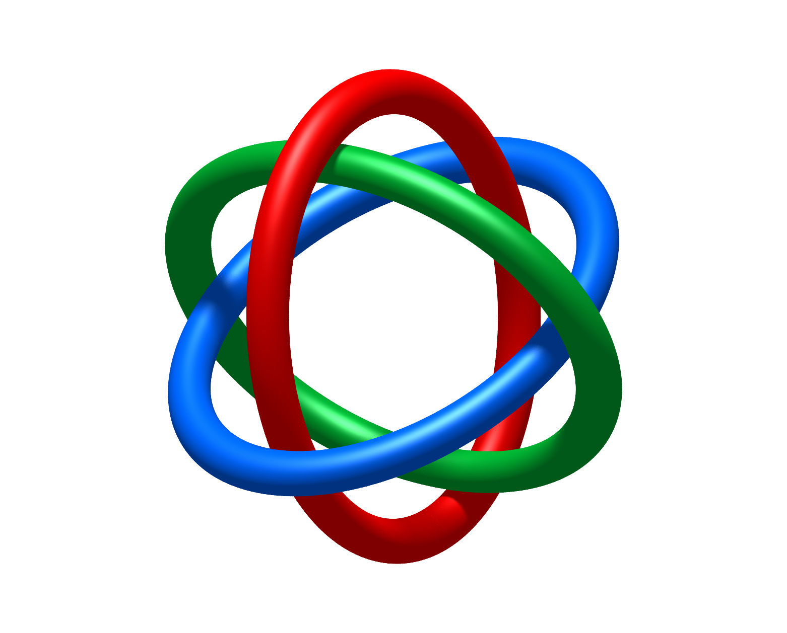

По этому образу совместное удержание условий называется в теории **борромеевской связностью запретов**. Здесь кольца служат наглядной аналогией совместной работы требований; их логическая независимость требует отдельной проверки. Нарушение любого из трёх условий разрушает целостность акта: оставшиеся требования уже не обеспечивают связного различения. Вместе они задают то, что в модели понимается под **целостностью интерфейса наблюдения**: *различённое остаётся доступным, а следующие состояния сохраняют связь с предыдущими*.

---

### 6.2. Механика разрешений: три режима работы интерфейса

Способ работы интерфейса, при котором все три условия удерживаются совместно, называется в теории **разрешением**. Запреты показывают, *при какой утрате целое распадается*; разрешения раскрывают способы *сохранить это целое в действии*.

Совместная работа запретов раскрывается через распределение ролей. В каждом режиме два условия определяют, как осуществляется различение, а третье удерживает предел, за которым оно разрушилось бы. Все три запрета продолжают действовать. Поочерёдно выделяя каждый из них как удерживающий предел, получаем три режима работы интерфейса:

- **Режим границы — удержание различия.**  
  
  > *Совместная работа:* На первый план выходят **запрет бесследности** и **запрет внешнего замыкания**. Проведённое различение должно оставаться доступным, а связь его сторон — поддерживаться самим устройством интерфейса. Благодаря этому стороны можно сохранять и распознавать как части одного отношения.  

  *Удерживаемый предел:* **Запрет совпадения** требует, чтобы принадлежность одному отношению не стирала разницу между сторонами. Они связаны, но должны оставаться различимыми. При их слиянии исчезло бы само основание говорить о границе.  

  *Разрешение:* Интерфейс может **сохранять само различие между сторонами**: при повторном обращении они остаются различимыми и узнаются как стороны того же отношения. Это позволяет удерживать, что именно отделено от чего.

- **Режим шага — изменение с доступным результатом.**  
  
  > *Совместная работа:* На первый план выходят **запрет совпадения** и **запрет внешнего замыкания**. Переход должен связывать различимые состояния по правилу, входящему в само устройство интерфейса (в двусторонней паре таким правилом служит взаимный обмен).  

  *Удерживаемый предел:* **Запрет бесследности** требует, чтобы совершённый шаг оставлял распознаваемый результат. Если утрачено всё, по чему этот шаг можно отличить от его отсутствия, его невозможно учесть при продолжении работы.  

  *Разрешение:* Интерфейс может **совершать переход и передавать его результат следующему действию**. Различие становится доступным изменением: после шага есть результат, который можно распознать и использовать дальше.

- **Режим связи — согласование сменяющихся состояний.**  
  
  > *Совместная работа:* На первый план выходят **запрет совпадения** и **запрет бесследности**. Состояния остаются различимыми, а результаты их смены — доступными. Вместе эти условия дают то, что предстоит согласовать: разные состояния и сохранённые результаты действий над ними.  

  *Удерживаемый предел:* **Запрет внешнего замыкания** требует, чтобы способ их сопоставления входил в само устройство интерфейса. Связь должна устанавливаться по его собственным отношениям и правилам. Иначе для каждого согласования пришлось бы обращаться к внешнему арбитру, а затем отдельно обосновывать уже его решение.  

  *Разрешение:* Интерфейс может **согласовывать результаты последовательных шагов**: устанавливать, какие изменения относятся к той же системе и как новый результат связан с предыдущим. Благодаря этому отдельные переходы складываются в связную последовательность.

**Так одни и те же требования раскрываются с трёх сторон**: *что позволяет удерживать границу, что делает возможным шаг и что сохраняет связь между состояниями*.

---

### 6.3. Счёт вариантов и границы класса моделей

Дальше метод задаёт конкретный вопрос об устройстве интерфейса и проверяет, сколько способов выполнить все требования остаётся. Результат относится к одному из трёх случаев:

- **Один вариант (вынужденная структура).**  
  *Механизм:* Совместное действие запретов определяет решение однозначно относительно поставленной задачи.  
  *Пример:* Для элементарной пары состояний требование нетривиального обратимого шага оставляет единственный вариант: взаимный обмен.  
  *Следствие:* Закон обмена определён самим устройством пары и не зависит от выбора наблюдателя. Свободным соглашением остаются только названия сторон.

- **Несколько вариантов (оставшаяся свобода).**  
  *Механизм:* Запреты отсекают недопустимое, но оставляют несколько решений, между которыми поставленные условия ещё не позволяют сделать однозначный выбор.  
  *Пример:* При переходе к нескольким независимым различениям структура задаёт их взаимные связи, но не определяет, какую ось считать первой, а какой конец отрезка — началом.  
  *Следствие:* Когда решения различаются лишь именами или порядком элементов, выбор определяется соглашением наблюдателя (калибровкой); если же различаются сами способы действия, требуется дальнейшее содержательное обоснование выбора.

- **Ни одного варианта (граница класса и расширение).**  
  *Механизм:* Поставленное требование принципиально несовместимо с запретами внутри выбранного класса моделей.  
  *Пример:* Дискретный шаг обмена связывает оба состояния в одну пару, но обязан менять состояние, исключая неподвижную точку. Если же мы дополнительно требуем представить эту связь неподвижной геометрической точкой баланса, дискретного носителя оказывается недостаточно: среди дискретных вершин нет ни одной подходящей точки (число решений равно нулю).  
  *Следствие:* Отсутствие решения фиксирует точный предел дискретного описания и ставит выбор: отказаться от дополнительного требования либо расширить класс моделей. Если мы выбираем геометрическое продолжение — весь отрезок или тело куба — и продолжаем на него тот же симметричный переворот, единственной неподвижной точкой этого преобразования становится центр.

Так запреты и разрешения работают как одна связная система: запреты удерживают условия различения, разрешения показывают способы их совместного выполнения, а счёт выясняет, что уже определено однозначно, где требуется соглашение или дополнительное условие и где достигнут предел принятого описания.

Способ различать, который удаётся воспроизводить и отличать от других, становится устойчивым способом работы интерфейса. Его результат можно включать в следующее действие, где снова проверяются те же базовые требования: различие должно сохраняться, результат — оставаться доступным, а связь — удерживаться изнутри.

Теперь можно сделать следующий шаг: перейти от одного элементарного двустороннего различения к нескольким независимым, построить их общий конечный носитель и проследить, какие связи и геометрические формы возникают в общей сцене наблюдения.

<details markdown="1">
<summary><strong>▷ [Формальная спецификация] Совместная допустимость, роли запретов и счёт решений.</strong></summary>


**Совместная допустимость.** Для конкретной задачи задаётся множество кандидатов $\mathcal{C}$ и проверяемые условия $P_D, P_F, P_C \colon \mathcal{C} \to \{0, 1\}$. Они выражают принятую в этой задаче математическую реализацию исходных требований. Запрещённые подмножества и множество разрешений имеют вид:

$$Z_i = \{S \in \mathcal{C} \colon P_i(S) = 0\}, \qquad \mathcal{R} = \bigcap_{i \in \{D, F, C\}} \{S \colon P_i(S) = 1\}.$$

Нарушение любого условия исключает соответствующую конструкцию из $\mathcal{R}$. Снятие требования с проверки действует иначе: оно расширяет или сохраняет множество разрешённых конструкций. Непустота $\mathcal{R}$ устанавливается предъявлением совместного решения.

Борромеевский образ в основном тексте выражает совместную необходимость требований в принятом определении целостности. Сама конъюнкция не доказывает их логическую независимость или существование топологического зацепления. Чтобы установить независимость каждого $P_i$ от остальных в выбранной модели, требуется предъявить конструкцию, удовлетворяющую двум остальным условиям и нарушающую $P_i$.

**Распределение ролей.** В принятой схеме один запрет имеет предельную роль $l$, а два других — активную роль $a$. В порядке $(D, F, C)$ существуют ровно три таких назначения:

$$(l, a, a), \qquad (a, l, a), \qquad (a, a, l).$$

Оба статуса предполагают соблюдение запрета. Эти три назначения ролей не следует отождествлять с шестью смешанными состояниями трёх двоичных координат, вводимыми в следующем разделе.

**Минимальный интерфейс.** Пусть $X$ — непустое конечное множество, а $\alpha \colon X \to X$ — свободная инволюция:

$$\alpha^2 = \mathrm{id}_X, \qquad \alpha(x) \neq x.$$

Каноническое чтение

$$\pi \colon X \to X/\langle\alpha\rangle, \qquad \pi(x) = \{x, \alpha x\}$$

удовлетворяет $\pi\alpha = \pi$. Это сохранение орбитального контекста. Роль наблюдения типизирована отдельно от точек $X$; условие этой типизации само по себе не является условием координатной симметрии.

**След одного шага.** Текущее состояние и его орбита не определяют, был ли совершён переход. Для различения одного шага и его отсутствия можно дополнительно сохранять исходное и конечное состояния:

$$r(x, \varepsilon) = (x, \alpha^\varepsilon x), \qquad x \in X, \quad \varepsilon \in \{0, 1\}.$$

На этой записи проверка

$$\tau(u, v) = \begin{cases} 0, & u = v, \\ 1, & u \neq v \end{cases}$$

удовлетворяет $\tau(r(x, \varepsilon)) = \varepsilon$. Это дополнительная доступная запись одного проверяемого перехода, а не следствие одного равенства $\pi\alpha = \pi$. Она не восстанавливает произвольную историю: для нескольких действий нужно отдельно указать, какое различие истории сохраняется. Увеличение числа координат без правила записи само по себе этой задачи не решает.

**Счёт и переописания.** Число размеченных решений равно $|\mathcal{R}|$. Если на $\mathcal{R}$ действует заранее заданная группа допустимых переописаний $G$, то число решений с точностью до этих переописаний равно $|\mathcal{R}/G|$. Единственность размеченного решения и единственность с точностью до $G$ — разные утверждения. Несколько орбит означают неэквивалентность относительно выбранного $G$; без дополнительных условий их нельзя объявлять неизоморфными во всех возможных смыслах.

**Проверяемый пример отбора операций.** На фиксированном множестве из $2m$ помеченных элементов число свободных инволюций равно

$$|\mathcal{I}_{2m}| = \frac{(2m)!}{2^m m!} = (2m-1)!!.$$

Для восьми состояний это $105$. На $X = \mathbb{F}_2^3$ согласованность со всеми сдвигами $T_a(x) = x \oplus a$, то есть $\alpha T_a = T_a\alpha$, вынуждает $\alpha(x) = x \oplus b$, где $b \neq 0$: остаётся семь операций. Согласованность дополнительно со всеми перестановками трёх координат требует, чтобы все координаты $b$ совпадали. Остаётся $b = 111$, то есть полный переворот $\kappa(x) = x \oplus 111$. Таким образом, при последовательном наложении именно этих условий число операций меняется как

$$8! = 40320 \longrightarrow 105 \longrightarrow 7 \longrightarrow 1.$$

**Отдельная задача о неподвижной точке.** Для $n \ge 1$ полный переворот $\kappa(x) = x \oplus \mathbf{1}$ на $\{0,1\}^n$ имеет $\mathrm{Fix}(\kappa) = \varnothing$. Это отсутствие неподвижной вершины, а не отсутствие допустимой операции переворота.

В выбранном непрерывном расширении $[0,1]^n$ центральное отражение $\bar{\kappa}(x) = \mathbf{1} - x$ имеет единственную неподвижную точку:

$$\bar{\kappa}(x) = x \iff x = (1/2, \ldots, 1/2).$$

Общий центр выражает симметрию всего расширения. При $n > 1$ он не заменяет чтение отдельной орбиты: разных противоположных пар несколько, а их середина одна.

</details>

---

## 7. Минимальный носитель: порождающий ряд и рождение сцены

Один изолированный акт различения изображается отрезком (рассмотренным в §4), но опыт удерживает несколько независимых различений одновременно: «светлее / темнее», «ближе / дальше», «слева / справа».

Чтобы исследовать их совместно, фиксируются все допустимые сочетания ответов сразу. Эту единую систему отношений организуют комбинаторика, теория графов и геометрия:

- **комбинаторика** задаёт число совместных состояний и их точный состав;
- **теория графов** задаёт отношения между состояниями;
- **геометрия** показывает выбранное расположение этих отношений вокруг общего центра симметрии.

### Комбинаторный носитель и ранги различения

Одно различение записывается как один двоичный разряд с двумя состояниями: 0 или 1. Независимые различия сочетаются во всех вариантах: для двух различий возникают четыре состояния — 00, 01, 10, 11. При добавлении следующего различения каждое из них получает два продолжения: например, из 00 получаются 000 и 001. Поэтому число совместных состояний каждый раз удваивается.

Число одновременно удерживаемых независимых различений задаёт **ранг сцены**:

- **ранг 1:** два состояния — 0 и 1;
- **ранг 2:** четыре состояния — 00, 01, 10, 11;
- **ранг 3:** восемь состояний — от 000 до 111.

На этом уровне задан набор двоичных разрядов и всех возможных сочетаний ответов. Их пространственное расположение выбирается следующим шагом.

### Геометрическое отображение ранга: порождающий ряд носителей

Один разряд 0/1 изображается отрезком: два состояния находятся на его концах, а середина показывает симметрию обмена. Для нескольких разрядов выберем взаимно перпендикулярные оси с одинаковым масштабом. Все оси проходят через **общий центр симметрии**. Каждое новое различение добавляет измерение и удваивает число вершин:

- **Ранг 1:** одно различение задаёт отрезок с двумя противоположными полюсами и центральной точкой баланса между ними;
- **Ранг 2:** два независимых различения задают две оси на плоскости, а четыре совместных состояния образуют вершины квадрата;
- **Ранг 3:** три независимых различения задают три пространственные оси, а восемь совместных состояний образуют вершины куба.

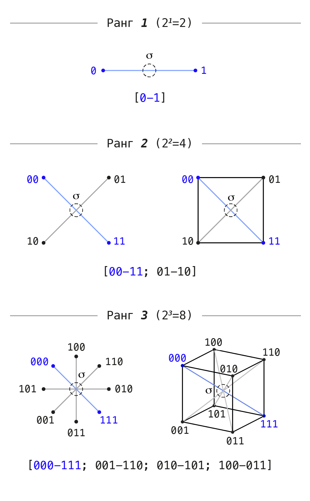
*(Примечание: лучи через центр на схеме рангов изображают диаметральные пары противоположностей, а не координатные оси)*

Дальнейшее исследование в статье разворачивается именно на примере **ранга 3**: это первый объёмный носитель в выбранном ряду.

В выбранном геометрическом представлении сохраняются три свойства:

1. **Общий центр симметрии.** Оси сходятся в центре фигуры. При обмене всех противоположных вершин он остаётся на месте. Состояния сцены расположены в вершинах; центр показывает их симметрию.
2. **Попарная дополнительность состояний.** Каждому состоянию отвечает ровно одна диаметрально противоположная вершина, в которой все нули заменены единицами, а все единицы — нулями.
3. **Равноправие вершин по симметрии.** Ни одно состояние не выделено заранее: повороты и отражения позволяют менять вершины местами, сохраняя фигуру.

На ранге 3 восемь вершин куба образуют четыре пары диаметральных противоположностей: 000 — 111, 001 — 110, 010 — 101, 011 — 100. Здесь три координатные оси и четыре противоположные пары: оси отвечают отдельным разрядам, а пары — одновременному перевороту всех разрядов.

### Полярная ось диапазона и рождение активной сцены

В принятой двоичной разметке выделим **полярную ось диапазона** — пару предельных состояний, в которых все ответы равны нулю или все равны единице. На ранге 3 это пара 000 — 111, выделенная на схеме синим цветом.

Для дальнейшего построения примем эту однородную пару за пределы диапазона, а смешанные сочетания будем рассматривать как активную сцену, где различия активны и контрастируют между собой.

В цветовой аналогии непрерывное заполнение полярной оси соответствует шкале яркости: от чёрного (000) к белому (111). На этой оси все три координаты равны и цвета нет. Остальные шесть вершин куба содержат различия между координатами, задавая хроматические (цветовые) отношения.

Это разделение определяет различие полного и активного носителей:

- **Полный носитель:** на ранге 3 это куб со всеми восемью состояниями и четырьмя противоположными парами: 000 — 111, 001 — 110, 010 — 101, 011 — 100.

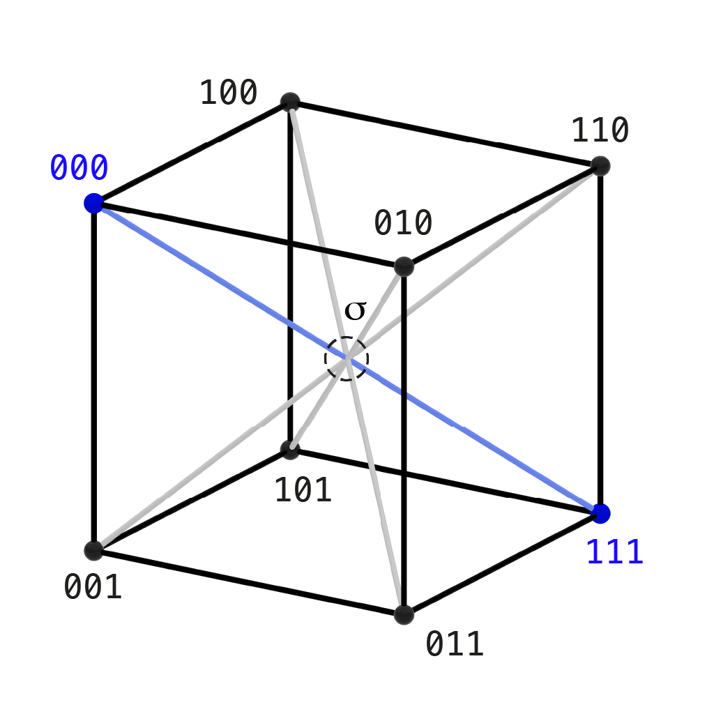
*(Примечание к схеме: диаметральные пары указаны верно; координатные рёбра куба соответствуют расстоянию Хэмминга 1, как на RGB-кубе в §9)*

- **Активная сцена:** состояния за вычетом двух крайних полюсов — 000 и 111. На ранге 3 остаются шесть смешанных состояний, образующих три противоположные пары: 001 — 110, 010 — 101, 011 — 100.


На каждом ранге из полного набора исключаются два полюса:

- при ранге 1 активная сцена отсутствует: оба состояния были полюсами;
- при ранге 2 остаются два состояния — одна противоположная пара, изображаемая линией;
- при ранге 3 остаются шесть состояний — три противоположные пары.

В этом ряду после одной активной линии сразу появляется трёхпарная сцена. Её объёмное изображение строится из отношений между шестью состояниями.

<details markdown="1">
<summary><strong>▷ [Формальное описание] Ранг, число состояний и выбор полярной пары.</strong></summary>


Для $n\ge 1$ независимых двоичных различений полный носитель равен $Q_n=\{0,1\}^n$ и содержит $2^n$ состояний. Независимость здесь означает допустимость всех сочетаний координат.

Полный переворот $\kappa(x)=\mathbf{1}-x$ разбивает вершины на $2^{n-1}$ противоположных пар. Число координатных осей равно $n$; число диаметральных пар при $n>2$ уже отличается от него.

В выбранной разметке фиксируется полярная пара $P=\{\mathbf{0},\mathbf{1}\}$. Активный носитель:

$$X_{\mathrm{adm}}=Q_n\setminus P,\qquad |X_{\mathrm{adm}}|=2^n-2.$$

Число активных пар равно $2^{n-1}-1$. При рангах $1,2,3$ получаем соответственно $0,1,3$ пары.

Пара $P$ зависит от разметки сторон отдельных координат. Например, смена меток первой координаты переводит пару $\{000,111\}$ в $\{100,011\}$. Перестановки координат и глобальное дополнение сохраняют исходную пару.

Геометрическое изображение дополнительно использует стандартную евклидову метрику и взаимно перпендикулярные равно масштабированные координатные оси. Центр непрерывного куба — $\sigma_{1/2}=(1/2,\ldots,1/2)$; среди дискретных вершин его нет. Комбинаторная независимость сама по себе не задаёт ни метрику, ни углы между осями.

</details>

---

## 8. Геометрия связей: от шага изменения к октаэдру

Шесть состояний активной сцены задают допустимые исходы. Но опыт восприятия определяется не изолированными точками, а отношениями между ними: переходом от одного состояния к другому, различением близкого и противоположного.

Полный переворот меняет стороны внутри одной противоположной пары. Но между состояниями сцены существуют разные степени близости. Мерой этой близости служит число разрядов, которые требуется переключить для перехода (расстояние Хэмминга):

- 10**0** → 10**1**: изменился один разряд (ближайшие соседи);
- **10**0 → **01**0: изменились два разряда (среднее расстояние);
- **001** → **110**: изменились все три разряда (диаметральная противоположность).

На шести состояниях активной сцены это правило задаёт ровно три непересекающихся типа связей:

1. **Один шаг (соседство и замкнутый цикл):**  
   Переходы с изменением ровно одного разряда связывают все шесть состояний в единый непрерывный замкнутый цикл:  
   001 → 101 → 100 → 110 → 010 → 011 → 001.


   Каждый шаг цикла означает смену одного различения при сохранении двух остальных.

2. **Два шага (расслоение на две триады):**  
   Переходы с изменением двух разрядов разбивают шесть состояний на две непересекающиеся тройки (триады):
   001, 010, 100 — первая тройка; 110, 101, 011 — вторая.

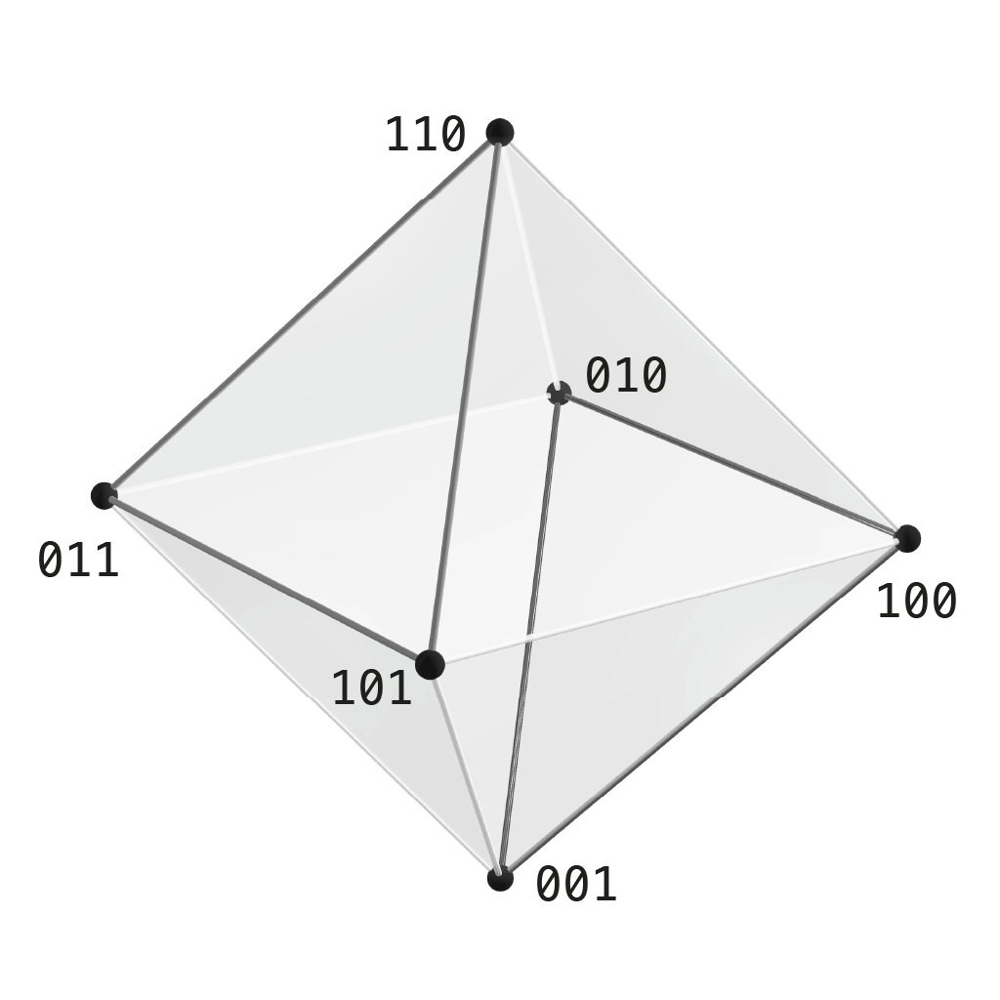

   В первой тройке активна ровно одна единица, во второй — ровно две. Внутри каждой тройки все состояния равноудалены друг от друга.

3. **Три шага (диаметральные противоположности):**  
   Переходы с одновременным изменением всех трёх разрядов образуют три взаимно противоположные пары:
   001 — 110, 010 — 101, 011 — 100.

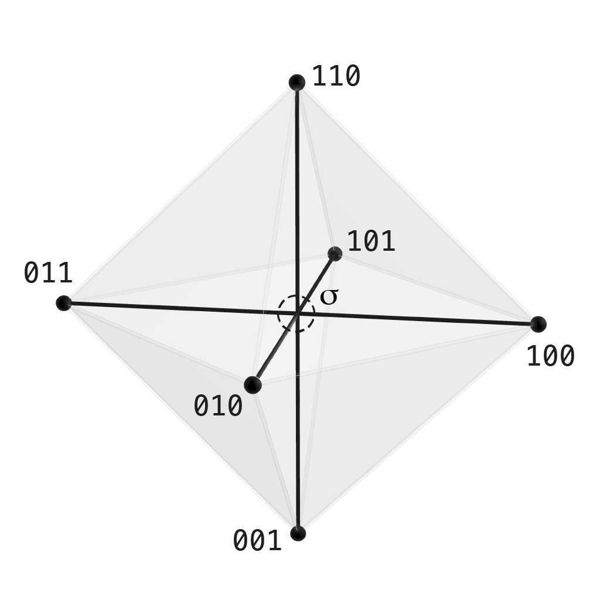

   Эти связи соединяют полные антиподы через центральную точку симметрии.

Все три типа отношений заданы на одних и тех же шести состояниях. Каждая пара попадает ровно в одну из этих групп: состояния различаются в одном, двух или трёх разрядах.

Если объединить связи ближайшего соседства (1 шаг) и связи внутри триад (2 шага), получится сеть рёбер **октаэдра**. Для изображения правильного октаэдра расположим шесть состояний симметрично, сохранив эти связи. Каждая вершина соединена с четырьмя другими; противоположная ей вершина лежит на другом конце внутренней диагонали. Три такие диагонали пересекаются в общем центре.

Куб и правильный октаэдр связаны **двойственностью**: если поместить вершины в центры шести граней куба и соединить центры соседних граней, получится октаэдр. Противоположные грани куба отвечают противоположным вершинам октаэдра. Так можно изобразить полученную сеть; после удаления двух полюсов оставшиеся вершины куба нужно расположить заново.


Построение активной сцены раскрывает принципиальное различие между **объективной структурой отношений** и **субъективным соглашением наблюдателя**:

1. **Инвариантность связей.** После выбора полярной пары и правил соседства конфигурация отношений определена: замкнутый шестиугольный цикл, две встречные триады и три пары противоположностей. Названия цветов, нот или делителей этих связей не меняют. В прикладных контекстах (§9) та же схема проявится как цветовой круг и пары дополнительных цветов, интервалы целотонового звукоряда или отношения делимости чисел.
2. **Свобода выбора координат.** Чтобы записать состояния числами, наблюдатель обязан выбрать систему отсчёта: порядок различений (какую ось назвать первой, второй, третьей) и соглашение о полярности (какую сторону назвать 0, а какую 1). Перестановка осей или одновременная смена всех нулей и единиц сохраняют выбранную полярную пару и все три типа связей.

Выбор разметки задаёт запись состояний и полярную пару; дальнейшие названия вершин позволяют читать ту же сеть в разных содержательных контекстах.

<details markdown="1">
<summary><strong>▷ [Формальное описание] Графовая структура и классификация симметрий сцены.</strong></summary>

На активном носителе $X_{\mathrm{adm}} = \{0,1\}^3 \setminus \{000, 111\}$ полный граф парных отношений $K_6$ содержит $\binom{6}{2} = 15$ пар. Метрика Хэмминга $d_H$ осуществляет строгое разбиение рёбер полного графа на три непересекающихся регулярных слоя:

$$E(K_6) = E(R_1) \sqcup E(R_2) \sqcup E(R_3), \quad 15 = 6 + 6 + 3.$$

1. **Слой $R_1$ (расстояние 1):** 2-регулярный связный подграф — гамильтонов цикл из шести вершин (6 рёбер). Задаёт минимальный дискретный обход соседних состояний.
2. **Слой $R_2$ (расстояние 2):** 2-регулярный несвязный подграф — два треугольника $2K_3$ (6 рёбер), расслаивающие носитель по весу Хэмминга на две плоскости ($w=1$ и $w=2$).
3. **Слой $R_3$ (расстояние 3):** 1-регулярный подграф — совершенное паросочетание антиподов $3K_2$ (3 ребра). Инволюция полного дополнения без неподвижных точек, связывающая диаметральные пары через центральную инверсию.

**Октаэдральный граф и его геометрическая реализация:**  
Объединение первых двух метрических слоёв $R_1 \cup R_2 = K_6 \setminus R_3$ образует абстрактный 4-регулярный полный трёхдольный граф $K_{2,2,2}$ (октаэдральный граф). В стандартной выпуклой реализации его восемь треугольных циклов становятся восемью гранями октаэдра. В унаследованных евклидовых координатах куба рёбра слоя $R_1$ имеют длину $1$, а слоя $R_2$ — длину $\sqrt{2}$; правильным октаэдр становится при симметричном переизображении (например, на вершинах $\{\pm e_1, \pm e_2, \pm e_3\}$). Слой $R_3$ задаёт три внутренние пространственные диагонали октаэдра, пересекающиеся в центре симметрии $\sigma_{1/2}$.  

**Группы симметрий и классификация базисов:**  

- Полная группа автоморфизмов октаэдрального графа $\mathrm{Aut}(K_{2,2,2}) \cong \mathbb{Z}_2^3 \rtimes S_3$ имеет порядок 48 (перестановки трёх противоположных пар и независимые перестановки внутри каждой пары).  
- Группа автоморфизмов трёхслойной структуры с сохранением каждого метрического слоя по отдельности ($R_1 \cong C_6$, $R_2 \cong 2K_3$, $R_3 \cong 3K_2$) имеет порядок 12 и изоморфна $S_3 \times \mathbb{Z}_2$ (перестановки трёх координат и операция глобального дополнения).  
- Полная группа линейных автоморфизмов векторного пространства $\mathbb{F}_2^3$ — это группа $\mathrm{GL}_3(\mathbb{F}_2)$ порядка 168. Она транзитивно действует на 168 упорядоченных линейных базисах, которые после факторизации по перестановкам трёх осей $S_3$ дают $168 / 6 = 28$ классов неупорядоченных базисов. Метрические изометрии Hamming-куба образуют гипероктаэдральную группу порядка 48. Сохранение фиксированного вектора полярной оси $111$ выделяет его стабилизатор в $\mathrm{GL}_3(\mathbb{F}_2)$ порядка $168 / 7 = 24$, что после факторизации по $S_3$ даёт $24 / 6 = 4$ класса базисов, согласованных с выбранной полярной осью (условие $v_1 + v_2 + v_3 = 111$).

**Связь с литералами:**  
Шесть смешанных двоичных слов взаимно-однозначно соответствуют шести литералам первого тома: $e_i \leftrightarrow (i, 1)$ и $\mathbf{1}-e_i \leftrightarrow (i, 0)$ для $i \in \{1, 2, 3\}$. Литералы одной координаты образуют несовместимые противоположные пары на расстоянии 3, а литералы разных координат совместимы, что определяет рёбра графа $K_{2,2,2}$ и точно сопоставляет вершины октаэдра шести граням булева куба. Детальный комбинаторный анализ подграфов приведён в статье [«Наблюдатель как конечная структура различения»](https://habr.com/ru/articles/1058448/).

</details>

---

## 9. Проекции одной комбинаторики: цвет, звук и арифметика

Полученная шеститочечная схема не зависит от того, какие содержательные имена даны её вершинам. Чтобы увидеть это наглядно, рассмотрим три разметки: цветовые вершины RGB-куба, классы высоты целотонового ряда и делители числа 30.

Во всех трёх случаях можно явно сопоставить элементы так, чтобы сохранялись цикл соседства, две триады и три дополнительные пары. Это позволяет исследовать одну структуру отношений на разных примерах:

- в **цветовом пространстве** (§9.1) три противоположные пары цветов образуют шестисекторный цветовой круг, две взаимодополнительные модели (RGB и CMY) и пары дополнительных цветов, сходящиеся в нейтральном сером центре;
- в **музыкальном строе** (§9.2) шаги в целый тон выделяют шестизвучный целотоновый звукоряд, распадающийся на два увеличенных трезвучия и предельные гармонические антиподы — тритоны;
- в **арифметике делителей** (§9.3) три простых сомножителя бесквадратного числа организуют его собственные делители в ту же систему делимости и дополнительных пар.

### 9.1. Цветовая проекция: от куба к октаэдру

Наглядной моделью полного носителя ранга 3 служит стандартный **цветовой RGB-куб**:

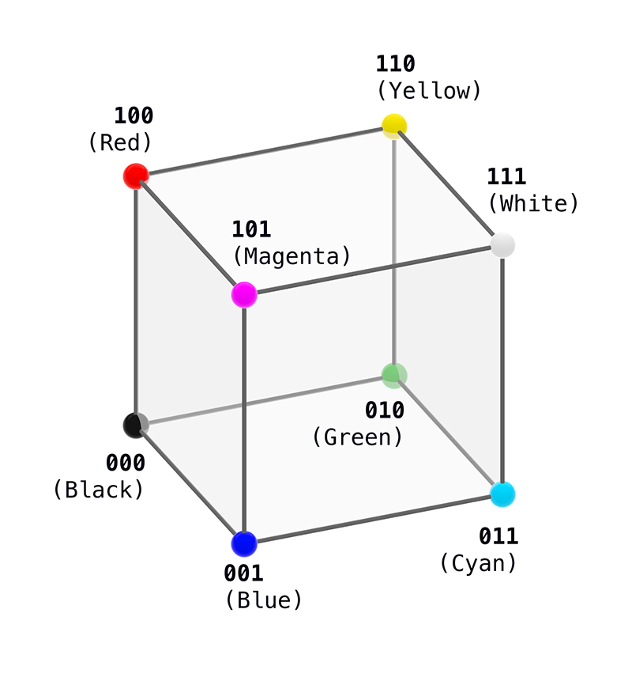

В его вершинах зафиксированы восемь состояний: предельные полюса — чёрный (000) и белый (111), а также шесть хроматических цветов. 

Исключение чёрного (000) и белого (111) оставляет шесть активных вершин — **хроматический октаэдр**:


На нём отношения между цветами представлены тремя типами связей:

- **Шестисекторный цветовой круг (соседство, расстояние 1):** отношение соседства образует замкнутый обход всех шести вершин октаэдра, последовательно чередующий аддитивные и субтрактивные цвета:  
  Красный (100) → Жёлтый (110) → Зелёный (010) → Циан (011) → Синий (001) → Маджента (101) → Красный (100).

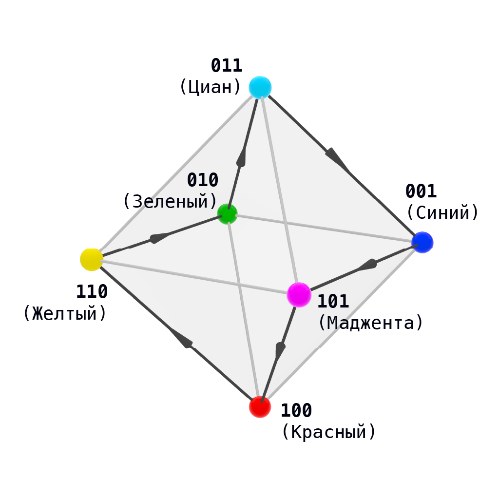

- **Аддитивная и субтрактивная модели (триады, расстояние 2):** вершины с одной единицей образуют аддитивную модель **RGB** (Красный 100, Зелёный 010, Синий 001), а вершины с двумя единицами — цвета субтрактивной модели **CMY** (Жёлтый 110, Маджента 101, Циан 011). В октаэдре они формируют две противоположные параллельные треугольные грани.

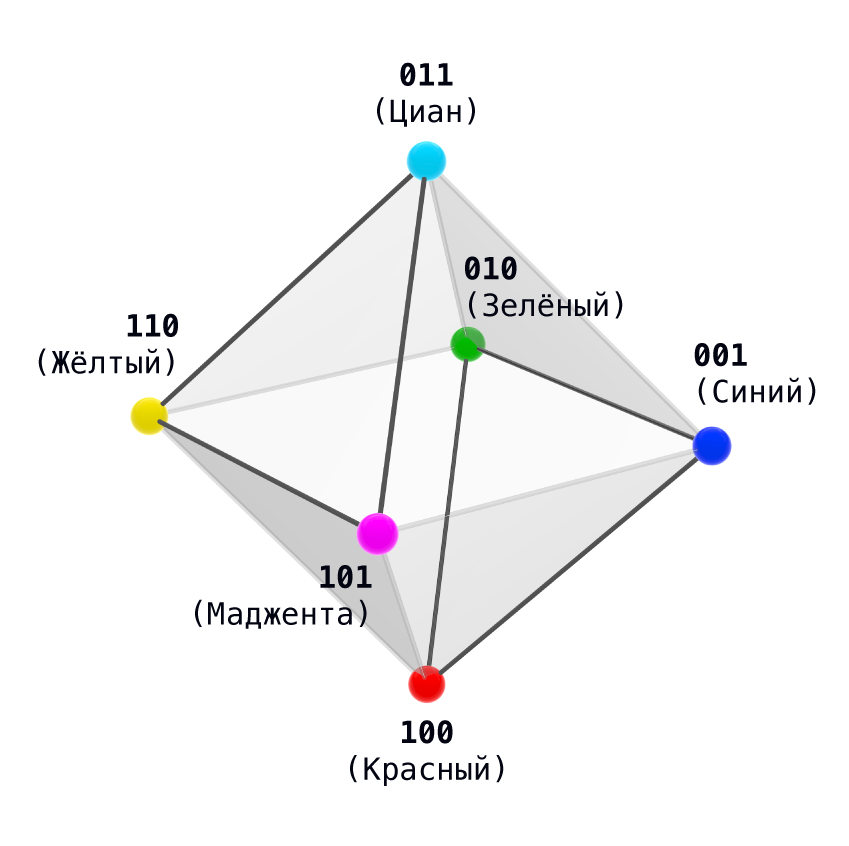

- **Комплементарные пары (антиподы, расстояние 3):** диаметральные противоположности связывают взаимодополнительные пары: Красный — Циан, Зелёный — Маджента, Синий — Жёлтый. Комплементарность задаётся операцией побитового дополнения в геометрической модели RGB-куба. Усреднение координат дополнительных цветов даёт нейтральный серый: на каждом из трёх цветовых каналов получается половина полного значения.

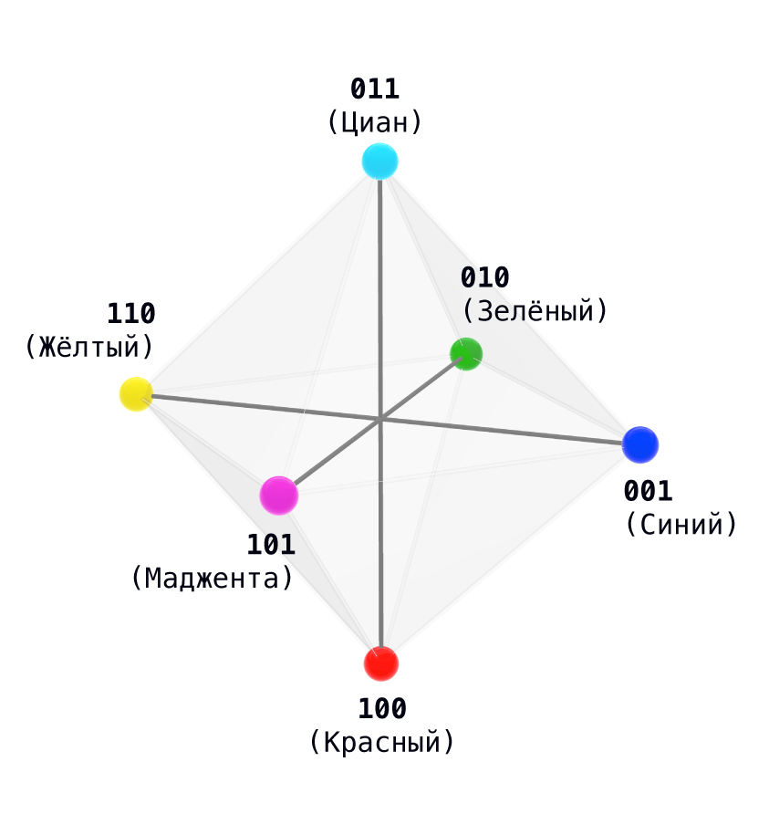

### 9.2. Звуковая проекция: целотоновый звукоряд

В двенадцатиступенном равномерно темперированном музыкальном строе шаг в целый тон (два полутона) выделяет **целотоновый звукоряд** из шести нот: до, ре, ми, фа-диез, соль-диез, ля-диез. Их буквенные обозначения на схемах — C, D, E, F♯, G♯, A♯. Ноты через октаву здесь считаются повторением той же ступени.

Шесть тонов несут ту же систему отношений октаэдра. Дополнительная шестёрка относится к дальнейшему расширению разметки: её числовые метки получены произведением соседних меток основной шестёрки, например, умножение 2 на 6 даёт 12. Здесь она показана для сопоставления двух целотоновых рядов:

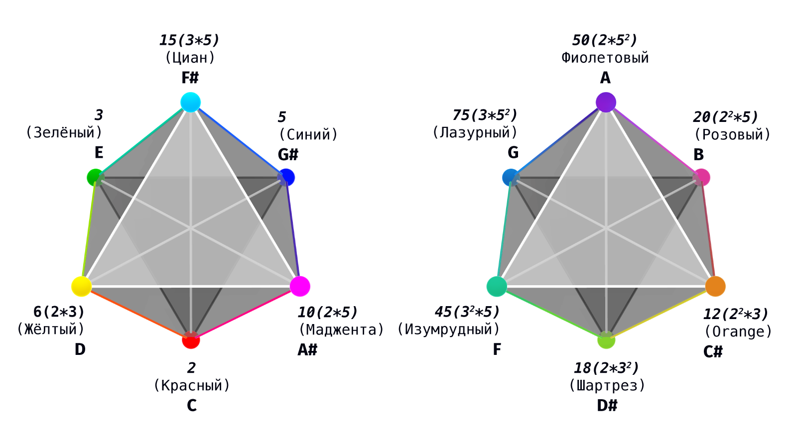
*(На схеме представлены два взаимно дополняющих октаэдра, в совокупности исчерпывающих 12 ступеней хроматической октавы: слева — основной целотоновый звукоряд C, D, E, F♯, G♯, A♯; справа — второй, дополнительный звукоряд C♯, D♯, F, G, A, B. На вершины одновременно нанесены ноты, цветовые метки и числовые делители)*

Чтобы сделать структуру связей наглядной в музыкальном строе, объёмный октаэдр проецируется на плоскость двенадцатитонового хроматического круга. При такой проекции три метрических слоя Хэмминга отображаются тремя различными типами линий:

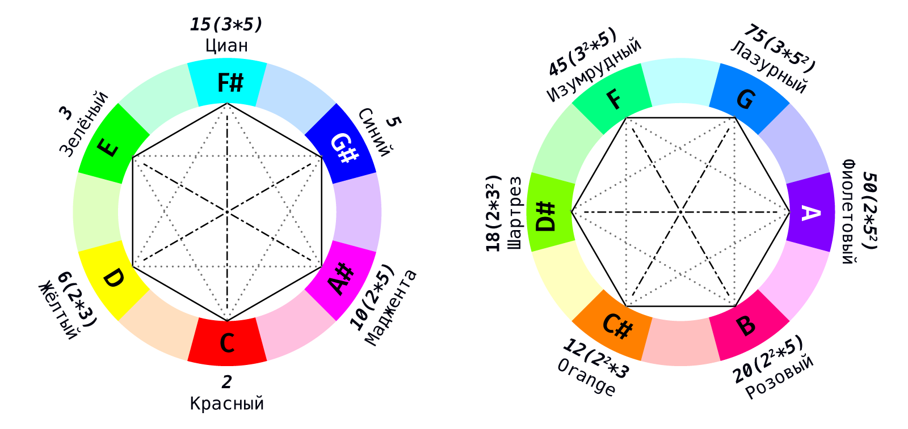

- **Целые тона (расстояние 1, сплошной шестиугольник):** соседство в цикле из шести вершин соответствует интервалу в целый тон (C → D → E → F♯ → G♯ → A♯ → C). На плоской схеме этот шаг образует сплошной замкнутый контур внешнего шестиугольника.
- **Две триады (расстояние 2, пунктирные треугольники):** шесть нот распадаются на два увеличенных трезвучия — две изолированные триады: C, E, G♯ и D, F♯, A♯ (полный структурный аналог троек RGB и CMY). На схеме они образуют два пунктирных встречных треугольника.
- **Тритоны (расстояние 3, штрихпунктирные диаметры):** диаметральные пары октаэдра образуют ровно три тритона — [C — F♯], [D — G♯], [E — A♯]. Тритон делит октаву ровно пополам и служит предельным гармоническим антиподом; на схеме эти противоположности соединены штрихпунктирными линиями через центр круга.

Выбор начальной ноты служит музыкальной калибровкой: транспозиция меняет названия нот, но сохраняет все интервальные отношения целотонового ряда.

### 9.3. Арифметическая проекция: мультипликативная решётка делителей 30

В элементарной теории чисел та же схема связей возникает на делителях числа 30. Оно получается умножением трёх разных простых чисел — 2, 3 и 5. Каждый множитель либо входит в делитель, либо отсутствует, поэтому выбор делителя записывается тремя двоичными разрядами:

- **Полярная ось:** тривиальные делители 1 (аналог 000) и 30 (аналог 111) исключаются как пределы диапазона.
- **Шесть делителей, кроме 1 и 30:**
  - Тройка простых (вес 1): 2, 3, 5 — неделимые первичные элементы (в цвете — RGB, в нотах — C, E, G♯).
  - Тройка составных (вес 2): парные произведения 6, 10, 15: шесть получается из двойки и тройки, десять — из двойки и пятёрки, пятнадцать — из тройки и пятёрки (в цвете — CMY, в нотах — D, A♯, F♯).
- **Отношения между делителями по расстоянию Хэмминга:**
  - **Расстояние 1:** отношение непосредственной делимости (умножение или деление на одно простое число) задаёт цикл 2 → 6 → 3 → 15 → 5 → 10 → 2.
  - **Расстояние 2:** разделение на неделимые простые 2, 3, 5 и три произведения двух простых чисел 6, 10, 15; каждая пара в этой тройке имеет один общий простой множитель.
  - **Расстояние 3:** пары дополнительных делителей с постоянным произведением 30: 2 — 15, 3 — 10, 5 — 6.

Соединение пар на расстояниях 1 и 2 вновь воспроизводит рёберный каркас октаэдра.

На приведённых выше схемах звукоряда (как на объёмном октаэдре, так и на круговой проекции) делители числа 30 уже нанесены рядом с вершинами. Делимость наглядно подтверждает изоморфизм трёх сред: простые делители 2, 3, 5 в точности занимают вершины аддитивной грани (RGB) и ноты C, E, G♯, а парные составные произведения 6, 10, 15 — вершины субтрактивной грани (CMY) и ноты D, F♯, A♯. Непосредственная делимость повторяет замкнутый шестиугольный цикл шагов (расстояние 1), а диаметральные пары взаимно дополнительных делителей (их произведение равно 30) точно совпадают с линиями тритонов и комплементарных цветов (расстояние 3).

Соответствие состояний в трёх примерах:

| Двоичный код | Число единиц | Цвет | Нота | Делитель 30 | Тройка цветов |
| :---: | :---: | :--- | :--- | :---: | :--- |
| **100** | 1 | Красный | C — до | 2 | RGB |
| **110** | 2 | Жёлтый | D — ре | 6 | CMY |
| **010** | 1 | Зелёный | E — ми | 3 | RGB |
| **011** | 2 | Циан | F♯ — фа-диез | 15 | CMY |
| **001** | 1 | Синий | G♯ — соль-диез | 5 | RGB |
| **101** | 2 | Маджента | A♯ — ля-диез | 10 | CMY |

| Число изменённых разрядов | Форма связей | Цвет | Звук | Делители 30 |
| :--- | :--- | :--- | :--- | :--- |
| **Один** | Замкнутый цикл из шести вершин | Шестисекторный круг | Целый тон — два полутона | Умножение или деление на один простой множитель |
| **Два** | Два треугольника | Тройки RGB и CMY | Два увеличенных трезвучия | Тройка 2, 3, 5 и тройка 6, 10, 15 |
| **Три** | Три противоположные пары | Дополнительные цвета | Три тритона | Пары с произведением 30 |

<details markdown="1">
<summary><strong>▷ [Формальное описание] Согласование цветовой, звуковой и арифметической разметок.</strong></summary>


Таблица задаёт биекции из активной сцены в три множества меток. Для цвета используется $c(x)=x$ на вершинах RGB-куба. Для противоположной пары $y=\mathbf{1}-x$:

$$c(x)+c(y)=(1,1,1),\qquad \frac{c(x)+c(y)}{2}=(1/2,1/2,1/2).$$

Это координатное усреднение в выбранной RGB-модели.

В порядке цикла $(100,110,010,011,001,101)$ музыкальные метки имеют высоты $(0,2,4,6,8,10)$ по модулю $12$. Круговое расстояние в полутонах между метками $p,q$ равно

$$\delta(p,q)=\min(|p-q|,12-|p-q|).$$

Для всех пар этих шести состояний $\delta(p(x),p(y))=2d_H(x,y)$. Слоям $R_1,R_2,R_3$ отвечают соответственно целые тона, большие терции внутри увеличенных трезвучий и тритоны.

Арифметическая метка задаётся формулой

$$d(x)=2^{x_1}3^{x_2}5^{x_3}.$$

Полюсам $000,111$ отвечают делители $1,30$. Для остальных шести состояний:

- $R_1$: умножение или деление на один простой множитель; цикл $C_6$;
- $R_2$: две тройки $\{2,3,5\}$ и $\{6,10,15\}$; граф $2K_3$;
- $R_3$: дополнительные делители $d(x)d(y)=30$; паросочетание $3K_2$.

Объединение $R_1\cup R_2$ даёт $K_{2,2,2}$. Эти соответствия сохраняют выбранные три отношения. Физические законы смешения цветов и восприятия музыкальных интервалов требуют собственных моделей.

</details>

*(На схемах с двумя октаэдрами и икосаэдром показано дальнейшее расширение разметки; его подробный математический разбор вынесен в отдельную публикацию).*

Цветовые вершины, ноты целотонового ряда и делители 30 реализуют единую трёхслойную схему связей. Дальнейшее развёртывание этой структуры до 12-частной системы икосаэдра исследовано в статье [«Комбинаторная синестезия: аккорды и цвета как арифметика делителей на икосаэдре»](https://habr.com/ru/articles/1058556/).


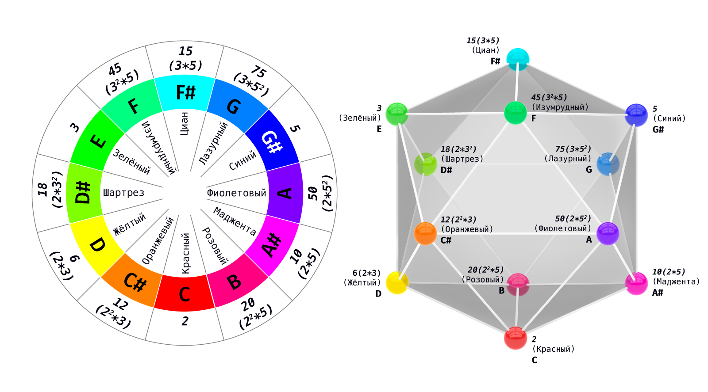
---

## 10. Структурный итог и математический мост ко второй части

Построенная схема связывает шаг смены состояния и сохранение общего контекста. Несколько независимых различений образуют совместную сцену, на которой можно исследовать отношения между состояниями:

1. **Интерфейс наблюдения:** шаг меняет состояние, а сохраняемое чтение позволяет распознать общий контекст. В этой связке описывается роль наблюдения.
2. **Процедура счёта допустимых вариантов:** принятые условия позволяют проверить, какие способы действия допустимы, где решение единственно и где остаётся выбор.
3. **Активная сцена ранга 3:** после исключения двух однородных полюсов остаются шесть смешанных состояний. Их связи образуют цикл, две триады и три противоположные пары. Объединение связей цикла и триад даёт сеть рёбер октаэдра.
4. **Центр симметрии:** в геометрическом изображении противоположные пары проходят через общую середину фигуры. При обмене противоположностей она остаётся неподвижной.

Последовательность построения:

1. Выделить предмет относительно позиции наблюдения и фона.
2. Рассмотреть двустороннюю границу и обмен её сторон.
3. Связать изменение состояния с сохранением общего контекста.
4. Указать условия, при которых различение остаётся доступным продолжению.
5. Собрать несколько независимых различений в совместную сцену.
6. Исследовать её связи и сопоставить их на примерах цвета, звука и делителей.

### Что предстоит во второй части

Во второй части («Первая математическая модель различения») будут подробно разобраны четыре вопроса:

1. **Единственность шага обмена:** какие условия оставляют на кубе единственный полный переворот всех разрядов.
2. **Свобода выбора координат:** какие изменения разметки сохраняют устройство сцены.
3. **Сохраняемые ответы:** что можно узнать о состоянии, если ответ должен оставаться тем же при перевороте.
4. **Дискретное и непрерывное:** как соотносятся отдельные пары состояний и общий центр их геометрического изображения.

<details markdown="1">
<summary><strong>▷ [Формальное описание] Математическая программа второй части.</strong></summary>

1. **Единственность шага обмена ($40320 \to 105 \to 7 \to 1$):** среди всех $8! = 40320$ возможных перестановок состояний куба наложенные отрицательные условия (требование свободной инволюции $\kappa^2 = \mathrm{id}, \kappa(x) \neq x$, согласованность со сдвигами и с перестановками различений) последовательно отсекают все лишние варианты, оставляя в данном классе перестановок куба ровно одно совместное решение — полный инверсный переворот $\kappa$.
2. **Симметрии носителя и классификация базисов:** группа $\mathrm{GL}_3(\mathbb{F}_2)$ порядка 168 транзитивно действует на 168 упорядоченных координатных базисах; после отождествления базисов, отличающихся перестановкой трёх осей, остаётся 28 классов ($168 / |S_3| = 28$); метрические изометрии куба образуют гипероктаэдральную группу порядка 48, а стабилизатор полярной оси $111$ в группе $\mathrm{GL}_3(\mathbb{F}_2)$ имеет порядок 24 (4 класса после факторизации по $S_3$).
3. **Инвариантное чтение и проективная геометрия:** факторизация куба по орбитам переворота $\kappa$ разбивает 8 состояний на 4 противоположные пары и порождает 16 булевых инвариантов чтения, образующих 4-мерное векторное пространство $\mathbb{F}_2^4$. Константные функции образуют 1-мерное подпространство тривиальных чтений $\langle \mathbf{1} \rangle$. Фактор-пространство по тривиальным константам $\mathbb{F}_2^4 / \langle \mathbf{1} \rangle \cong \mathbb{F}_2^3$ имеет размерность 3; при его проективизации 7 ненулевых классов образуют 7 точек проективной плоскости Фано $\mathrm{PG}(2, 2)$, где каждая точка соответствует паре нетривиальных взаимно-дополнительных инвариантов $\{f, \neg f\}$, а её 7 прямых задаются семью тройками этих точек.
4. **Граница дискретного и непрерывное выпуклое расширение:** на вершинах куба уравнение $\kappa(x)=x$ не имеет решений, поэтому инвариант дискретной модели задан отношением орбит, а не неподвижной вершиной. При отдельном выборе непрерывного выпуклого расширения $[0,1]^3$ появляется неподвижная точка аффинного переворота $\sigma_{1/2}$.

</details>

---

### Опубликованные материалы цикла

Отдельные части модели разобраны в опубликованных статьях цикла:

- [«Наблюдатель как конечная структура различения»](https://habr.com/ru/articles/1058448/) — развёртывание минимальной модели наблюдателя на булевом кубе, шеститочечная сцена, октаэдр и оппонентный цветовой круг.
- [«Наблюдатель и различение: дискретное и непрерывное проявления изотропной границы»](https://habr.com/ru/articles/1058672/) — граница дискретной модели, запрет неподвижной точки переворота и выход в непрерывное пространство к центру симметрии.
- [«Комбинаторная синестезия: аккорды и цвета как арифметика делителей на икосаэдре»](https://habr.com/ru/articles/1058556/) — согласование модальностей восприятия через геометрию многогранников и арифметические решётки делителей.

Ранняя редакция проекта доступна в [архиве DOT: Distinction Observable Theory, версия 4](https://doi.org/10.5281/zenodo.20257220).

---

### Лицензия и авторские права

&copy; 2026 Игорь Жук ([igor.m.zhuk@gmail.com](mailto:igor.m.zhuk@gmail.com)).  

Материал опубликован на условиях открытой общедоступной некоммерческой лицензии **Creative Commons Attribution-NonCommercial 4.0 International ([CC BY-NC 4.0](https://creativecommons.org/licenses/by-nc/4.0/deed.ru))**.

* **Свободное использование:** Разрешено свободное чтение, скачивание, распространение, цитирование и использование материала в любых научных, образовательных и личных некоммерческих целях.
* **Условие указания авторства:** Обязательно указание авторства (Игорь Жук) и ссылки на первоисточник ([https://nondual-observer.github.io/ObserverInterfece/ru/](https://nondual-observer.github.io/ObserverInterfece/ru/)).
* **Некоммерческое использование:** Любое коммерческое использование материалов статьи без предварительного письменного согласия автора запрещено.
