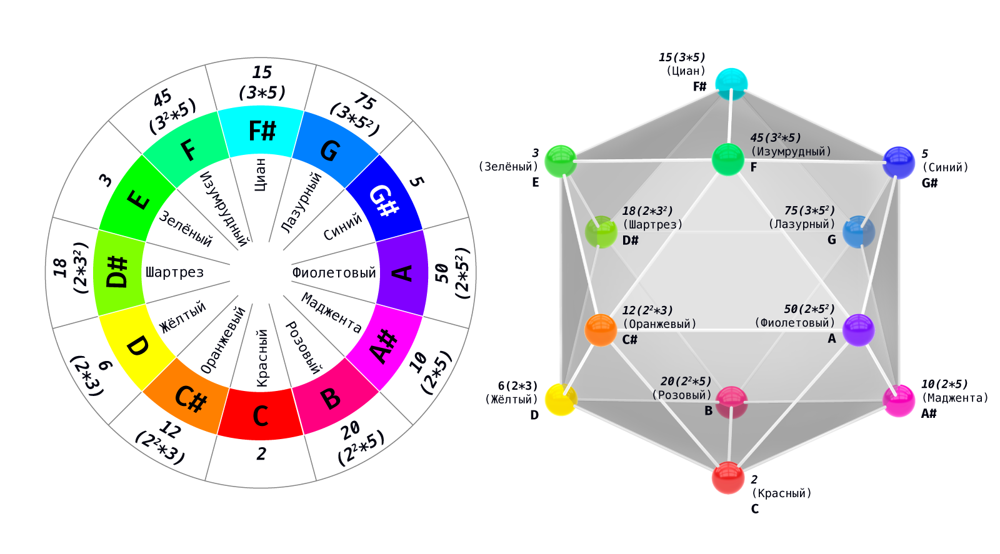
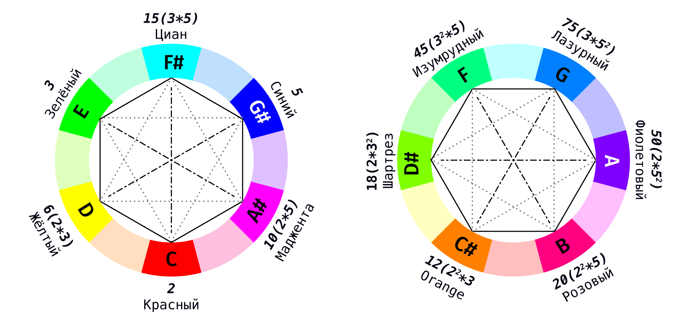
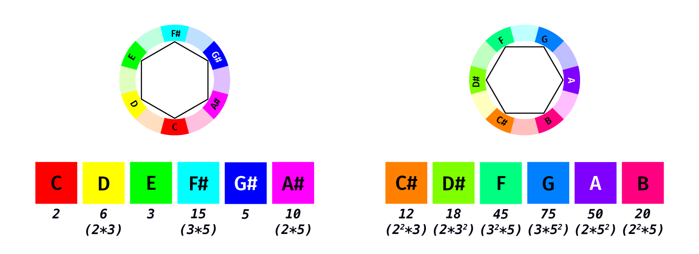
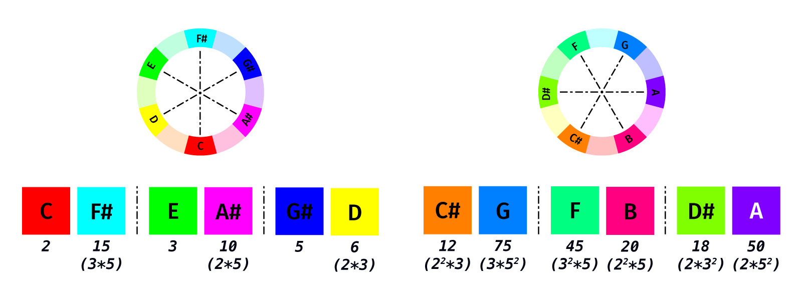
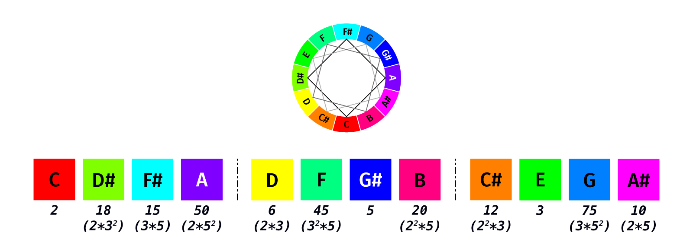
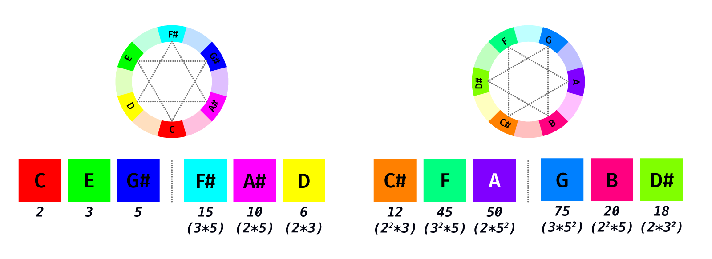
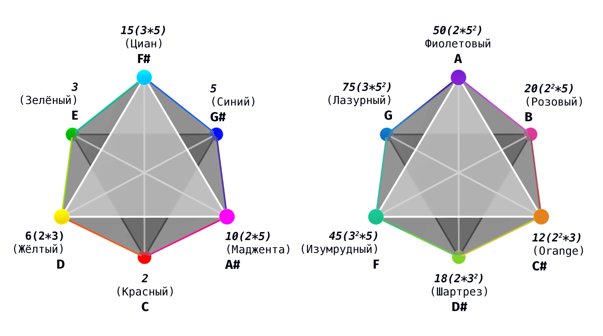
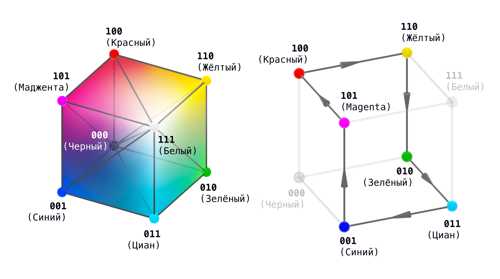
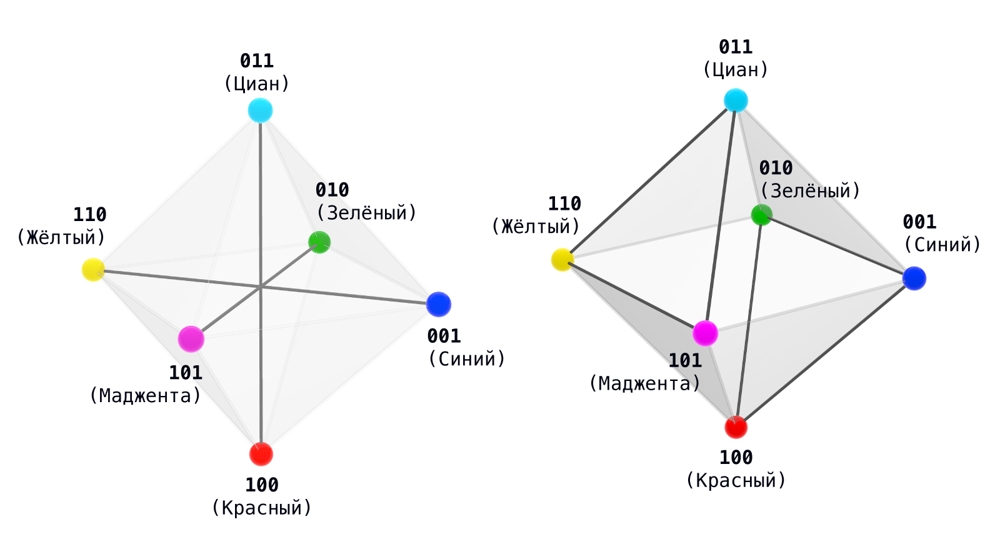

  🌐 <strong>Язык:</strong> Русский &bull; <a href="./">Главная статья («Интерфейс наблюдателя»)</a>
  <a href="../synesthesia.html" class="lang-btn">🇬🇧 Read in English (EN)</a>

# Комбинаторная синестезия: аккорды и цвета как арифметика делителей на икосаэдре

**Автор:** Игорь Жук ([igor.m.zhuk@gmail.com](mailto:igor.m.zhuk@gmail.com))  
*Исследовательский проект Distinction Observable Theory (DOT / ТНР)*  
*Архив проекта:* [github.com/Nondual-Observer/DOTheory](https://github.com/Nondual-Observer/DOTheory/blob/main/ru/README_RU.md)  
*Оригинал на Хабре:* [habr.com/ru/articles/1058556/](https://habr.com/ru/articles/1058556/) &bull; *English version on Reddit:* [r/combinatorics](https://www.reddit.com/r/combinatorics/comments/1urhkt2/combinatorial_synesthesia_chords_and_colors_as/)

> Представьте, что 12 нот хроматической гаммы и 12 оттенков цветового круга — это не просто разные физические волны, воспринимаемые нашими органами чувств, а проекции единой математической структуры. Что если законы музыкальной гармонии (аккорды) и правила художественного контраста (цветовые схемы) можно описать с помощью чистой арифметики делителей на гранях правильного многогранника?

> В этой работе мы подробно разберем, как объединить хроматическую гамму и 12-цветовой круг на вершинах правильного икосаэдра с помощью арифметики делителей. Исследуем путь от простейших бинарных признаков до геометрической разметки многогранника, где музыкальные интервалы и цветовые гармонии оказываются следствиями одних и тех же численных инволюций.

> Эта работа показывает, что глубинная связь между звуком и цветом носит не волновой, а структурно-категорный характер. Для понимания статьи не требуются глубокие знания высшей математики.

---

Двенадцать нот, двенадцать цветов и все их симметричные аккорды располагаются на одном многограннике; тритон всегда оказывается на противоположной вершине. Каждая вершина несёт в себе делитель — число, простое разложение которого указано на метке.

## Как строится соответствие

Возьмем три простых числа: $2, 3, 5$. Их произведения без повторений — $2, 3, 5$, а также $6 = 2 \cdot 3$, $10 = 2 \cdot 5$, $15 = 3 \cdot 5$ — это шесть собственных делителей числа $30 = 2 \cdot 3 \cdot 5$. Они сопоставлены шести первичным вершинам: цветам $R, Y, G, C, B, M$ (красный, желтый, зеленый, голубой, синий, маджента), которые также соответствуют нотам целотоновой шкалы.

Шесть промежуточных вершин сопоставлены произведениям двух соседних первичных делителей: например, оранжевый ↔ $2 \cdot 6 = 12 = 2^2 \cdot 3$. Здесь показатель степени $2$ появляется впервые — простое число берётся дважды. В то время как делитель первичной вершины определяется одним вопросом (какие простые числа используются), промежуточная вершина добавляет второй (сколько раз).

В рамках единой шкалы все двенадцать чисел являются делителями числа $900 = 30^2$: на первичных вершинах это квадраты (например, $10 \to 100$), на промежуточных — произведения соседей.

Делители играют две разные роли: делители числа $900$ привязаны к вершинам, а делители числа $12$ задают симметричные разбиения круга — делитель $d$ разбивает двенадцать вершин на $d$ равных групп по $12/d$ элементов:

| К-во групп ($d$) | Сколько в группе ($12/d$) | В музыке | В цвете |
| :---: | :---: | :--- | :--- |
| **2** | 6 | две целотоновые шкалы | первичная и промежуточная шестёрки |
| **3** | 4 | три уменьшенных септаккорда | три «квадрата» |
| **4** | 3 | четыре увеличенных трезвучия | четыре триады (RGB, CMY, …) |
| **6** | 2 | шесть тритонов | шесть комплементарных пар |
| **12** | 1 | хроматическая гамма | полный цветовой круг |

У числа $12$ нет других равных разбиений. Разделы ниже подробно разбирают строки этой таблицы. Единицей измерения на протяжении всей статьи служит шаг круга: полутон в музыке, $30^\circ$ в цвете.

## Две шестёрки

Вершины через один шаг образуют целотоновую шкалу $C, D, E, F\#, G\#, A\#$; остальные шесть образуют вторую шкалу $C\#, D\#, F, G, A, B$. Цветовой круг имеет те же два класса: первичную шестёрку $R, Y, G, C, B, M$ и промежуточную (оранжевый, салатовый, лазурный…).

Промежуточная шестёрка — это усредненная первичная: каждый из этих цветов представляет собой смесь двух соседних первичных, а каждая нота — середину шага ($C\#$ между $C$ и $D$); отсюда и произведения в их делителях. Геометрическое построение этого усреднения приведено ниже.

## Пары → Тритоны и комплементарные цвета

Две вершины, находящиеся на расстоянии шести шагов, расположены строго напротив друг друга: в музыке это тритон, самый напряженный интервал; в цвете — комплементарная пара (красный — голубой/циан). Шесть пар образуют шесть диаметров круга.

## Четвёрки → Уменьшенные септаккорды

Четыре вершины с шагом в три шага образуют уменьшенный септаккорд (например, $C, D\#, F\#, A$); всего их три. В цвете это «цветовой квадрат». Теория цвета использует квадраты реже, чем пары и триады, хотя это разбиение столь же регулярно; причина этого объясняется ниже.

## Тройки → RGB, CMY и увеличенные трезвучия

Три вершины с шагом в четыре шага образуют увеличенное трезвучие в музыке и цветовую триаду в цвете. Две триады первичной шестёрки наиболее известны:

* $C, E, G\# \to RGB$: первичные цвета излучения (аддитивные), суммирующиеся от чёрного к белому;
* $D, F\#, A\# \to CMY$: первичные цвета пигментов (субтрактивные), вычитающиеся от белого к чёрному.

Еще две триады лежат на промежуточных вершинах ($C\#–F–A$, $D\#–G–B$). Музыка не делает различий между этими четырьмя тройками — это одно увеличенное трезвучие в четырёх транспозициях; различие между светом и пигментом существует только на стороне цвета.

Первичная шестёрка имеет каноническую конструкцию. Куб $2^3$ — это восемь состояний трёх бинарных признаков; в цвете этот куб известен буквально: $RGB$-куб, три оси которого представляют собой каналы красного, зелёного и синего цветов, где $(0,0,0)$ — чёрный, а $(1,1,1)$ — белый. Удалите оба полюса, и останутся шесть цветных вершин: $R, G, B$ с одним включенным каналом и $C, M, Y$ с двумя.

Между ними существуют ровно три типа отношений, определяемых количеством каналов, которыми различаются вершины: цикл из шести шагов (один канал), два треугольника $\{R,G,B\}$ и $\{C,M,Y\}$ (два канала) и три диагонали «цвет ↔ комплемент» (все три канала). Вместе они образуют каркас октаэдра: $6 + 6 = 12$ рёбер и три оси.

В нотах этот цикл — целотоновая гамма, треугольники — трезвучия $C–E–G\#$ и $D–F\#–A\#$, диагонали — тритоны. В числах это шесть делителей числа $30$: оси соответствуют простым числам $2, 3, 5$, а диагонали — парам $d \leftrightarrow 30/d$.

*(Подробный разбор шеститочечной структуры приведён в статье «*[*Наблюдатель как конечная структура различения*](https://habr.com/ru/articles/1058448/)*»; здесь она удваивается до двенадцати).* Октаэдр имеет ровно двенадцать рёбер — ниже они превратятся в двенадцать вершин икосаэдра.

Каждый класс аккордов и каждый класс цветовых гармоний оказались одним и тем же разбиением одного и того же круга; это не требует никакого физического сходства между звуком и цветом. Остаётся получить сам многогранник — показать, почему двенадцать вершин ложатся на икосаэдр.

## Откуда берется икосаэдр: вершина как ребро октаэдра

Икосаэдр строится из октаэдра с помощью классической конструкции. На каждом из $12$ рёбер октаэдра отмечается одна точка, делящая его в отношении $1 : \varphi$ (золотое сечение), с согласованным выбором направления вдоль всех рёбер. Полученные двенадцать точек являются вершинами правильного икосаэдра.

Каждая вершина икосаэдра, таким образом, соответствует ребру октаэдра, на котором она лежит, то есть паре соседних первичных цветов. Новая вершина на круге является серединой дуги между этой парой; её цвет — это смесь цветов пары.

Арифметическое выражение этого факта: произведение двух соседних делителей числа $30$ даёт делитель промежуточной вершины — $12, 18, 45, 75, 50, 20$, все они являются делителями числа $900$; противоположные вершины связаны единой формулой: 

$$x \mapsto 900/x$$

 ($12 \cdot 75 = 18 \cdot 50 = 45 \cdot 20 = 900$). Показатели простых чисел в разложении делителя, делённые пополам, дают $RGB$-координаты смеси: например, $12 = 2^2 \cdot 3^1 \cdot 5^0 \mapsto (1, 1/2, 0)$ — вектор оранжевого цвета.

Числа $30$ и $900$ играют разные роли. Число $30$ свободно от квадратов, и его шесть делителей сами по себе образуют октаэдр: рёбра и оси считываются прямо из арифметики. Решётка делителей числа $900$ построена иначе (показатели степеней достигают двойки) и сама по себе не содержит икосаэдра; здесь арифметика даёт разметку вершин, правило дополнения $x \mapsto 900/x$ и хроматический шаг — делители соседних вершин отличаются умножением или делением на одно простое число, а полный обход круга представляет собой цепочку: 

$$\times 3 \to \times 3 \to \div 2 \to \div 2 \to \times 5 \to \times 5 \to \div 3 \to \div 3 \to \times 2 \to \times 2 \to \div 5 \to \div 5$$

 Сам же многогранник задаётся золотым сечением рёбер; это не следует напрямую из арифметики.

Положение точки на ребре является параметром. Точное деление пополам даёт кубооктаэдр — кристаллографическое тело с 4-кратной осью симметрии; золотое сечение даёт правильный икосаэдр, причём два зеркальных золотых варианта симметричны относительно середины.

При такой разметке хроматическая гамма проходит по рёбрам поверхности икосаэдра, квинтовый круг — по его внутренним хордам, а тритон — по диаметру. Причина такого расположения (шесть осей, проекция из шести измерений) описана в послесловии.

## Во времени и в пространстве

Геометрия аккордов и гармоний одна и та же; различается лишь среда — музыка разворачивается во времени, цвет — в пространстве. Общий закон: чем симметричнее фигура, тем меньше у неё привязки (якоря). Тритон, увеличенное трезвучие и уменьшенный септаккорд — самые неустойчивые аккорды, не имеющие тоники; комплементарная пара, триада и квадрат — максимальный контраст, не имеющий доминирующего тона.

Однако то, во что разрешается напряжение, различается. Во времени оно работает как двигатель: тритон требует разрешения («дьявол в музыке»), а уменьшенный септаккорд в силу своей симметрии разрешается сразу в четырёх направлениях и служит шарниром между тональностями — максимально симметричные аккорды ценятся именно как движение.

В пространстве напряжению некуда идти: цветовой квадрат перегружает — четыре контраста присутствуют одновременно, и привязку приходится вводить вручную, приглушая три из четырёх цветов. Вот почему музыка ценит максимальную симметрию как шаг, в то время как цвет строит иерахию — доминирующий тон и акценты.

## Открытый вопрос

Один круг с его делениями по делителям организует музыкальные и цветовые симметрии независимо. Являются ли эти две системы единственными — или та же структура проявляется где-то ещё: в математике, физике, компьютерных науках?

## Послесловие: делители, пятёрка и золотое сечение

**Делители и повороты.** Порядки вращения, совместимые с периодической решёткой, равны $\{1, 2, 3, 4, 6\}$ (кристаллографическая теорема ограничения); $12$ — их наименьшее общее кратное (НОК). Число $12$ вмещает в себя все периодические симметрии одновременно. Пятёрки среди них нет.

**Пятёрка — золотая.** Ось 5-го порядка требует иррационального числа $\varphi = 2\cos(\pi/5) = \frac{1+\sqrt{5}}{2}$ — именно поэтому квазикристаллы с осями 5-го порядка стали сюрпризом. Добавление пятёрки увеличивает наименьшее общее кратное с $12$ до $60 = \text{lcm}\{1,\dots,6\} = |A_5|$ (порядок группы вращений икосаэдра); $12 = 60/5$ — это орбита оси 5-го порядка. Двенадцать — предел периодического мира; переход октаэдр → икосаэдр меняет 4-кратную ось (уменьшенный септаккорд) на 5-кратную — уменьшенный септаккорд является платой за этот шаг.

**Тень шестимерного.** Шесть диаметров круга — это шесть осей; в шести измерениях их можно сделать взаимно перпендикулярными (такой многогранник называется ортоплексом), а икосаэдр является его проекцией в трёхмерное пространство под золотым углом. Та же проекция из шестимерной решётки порождает икосаэдрические квазикристаллы (их открытие принесло Нобелевскую премию по химии 2011 года). Шестьдесят рёбер ортоплекса делятся на тридцать поверхностных рёбер икосаэдра и тридцать внутренних хорд: хроматическая гамма замыкается в путь по поверхности, квинтовый круг — в эквивалентный путь по хордам, а умножение на $7 \pmod{12}$ меняет их местами.

**Дискретное и непрерывное.** Смешивание (blending) — это то, что проводит границу: тройки замыкаются в целых числах, шаги требуют половины — первая точка, где дискретная система поворачивается лицом к непрерывной. Лестница удвоений продолжает это движение ($12 \to 24 \to 48 \to \dots$), и её пределом является сплошной, непрерывный круг. Та же граница проходит через многогранник: рациональное деление ребра пополам даёт кристаллографический кубооктаэдр, иррациональное золотое сечение даёт икосаэдр. Граница между дискретным и непрерывным — центральный предмет теории, на каркасе которой построена эта статья.

## Источники

Эта конструкция представляет собой один из примеров теории Distinction Observable Theory (DOT): она трактует структуру различных областей как проекции единого каркаса, вырастающего из акта различения — булев куб, удаление полюсов, башня рангов, в которой октаэдр и икосаэдр занимают соседние этажи. Здесь этот каркас развёрнут конкретно: его можно услышать в аккордах и увидеть в цветовых гармониях, а шов между рациональным делением ребра пополам (кубооктаэдр) и золотым сечением (икосаэдр) — это тот самый шов между дискретным и непрерывным, который теория рассматривает в качестве общего предмета.

Полная теория находится в открытом репозитории: [https://github.com/Nondual-Observer/DOTheory](https://github.com/Nondual-Observer/DOTheory/blob/main/ru/README_RU.md)
