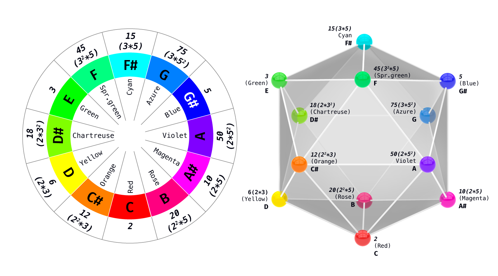
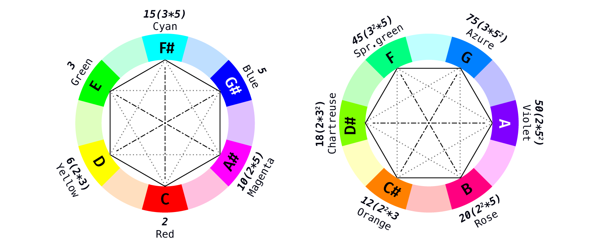
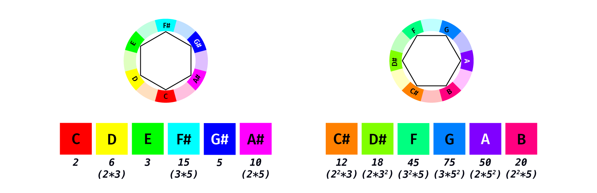
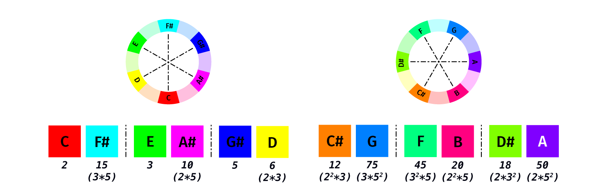
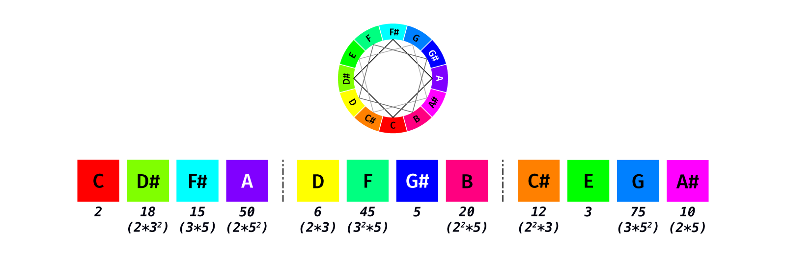
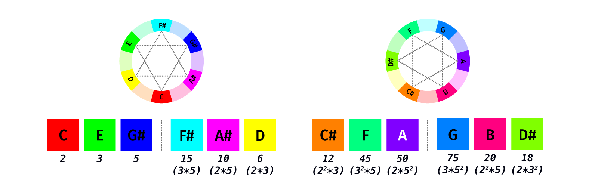
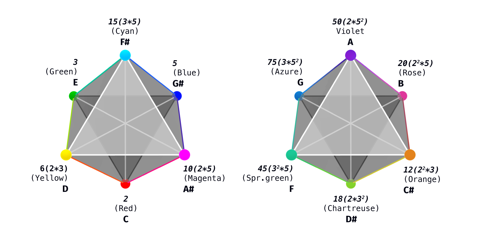
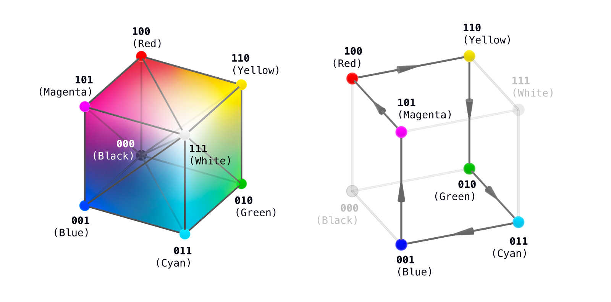
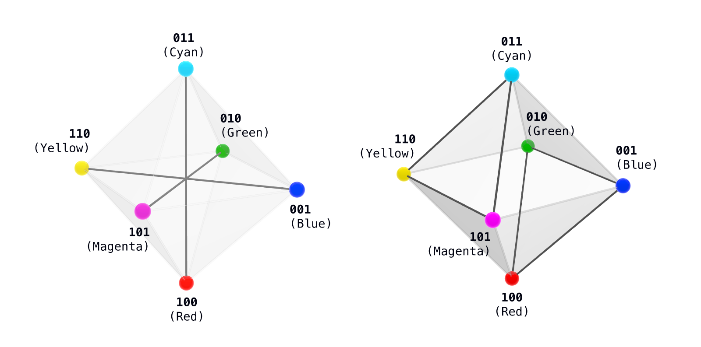

  🌐 <strong>Language:</strong> English &bull; <a href="./">Main Article ("The Interface of Observation")</a>
  <a href="ru/synesthesia.html" class="lang-btn">🇷🇺 Читать на русском (RU)</a>

# Combinatorial Synesthesia: Chords and Colors as Divisor Arithmetic on the Icosahedron

**Author:** Igor Zhuk ([igor.m.zhuk@gmail.com](mailto:igor.m.zhuk@gmail.com))  
*Preprint / Research Project DOT (Distinction Observable Theory)*  
*Project Archive:* [github.com/Nondual-Observer/DOTheory](https://github.com/Nondual-Observer/DOTheory)  
*Reddit discussion:* [r/combinatorics](https://www.reddit.com/r/combinatorics/comments/1urhkt2/combinatorial_synesthesia_chords_and_colors_as/) &bull; *Russian edition on Habr:* [habr.com/ru/articles/1058556/](https://habr.com/ru/articles/1058556/)

---

Twelve notes, twelve colors, and all their symmetric chords sit on one solid; the tritone is always the opposite vertex. Each vertex carries a divisor — a number whose prime factorization is given in the label.

## How the Correspondence Is Built

Here is how the correspondence is built. Take the three primes $2, 3, 5$. Their products without repetition — $2, 3, 5$, $6 = 2 \cdot 3$, $10 = 2 \cdot 5$, $15 = 3 \cdot 5$ — are the six proper divisors of $30 = 2 \cdot 3 \cdot 5$. These are assigned to the six primary vertices: the colors R Y G C B M (red, yellow, green, cyan, blue, magenta), which are also the notes of the whole-tone scale.

The six intermediate vertices are assigned the products of two neighboring primary divisors: orange $\leftrightarrow 2 \cdot 6 = 12 = 2^2 \cdot 3$. Here the exponent $2$ appears for the first time — a prime taken twice: a primary vertex's divisor is settled by one question (which primes are used), an intermediate vertex adds a second (how many times).

On a single scale, all twelve numbers are divisors of $900 = 30^2$: at the primary vertices these are squares ($10 \to 100$), at the intermediate ones, products of neighbors.

Divisors play two different roles: divisors of $900$ are assigned to vertices, while divisors of $12$ set up symmetric partitions of the circle — a divisor $d$ splits the twelve vertices into $d$ equal groups of $12/d$:

| groups ($d$) | of ($12/d$) | in music | in color |
| :---: | :---: | :--- | :--- |
| **2** | 6 | two whole-tone scales | the primary and intermediate sixes |
| **3** | 4 | three diminished sevenths | three "squares" |
| **4** | 3 | four augmented triads | four triads (RGB, CMY, …) |
| **6** | 2 | six tritones | six complementary pairs |
| **12** | 1 | the chromatic scale | the full wheel |

Twelve has no other equal partitions. The sections below walk through the table row by row. The unit throughout is a step of the circle: a semitone in music, $30^\circ$ in color.

## Two Sixes

Vertices one step apart form the whole-tone scale $C, D, E, F\\#, G\\#, A\\#$; the other six form the second scale $C\\#, D\\#, F, G, A, B$. Color has the same two classes: the primary six R Y G C B M and the intermediate one (orange, chartreuse, azure…).

The intermediate six is the primary six averaged: each of its colors is a blend of two neighboring primaries, each note the midpoint of a step ($C\\#$ between $C$ and $D$); hence the products in its divisors. The geometric construction of this averaging follows below.

## Pairs → Tritones and Complementary Colors

Two vertices six steps apart stand directly opposite each other: in music this is the tritone, the tensest interval; in color, a complementary pair (red–cyan). Six pairs make six diameters of the circle.

## Fours → Diminished Sevenths

Four vertices spaced three steps apart form a diminished seventh chord ($C, D\\#, F\\#, A$); there are three of them. In color, this is a "square." Color theory uses squares less often than pairs and triads, even though the partition is just as regular; the reason is worked out below.

## Threes → RGB, CMY, and Augmented Triads

Three vertices spaced four steps apart form an augmented triad in music, a triad in color. Two triads of the primary six are the best-known ones:

* $C, E, G\\# \to \text{RGB}$: the primary colors of light, adding up from black to white;
* $D, F\\#, A\\# \to \text{CMY}$: the primary colors of pigment, subtracting down from white to black.

Two more triads sit on the intermediate vertices ($\text{C\\#–F–A}$, $\text{D\\#–G–B}$). Music does not distinguish among these four triples — one augmented triad in four transpositions; the light/pigment distinction exists only on the color side.

The primary six has a canonical construction. The cube $2^3$ is the eight states of three binary features; in color this cube is known quite literally: the RGB cube, whose three axes are the red, green, and blue channels, with $(0,0,0)$ black and $(1,1,1)$ white. Remove both poles and six colored vertices remain: R G B with one channel on, and C M Y with two.

Among them there are exactly three types of relation, by the number of channels in which vertices differ: a cycle of six steps (one channel), two triangles $\\{R,G,B\\}$ and $\\{C,M,Y\\}$ (two channels), and three diagonals, "color $\leftrightarrow$ complement" (all three channels). Together these form the frame of an octahedron: $6 + 6 = 12$ edges and three axes.

In notes, the cycle is the whole-tone scale, the triangles are the triads $\text{C–E–G\\#}$ and $\text{D–F\\#–A\\#}$, the diagonals are tritones. In numbers, this is the six divisors of thirty: the axes are the primes $2, 3, 5$, the diagonals the pairs $d \leftrightarrow 30/d$.

*(A detailed treatment of the six-point structure is in the post [Observer as a Finite Structure of Distinction](https://www.reddit.com/r/cybernetics/comments/1tbc6wm/observer_as_a_finite_structure_of_distinction/); here it doubles to twelve.)* An octahedron has exactly twelve edges — below, they become the twelve vertices of an icosahedron.

Every class of chords and every class of color harmonies turned out to be the same partition of the same circle; this requires no resemblance between sound and color. What remains is to obtain the solid — to show why the twelve vertices fall on an icosahedron.

## Where the Icosahedron Comes From: A Vertex Is an Edge of the Octahedron

The icosahedron is built from the octahedron by a classical construction. On each of the octahedron's 12 edges, a single point is marked, dividing it in the ratio $1 : \varphi$ — the golden ratio — with a consistent choice of side across all edges. The resulting twelve points are the vertices of a regular icosahedron. Each vertex of the icosahedron thus corresponds to the edge of the octahedron it sits on, which is a pair of neighboring primary colors. The new vertex's note is the midpoint of the arc between the pair on the circle; its color is the blend of the pair's colors.

The arithmetic form of the same fact: the product of two neighboring divisors of thirty gives the intermediate vertex's divisor — $12, 18, 45, 75, 50, 20$, all divisors of $900$; opposite vertices are linked by the single formula:

$$x \mapsto 900/x$$

($12 \cdot 75 = 18 \cdot 50 = 45 \cdot 20 = 900$); the prime exponents, halved, give the RGB coordinates of the blend:

$$12 = 2^2 \cdot 3^1 \cdot 5^0 \mapsto (1, 1/2, 0)$$

— the vector for orange.

The numbers $30$ and $900$ play different roles. Thirty is squarefree, and its six divisors form an octahedron on their own: the edges and axes are read straight off the arithmetic. Nine hundred's exponents reach as high as two, its divisor lattice is built differently and does not contain an icosahedron; here the arithmetic supplies the labeling of vertices, the complement rule $x \mapsto 900/x$, and the chromatic step — neighboring vertices' divisors differ by multiplying or dividing by a single prime, and a full circuit of the circle is the chain:

$$\times 3 \to \times 3 \to \div 2 \to \div 2 \to \times 5 \to \times 5 \to \div 3 \to \div 3 \to \times 2 \to \times 2 \to \div 5 \to \div 5$$

The solid itself is set by the golden division of the edges; that does not follow from the arithmetic.

The point's position on the edge is a parameter. An exact half-and-half split gives the cuboctahedron — a crystallographic solid with a 4-fold axis; the golden split gives the regular icosahedron, and the two mirror-image golden variants are symmetric about the midpoint. Under this labeling, the chromatic scale runs along the icosahedron's surface edges, the circle of fifths along its internal chords, and the tritone along a diameter. The reason for this layout (six axes, a projection from six dimensions) is in the postscript.

## In Time and In Space

The geometry of chords and harmonies is one and the same; only the medium differs — music unfolds in time, color in space. The general law: the more symmetric the figure, the less anchoring it has. The tritone, the augmented triad, and the diminished seventh are the least stable chords, with no root tone; the complementary pair, the triad, and the square are maximal contrast, with no dominant hue.

What the tension resolves into differs. In time it acts as an engine: the tritone demands resolution (the "devil in music"), and the diminished seventh, owing to its symmetry, resolves in four directions at once and serves as a hinge between keys — the most symmetric chords are prized precisely as motion. In space, tension has nowhere to go: a color square overwhelms — four contrasts sit at once, and anchoring has to be introduced by hand, muting three of the four colors. This is why music values maximal symmetry as a move, while color builds a hierarchy — a dominant tone and accents.

## An Open Question

One circle, with its divisor partitions, organizes musical and color symmetries independently. Are these the only two systems — or does the same framework show through somewhere else too: in mathematics, physics, computer science?

## Postscript: Divisors, the Five, and the Golden Ratio

**Divisors and rotations.** The rotation orders compatible with a periodic lattice are $\\{1, 2, 3, 4, 6\\}$ (the crystallographic restriction theorem); $12$ is their least common multiple — twelve accommodates all periodic symmetries at once. Five is not among them.

**The five is golden.** A 5-fold axis requires the irrational number $\varphi = 2\cos(\pi/5) = \frac{1+\sqrt{5}}{2}$ — which is why quasicrystals with 5-fold axes came as a surprise. Bring in the five, and the least common multiple jumps from $12$ to:

$$60 = \operatorname{lcm}\\{1,\dots,6\\} = |A_5|$$

the order of the icosahedron's rotation group; $12 = 60/5$ is the orbit of the 5-fold axis. Twelve is the limit of the periodic world; the transition octahedron $\to$ icosahedron trades the 4-fold axis (the diminished seventh) for a 5-fold one — the diminished seventh is the price of that step.

**The shadow of the six-dimensional.** The circle's six diameters are six axes; in six dimensions they can be made mutually perpendicular (this solid is called an orthoplex), and the icosahedron is its projection into three dimensions at the golden angle. The same projection from a six-dimensional lattice produces icosahedral quasicrystals (their discovery won the 2011 Nobel Prize in Chemistry). The orthoplex's sixty edges split into thirty surface edges of the icosahedron and thirty internal chords: the chromatic scale closes into a path along the surface, the circle of fifths into an equivalent path along the chords, and multiplication by $7 \pmod{12}$ swaps the two.

**Discrete and continuous.** Blending is what draws the boundary: triples close up in whole numbers, steps require a half — the first point where the discrete system turns to face the continuous. The ladder of doublings continues the same motion: inserting midpoints repeats ($12 \to 24 \to 48 \to \dots$), and its limit is a solid, unbroken wheel. The same boundary runs through the solid: a rational bisection of the edge gives the crystallographic cuboctahedron, an irrational golden one gives the icosahedron. The boundary between discrete and continuous is the central subject of the theory this post's skeleton is drawn from.

Divisor combinatorics, the golden geometry of the icosahedron, and the boundary between discrete and continuous converge on one skeleton of twelve points.

---

## References

This construction is one instance of Distinction Observable Theory (DOT): it reads the makeup of different domains as projections of a single structure that grows out of the act of distinction — the Boolean cube, the removal of poles, a tower of ranks in which the octahedron and the icosahedron sit on neighboring floors. Here that tower is unfolded concretely: it can be heard in chords and seen in color harmonies, and the seam between a rational bisection of the edge (the cuboctahedron) and a golden one (the icosahedron) is the very seam between discrete and continuous that the theory treats as a general subject.

The full theory is in the open repository: [https://github.com/Nondual-Observer/DOTheory](https://github.com/Nondual-Observer/DOTheory); the treatment of the orthoplex, the golden half, and the quasicrystal, with a verifier, is in `Bridges/opposition_bridge.md`.
